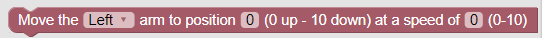
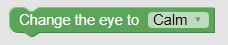

# {{title}}

## Introduction

 Blockly is a block-based, visual programming language developed by Google. Misty has a custom Blockly editor that runs in your web browser. We recommend the following browsers for running Blockly with Misty: Chrome, Safari, Firefox, and Microsoft Edge (latest versions).

 Before diving into the API, make sure to get Blockly set up by reading [Starting to Program Misty with Blockly](../../../../../onboarding/3-ways-to-interact-with-misty/blockly).

## Blockly Controls

The following controls are available on Misty's Blockly editor.

* **Enter Robot IP Address**: Misty's IP address; you can obtain this value from the Companion App.
* **Connection Status**: Indicates whether Blockly can communicate with Misty (green is success, and red is failure).
* **Status**: Current status information.
* **Run**: Run the Blockly blocks on the workspace.
* **Abort**: Stop the currently running blocks.
* **Show JavaScript Code**: Display the JavaScript code generated by Blockly.
* **Save Blockly**: Save the current blocks on the workspace as blockly.txt to ~/Downloads folder.
* **Open Blockly**: Open a saved Blockly file onto the workspace.
* **Enable Locomotion**: Enable/disable locomotion blocks on the workspace. This is useful when you are testing a sequence of blocks and want to skip the blocks that would make Misty move away or off a table.

## API

The following are descriptions of Blockly's Misty-specific blocks.

**Note: After clicking Run with Blockly, there currently can be a 2-3 second delay before Misty reacts, and up to a 5-second delay between actions.**

**Important: Commands noted as "Alpha" may be partially or entirely non-functional at this time. "Beta" commands may behave unpredictably.**

### Move at speed for duration ###
Drives Misty forward or backward at a certain speed for a duration specified in milliseconds.

Parameters
* Direction: Forward or backward.
* Speed: A value from 0 (stopped) to 10 (full speed).
* Duration: A value in milliseconds, using 100 ms increments, with a maximum value of 10 seconds.

### Turn at speed for duration ###
Turns Misty left or right at a given speed for a duration specified in milliseconds.

Parameters
* Direction: Left or right.
* Speed: A value from 0 (stopped) to 5 (full speed).
* Duration: A value in milliseconds, using 100 ms increments, with a maximum value of 10 seconds.

### Pause for duration ###
Pauses Misty for a duration specified in milliseconds.

Parameters
* Duration: A value in milliseconds, using 100 ms increments, with a maximum value of 10 seconds.

### Move arm to position (ALPHA) ###
(Not available with Misty I.) Moves Misty's left or right arm to position up or down at a certain speed.

Parameters
* Arm: Left or right.
* Position: A value ranging from 0 (fully up) to 10 (fully down).
* Speed: A value from 0 (stopped) to 10 (full speed).

### Move head to location ###
Moves Misty's head to a given location.

Parameters
* location: Left, right, up, down, or center.
* velocity: A value from 0 (stopped) to 10 (full speed).

### Set head to position (ALPHA) ###
Moves Misty's head in one of three axes (tilt, turn, or up-and-down).

Parameters
* Axis: Yaw (turning left or right), pitch (moving up and down) or roll (tilting Misty's head toward her shoulder).
* Position: A value from -5 to 5 specifying the amount of movement.
* Velocity: A value from 0 (stopped) to 10 (full speed).

### Change LED color ###
Changes the color of the LED behind the logo on Misty's torso.

Parameters
* Color: A color selected from the block's options.

### Get string sensor readings (ALPHA) ###
Obtains sensor readings in string format.

Parameters
* None

### Start / Stop mapping ###
Starts or stops Misty's mapping of an area.

Parameters
* None

### Start / Stop tracking ###
Starts or stops Misty tracking her location on a previously generated map.

Parameters
* None

### Follow path ###
Drives Misty on a specified path.

Parameters
* Path: A string of (x,y) coordinates for the path to follow. These must be obtained from a previously generated map.

### Set affect (ALPHA) ###
Not currently recommended for use.

### Change the eye (ALPHA) ###
Changes the eye image Misty is displaying.

Parameters
* Eye: A pre-defined eye image.

### Hallucinate object (ALPHA) ###
Not currently recommended for use.

### Browse for file ###
Browse for a file on your computer to upload onto the robot. Normally used to select a file, prior to calling a "save audio file" block or a "save image file" block.

Parameters
* File: When you click on this block, a browse file dialog is displayed to allow for file selection. Valid image file types are .jpg, .jpeg, .gif, .png. All audio file types are valid, however Misty cannot currently play OGG files. Maximum file size is 3 MB.

### List audio files###
Lists the existing audio files on Misty.

Parameters
* File: An existing audio file stored on Misty.

### Play audio file ###
Plays an audio file that has been previously uploaded to Misty.

Parameters
* File: The audio file to play. Connect this block to the "list audio files" block to play a selected audio file.

### Save audio file ###
Saves an audio file onto Misty. This block must **follow** the "browse for file" block, to select the audio file to be saved.

Parameters
* File: The audio file to save to Misty from the "browse for file" block. This command accepts all audio format types, however Misty cannot currently play OGG files. The maximum file size is 3 MB.

### Save image file ###
Saves an image file to Misty. This block must **follow** the "browse for file" block, to select the image file to be saved.

Parameters
* File: The image file to save to Misty from the "browse for file" block. Valid image file types are .jpg, .jpeg, .gif, .png. Maximum file size is 3 MB. Misty's screen is 480 x 272 pixels in size. Because Misty does not adjust the scaling of images, for best results use an image with proportions similar to this.

### Display image file ###
Sets the current image being displayed on Misty's screen.

Parameters
* Filename: The name of the file containing the image to display.

### List image files ###
Obtains a list of the images currently stored on Misty.

Parameters
* None

### Revert display image ###
Changes Misty's screen to display the previous image.

Parameters
* None

