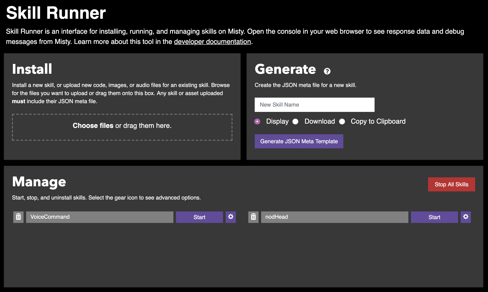
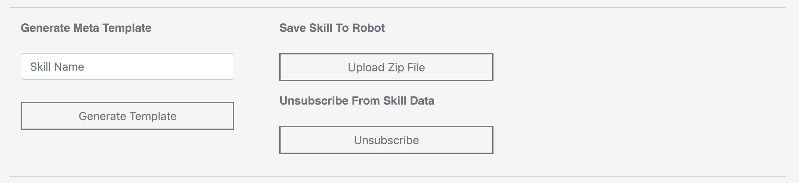
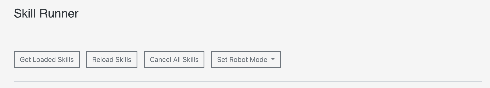
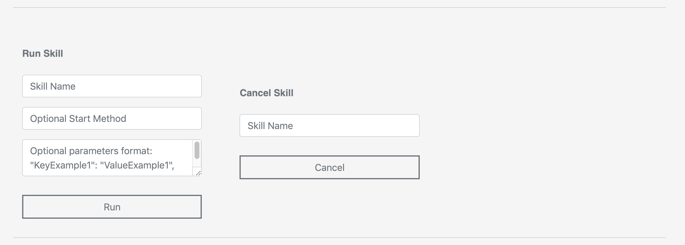
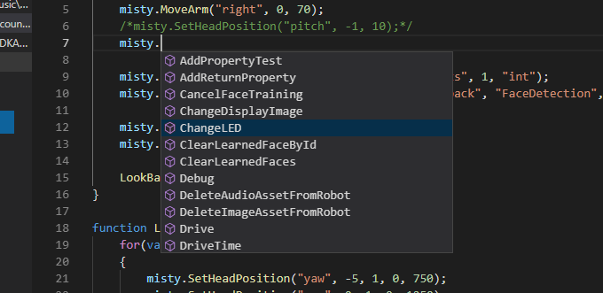
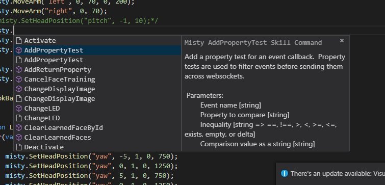

# {{title}}

## Misty Skill Runner

The [Misty Skill Runner](https://skill-runner.mistyrobotics.com) web tool is a graphic interface for some of the skill-management actions that you would otherwise need to handle via a REST client.

To use Skill Runner to upload a skill to your robot, follow the steps below. 

1. Compress and save your skill’s `Meta` and `Code` files into a .zip file with the same name as your skill.
2. Open `SkillRunner.html` and connect to Misty using your robot’s IP address.
3. Open up your browser’s JavaScript console for the Skiller Runner page, so you can see what’s happening.
4. Select **Upload Zip File** under “Save Skill to Robot.”
5. Select the .zip file you just created. Observe the JavaScript console for a success message confirming that the upload request was received.
6. Once the file has been uploaded to Misty, click **Reload Skills** at the top of the page. This ensures that your robot and latest code changes are in sync. Observe the JavaScript console for a log message verifying the skills have been loaded. 
7. To run your skill, enter the skill’s name under “Run Skill” and click **Run**. Continue observing the console; as events are triggered, you’ll see debug messages in the console. 

**Note:** You can generate useable `meta` file content with the Generate Meta Template controls in Skill Runner.

## Visual Studio Code Extension

To aid in local skill development, we provide the MistySkills extension for [Visual Studio Code](https://code.visualstudio.com/). Download the extension [here](https://s3.amazonaws.com/docs-dev.mistyrobotics.io/VSC+Extension/mistyskills-0.0.1.vsix). This extension provides a list of the available methods for local skills: 

As well as auto-complete, tabbed parameter entry, and information about each method:

To install the MistySkill extension, use the [Visual Studio Code Extensions Manager](https://code.visualstudio.com/docs/editor/extension-gallery). Select **Install from VSIX** in the dropdown menu.

To activate the MistySkill extension when writing a skill:
* On Mac OS - **Press Command+Shift+P** and select MistySkills. Type `misty` to start getting autocomplete and command information.
* On Windows - Press **Conrol+Shift+P** and select MistySkills. Type `misty` to start getting autocomplete and command information.
