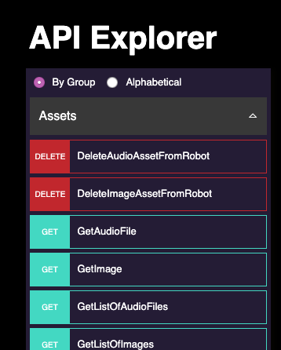
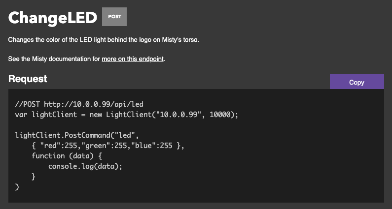
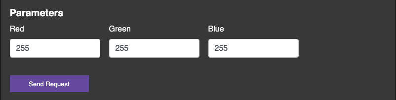
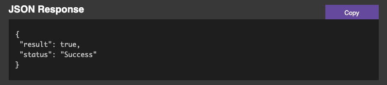
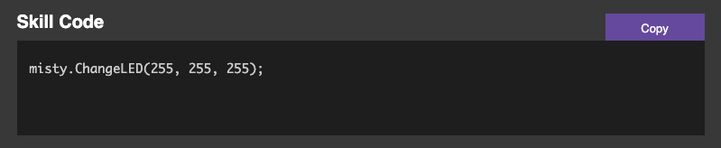

# {{title}}

Misty's [API Explorer](http://sdk.mistyrobotics.com/api-explorer/) provides interactive access to Misty's REST API endpoints. You can use the API Explorer to:

* browse the list of Misty's REST API endpoints
* send REST API commands to Misty
* experiment with different parameters
* generate code samples for Misty's REST API and on-robot JavaScript API

The API Explorer simplifies experimenting with different commands. It allows you to quickly see Misty's responses, so you can understand how your code works with Misty. For more information about using Misty's APIs, see the [REST API](../../../docs/reference/rest) and [on-robot JavaScript API](../../../docs/reference/javascript-api) reference documentation.

**NOTE:** **The API Explorer is currently in a pre-release state**. As such, not all features are fully functional, and the site may change before the release of Misty's SDK.

## Setting Up the API Explorer

Connect Misty to the [API Explorer](http://sdk.mistyrobotics.com/api-explorer/) to start experimenting with her REST endpoints. Before you connect Misty to an instance of the API Explorer, **make sure your computer and Misty are on the same Wi-Fi network**.

1. [Open up the API Explorer](http://sdk.mistyrobotics.com/api-explorer) in a browser window.
2. Enter the IP address of your robot (you can find your robot's IP address in the Misty companion app) and click the **Connect** button. Watch for the text on the **Connect** button to change to **Connected**.

## Sending a Request

Follow these steps to send REST requests from the API Explorer to Misty.

1. Make sure Misty is connected to the [API Explorer](http://sdk.mistyrobotics.com/api-explorer/).
2. Choose a command from the [**Command List**](./#command-list) on the left-hand side of the page.
3. Enter values for any parameters the command requires.
4. Click the **Send Request** button to send the request to Misty.

When you send a request, Misty's response appears in the [**JSON Response** section](./#json-response) of the API Explorer, as well as in your browser's web console.

## Using Code Samples

You can use the [API Explorer](http://sdk.mistyrobotics.com/api-explorer/) to generate code samples for Misty's REST API and her on-robot JavaScript API. Click the **Copy** button next to a section to copy the text from that section to your computer's clipboard.

### REST API Code Samples

The API Explorer generates code samples for Misty's REST API in JavaScript that are based on jQuery and the [lightClient.js](../../../docs/skills/remote-command-architecture/#using-the-lightclient-js-helper) helper tool. This tool simplifies the code required to send requests to Misty from your web browser.

You can run these code samples by pasting them into the `<script>` tags of an .html file and opening that file in your web browser. **The .html file must include the following references**:

* a reference to the [jQuery](https://jquery.com/) library (available from [Google](https://developers.google.com/speed/libraries/))
* a reference to a local directory that contains the [lightClient.js](../../../docs/skills/remote-command-architecture/#using-the-lightclient-js-helper) helper tool

Read more about lightClient.js [in the documentation](../../../docs/skills/remote-command-architecture/#using-the-lightclient-js-helper).

[Download lightClient.js](https://github.com/MistyCommunity/SampleCode/tree/master/Tools/javascript) from GitHub.

### On-Robot JavaScript API Code Samples

You can use the API Explorer to generate code samples for many of the methods in Misty's on-robot JavaScript API. These code samples appear in the [**Skill Code** section](./#skill-code) of the request form.

**Note:** Code samples for "Get" commands also include examples of the [callback function required to handle the data](../../../docs/skills/local-skill-architecture/#-quot-get-quot-data-callbacks) that Misty returns.

You can run these code samples by copying them from the API Explorer and pasting them into the [code file](../../../docs/skills/local-skill-architecture/#code-file) for an on-robot skill. Then, [upload the code to Misty](../../../docs/skills/local-skill-architecture/#loading-amp-running-an-on-robot-skill) and [start the skill](../../../docs/skills/local-skill-architecture/#starting-amp-stopping-an-on-robot-skill).

## Parts of the API Explorer

This topic briefly describes the function of each part of the API Explorer.

### Command List

Browse the command list to see the endpoints available on the connected Misty robot. Select a command to open the request form.

Commands are organized into groups by function. You can also choose sort the list of commands alphabetically. Each command in the list is labeled with the HTTP method used when you send a request to the endpoint associated with that command.

### Request

The **Request** section of the request form includes a brief description of the selected command. It also shows sample code for making a request to the associated endpoint.

The sample code in this section automatically updates when you enter new data into the **Parameters** fields. To copy this sample code, click the **Copy** button. 

For information about using this sample code with Misty, see [REST API Code Samples](./#rest-api-code-samples).

### Parameters

The **Parameters** section includes fields where you can enter data to send along with your request. When you enter values into these fields, the sample code in the **Request** and **Skill Code** sections automatically update. To send a request to Misty, click the **Send Request** button.

### JSON Response

The **JSON Response** section shows any data Misty returns when you send a request.
To copy the contents of this section to your clipboard, click the **Copy** button.

For more information about the return values for Misty's REST API, see the [REST API reference documentation](../../../docs/reference/rest).

### Skill Code

The **Skill Code** section of the API Explorer shows sample code for using the command in Misty's [on-robot JavaScript API](../../../docs/skills/local-skill-architecture).

For information about using this code in your skills, see [On-Robot JavaScript API Code Samples](./#on-robot-javascript-api-code-samples).
For details about each of the methods in Misty's on-robot JavaScript API, see the [on-robot JavaScript API reference documentation](../../../docs/reference/javascript-api).

