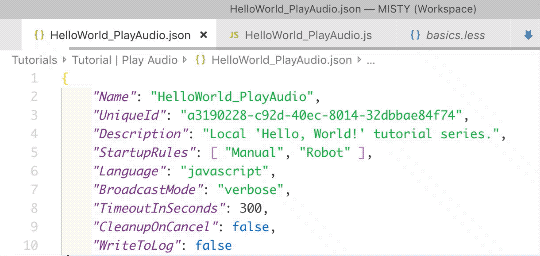

# {{title}}

You can use the Misty Skills extension for [Visual Studio Code](https://code.visualstudio.com/) to aid in skill development. This extension provides a list of the available methods in Misty's on-robot JavaScript API. It offers auto-complete, tabbed parameter entry, and information about each method. It also provides basic commands for uploading, running, and stopping skills on Misty from within the Visual Studio Code editor.

Access to the Misty skills extension is currently limited to a small group of field trial robot testers. If you are a field trial tester, you can access your extension download in the Field Trials section of the [Community forums](https://community.mistyrobotics.com/).

### Installing the Misty Skills Extension

Follow these steps to install the Misty Skills extension:

1. Open Visual Studio Code.
2. Use **Ctrl** + **Shift** + **X** (Windows) or **Command** + **Shift** + **X** (Mac) to see your list of Installed extensions.
3. Use the menu at the top of this list to select the option to **Install from VSIX...**
4. Locate your Misty Skills `.vsix` file and select it to install.

### Activating the Misty Skills Extension

To activate the extension when writing a skill:
* On Mac OS - Press **Command+Shift+P** and select MistySkills.
* On Windows - Press **Control+Shift+P** and select MistySkills.

With the extension activated, start typing `misty` in a JavaScript code file to start getting autocomplete and command information.

### Uploading, Running, and Stopping Skills

When the Misty Skills extension is active, you can run commands directly from your VSC window to upload a skill, upload and run a skill, or to stop the skills that Misty is currently running. This makes it possible to edit and update your skill code on Misty without leaving your text editor.

The list of currently available commands is:

* Upload
* Upload and Run
* Stop Skills

To view and use these commands:

1. Make sure Misty is powered on and connected to the same local Wi-Fi network as your computer.
2. Activate the Misty Skills extension in Visual Studio Code.
3. Press **Command+Shift+P** (Mac) or **Control+Shift+P** (Windows).
4. Type **Misty:** to see the list of commands, and select the command you want to use.

To **upload** a skill:

1. Follow the steps above to view the list of commands.
2. Select **Misty: Upload and Run**.
3. Enter Misty's IP address. (You can find Misty's IP address in the [Misty companion app](../../../docs/apps/misty-app)).
4. Watch for the notification that the upload is complete.

To **upload and run** a skill:

1. Follow the steps above to view the list of commands.
2. Select **Misty: Upload**.
3. Enter Misty's IP address. (You can find the IP address in the [Misty companion app](../../../docs/apps/misty-app)).
4. Watch for the notification that the upload is complete and wait for your skill to run.

{{box op="start" cssClass="boxed noteBox"}}
**Note:** When you run the **Upload** or **Upload and Run** command, the Misty Skills extension compresses the entire directory for the currently active file into a .zip and attempts to upload this .zip to Misty using the [SaveSkillToRobot](../../../docs/reference/rest/#saveskilltorobot) endpoint. Loading a skill onto Misty this way also uploads any image and audio files from the compressed directory to Misty and associates them with the skill.

An upload will fail if the directory you attempt to upload does not contain the [JSON `meta`](../../../docs/skills/local-skill-architecture/#file-structure-amp-code-architecture) file for the skill. If there is a problem with an upload, the extension displays an error notification in your Visual Studio Code window. Click this notification to see more details about the error.

For more information about loading skills onto Misty, see [Loading & Running an On-Robot Skill.](../../../docs/skills/local-skill-architecture/#loading-amp-running-an-on-robot-skill)
{{box op="end"}}

To **stop skills**:

1. Follow the steps above to view the list of commands.
2. Select **Misty: Stop Skills**.
3. Enter Misty's IP address. (You can find the IP address in the Misty [Misty companion app](../../../docs/apps/misty-app).)
4. Watch for the notification that the command was successful and wait for Misty to stop skill execution.

{{box op="start" cssClass="boxed tipBox"}}
**Tip:** When you use the **Misty: Stop Skills** command, the Misty Skills extension stops skill execution by sending a POST request to the REST endpoint for Misty's [CancelSkill](../../../docs/reference/rest/#cancelskill) command.
{{box op="end"}}