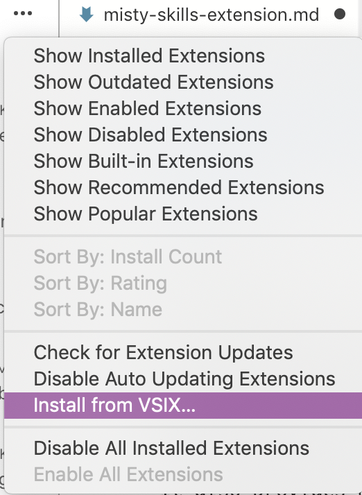

# {{title}}

You can use the Misty Skills extension for [Visual Studio Code](https://code.visualstudio.com/) to aid in skill development. This extension provides a list of the available methods in Misty's on-robot JavaScript API. It offers auto-complete, tabbed parameter entry, and information about each method. It also provides basic commands for uploading, running, and stopping skills on Misty from within the Visual Studio Code editor.

Access to the Misty skills extension is currently limited to a small group of field trial robot testers. If you are a field trial tester, you can access your extension download in the Field Trials section of the [Community forums](https://community.mistyrobotics.com/).

### Installing the Extension

Follow these steps to install the Misty Skills extension:

1. Open Visual Studio Code.
2. Use **Ctrl** + **Shift** + **X** (Windows) or **Command** + **Shift** + **X** (Mac) to see your list of Installed extensions.
3. Open the menu at the top of this list and select the option to **Install from VSIX...** 
4. Locate the Misty Skills .vsix file and select it to install.

### Activating the Misty Skills Extension

To activate the extension when writing a skill:
* On Mac OS - Press **Command+Shift+P** and select MistySkills.
* On Windows - Press **Control+Shift+P** and select MistySkills.

With the extension activated, type `misty` in your JavaScript code file to start getting autocomplete and command information.

### Uploading Running, and Stopping Skills

The Misty Skills Extension provides commands for uploading, running, and stopping skills, so you can iterate quickly and manage skills without leaving your text editor. To view these commands, press **Command+Shift+P** (Mac) or **Control+Shift+P** (Windows) and start typing `Misty:`.

Note: Your robot needs to be turned on and connected to the same local Wi-Fi network as the computer you are using for development in order to work.

Both upload commands compresses the contents of the directory where the skill file you are currently editing is stored into a .zip, and then sends that .zip file to Misty using the REST endpoint for the SaveSkillToRobot endpoint.

* Select **Misty: Upload** and enter your robot's IP Address to upload your skill to Misty.
* Select **Misty: Upload and Run** and enter your robot's IP address to upload your skill to Misty and run it immediately.
* Select **Misty: Stop Skills** and enter your robot's IP address to stop all skills that are currently running.
