# {{title}}

Welcome! Your Misty I Developer Edition Prototype robot has been hand-built by the Misty Robotics team.

For safety and care during shipping, your robot arrives with a couple of items disconnected and with the final pieces of the case removed. Please start here for some quick words of advice on setting her up. You can also [watch this video](https://youtu.be/ROqzzQRf2qI) to see the setup process directly.

**Important:** While future versions of Misty will be much tougher, it’s important that you handle your Misty I Developer Edition Prototype robot with care. When carrying Misty, support the entire robot from the front and back, below the main chassis between the two tracks.

**Note:** To avoid the risk of driving Misty off a high surface, we recommend either working with the robot on the floor or temporarily elevating the wheels so the robot cannot drive. To do this, you can either place a couple of books underneath Misty between the wheels or use this handy [stand for Misty I](https://github.com/MistyCommunity/assets/blob/master/M1_Robot_Stand.STL) that you can 3D print.

## What's in the Box?
Aside from Misty herself, there are a few things to look for in her packaging:

* battery
* power supply
* two side panels
* USB-to-Ethernet adapter
* FTDI cable

**Note:** Please keep all the original packaging for Misty. In case you need to ship her in the future, this packaging has been specially designed to protect these hand-built prototypes.

## Connecting the Battery
While Misty's case is open is the ideal time to connect up your robot's battery. **Before doing so, please read the following important notes:**

 * Always use the battery that came with Misty.
 * Always use a power supply (12-volt, 3 Amp, **center positive**) with the same specifications as that which came with Misty. Using a differently configured power supply creates a high risk of fire.
 * If you encounter any resistance or difficulty plugging the power supply into the jack on the back of Misty: STOP. Pull the plug out and try again, rotating the plug if necessary, until the plug inserts smoothly. It’s possible to catch the ground leaf spring on the bottom of the jack with the power supply plug and create a short. This renders Misty inoperative.
 * **Never** unplug the power connectors inside Misty. These connectors can be reversed or otherwise improperly re-inserted and create a **high risk of fire**. 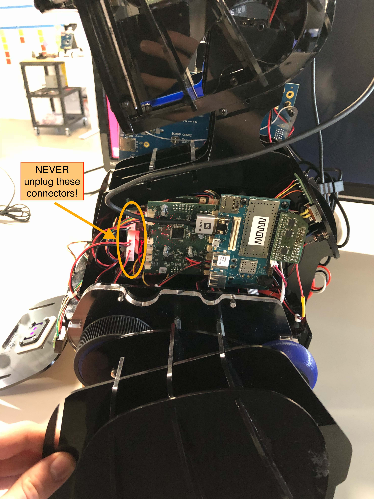

To connect Misty's battery:

1. Set Misty on the floor and get the battery from the shipping packaging. 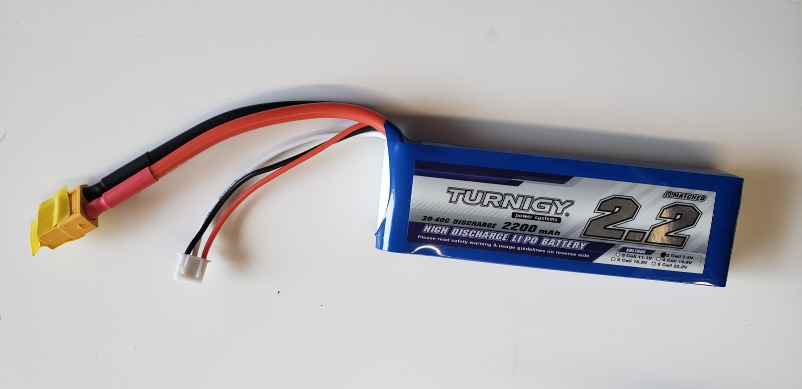
2. On Misty's right side, you can see an opening and loose yellow and white plugs. This is where you will connect and insert the battery. 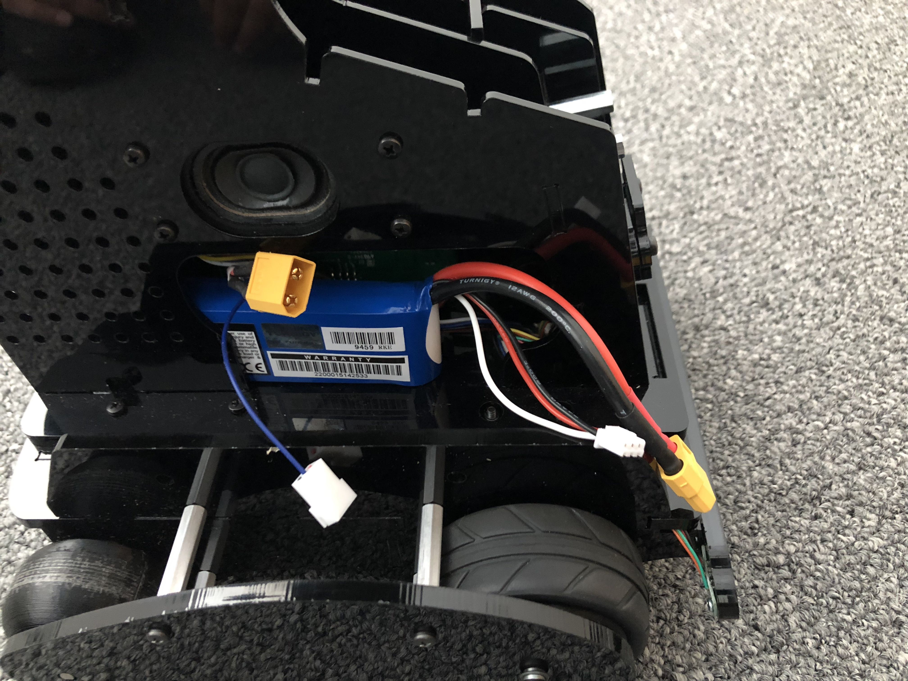
3. Plug the yellow connectors together. 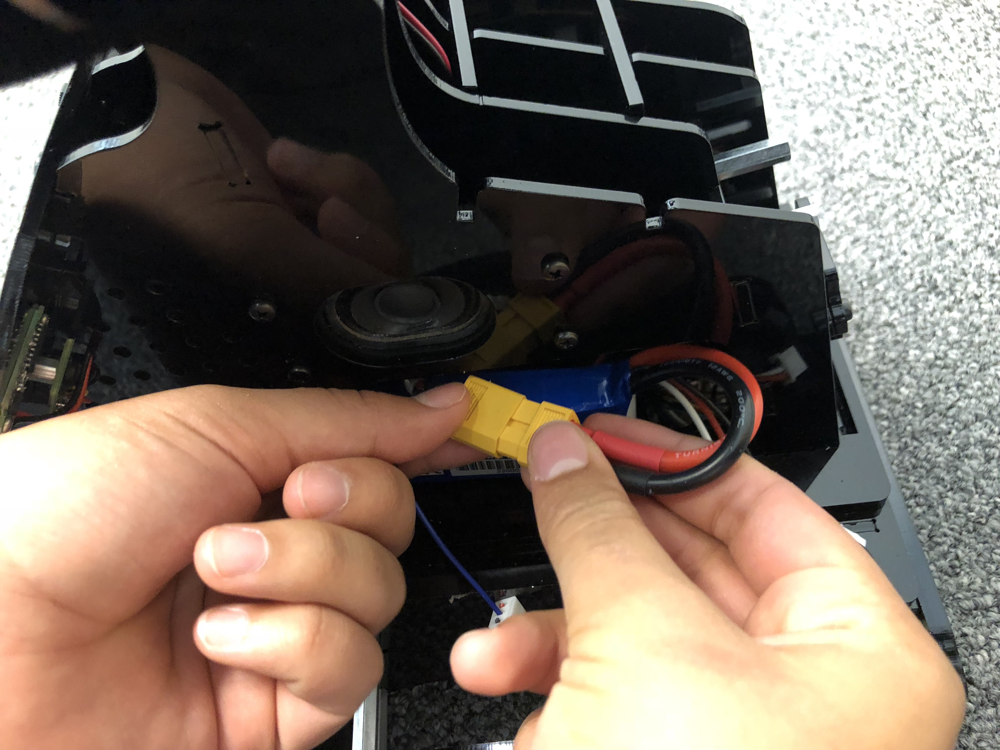
4. Plug the white connectors together. 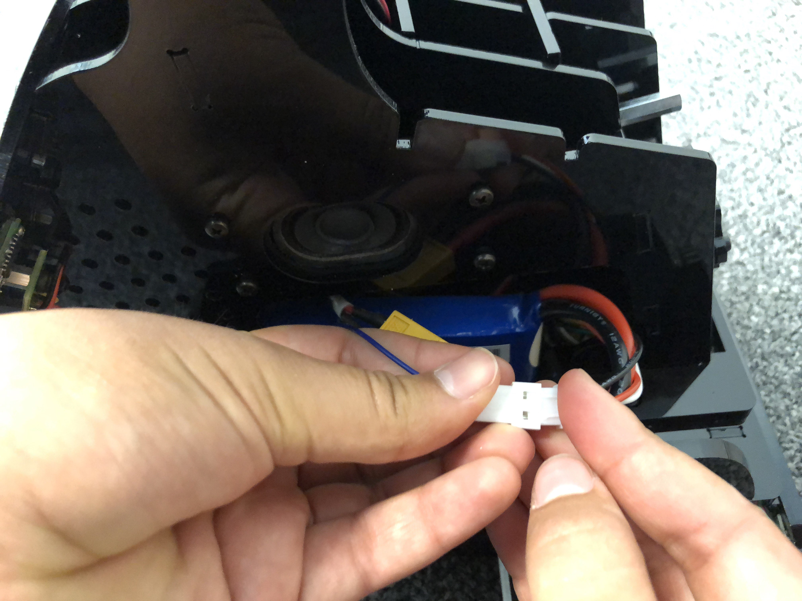
5. Gently make sure the battery and connectors are inserted into Misty. 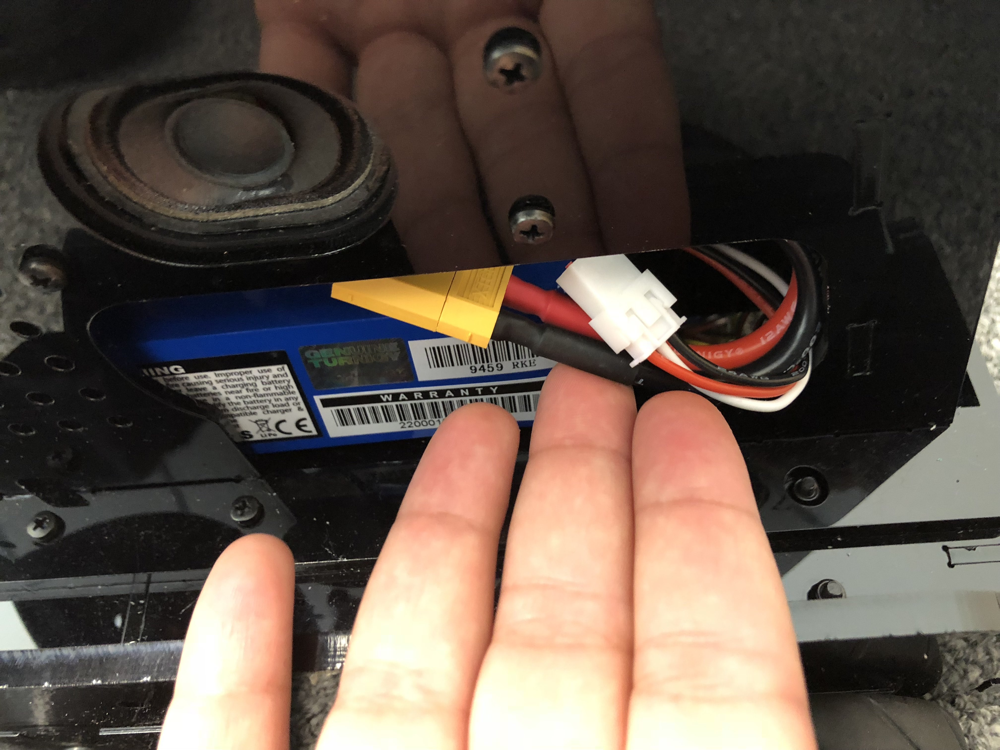
6. You can now plug the power adaptor into the back of Misty and into a power source. If the number on the battery charge indicator does not increase, unplug and re-plug the adaptor from Misty's power port. When Misty is fully charged, you should see values above 8 on the charge indicator. Note that Misty continues to use some power even when switched off, so her battery levels will drop even when she is powered down. A charge level lower than 7 may cause Misty to power down without warning. 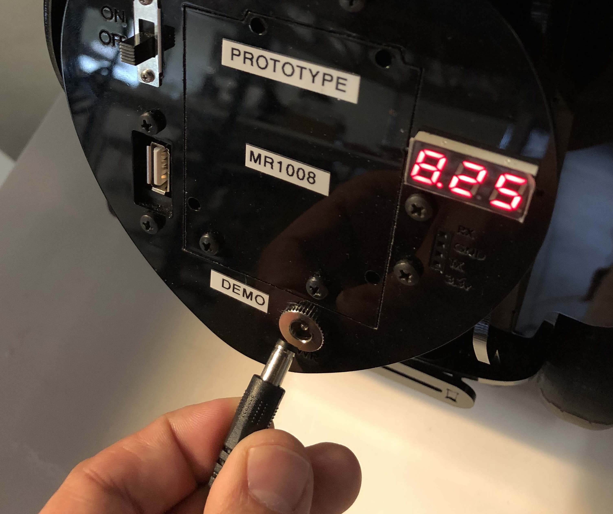

Once you've plugged in the battery, you can assemble Misty's case and connect the Occipital Structure Core depth sensor.

**Note:** If you want to charge the robot while it’s turned on, you’ll need to **first** let the robot fully boot up, **then** plug the power adaptor into the robot’s back.

## Assembling Misty's Case
Now that the battery is connected, you can put together the finishing pieces of Misty's case:

1. Undo the two small bolts that attach the plastic logo plate to the front of Misty's chest. Remove the plate and set it and the bolts aside. 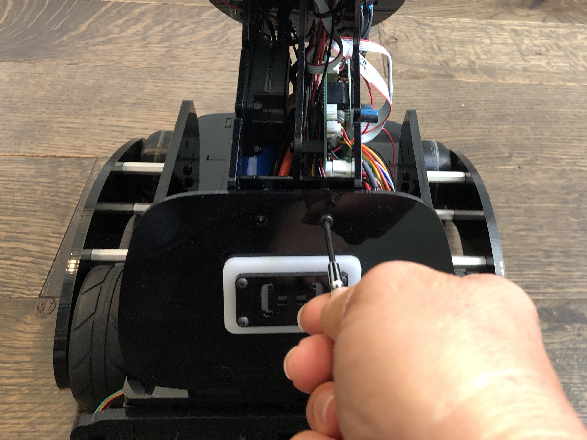
2. Find the two plastic side panels that shipped with your robot, underneath Misty in the packaging. 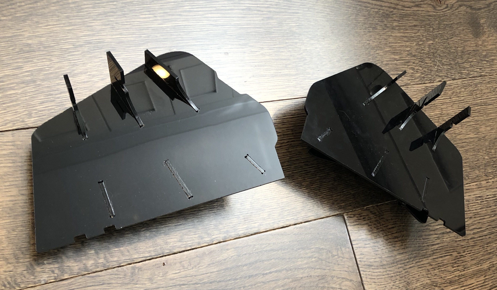
3. Align the slots and gently attach each panel to one of Misty's sides.  Each panel should easily drop into the slots as shown. 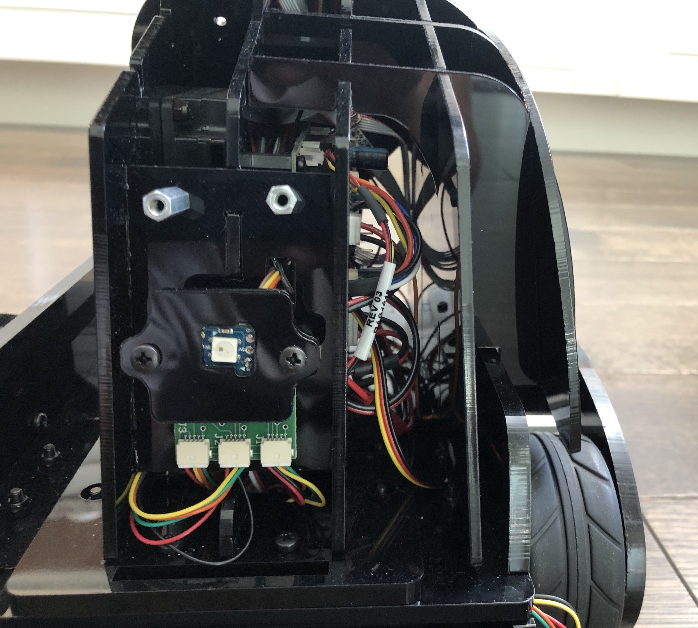
4. Once both side panels are attached, reattach Misty's logo plate, gently hand-tightening the bolts.

## Connecting the Occipital Structure Core Depth Sensor
The Occipital Structure Core depth sensor is your Misty robot's main way of mapping and seeing the world. The cable for this sensor is disconnected for shipping. It's simple to reattach as follows, but be sure to snap it in all the way. **You must feel a click when attaching the cable**, or it won't be seated fully and can't function.

1. Tucked behind Misty's faceplate, find the black USB cable with a loose end. 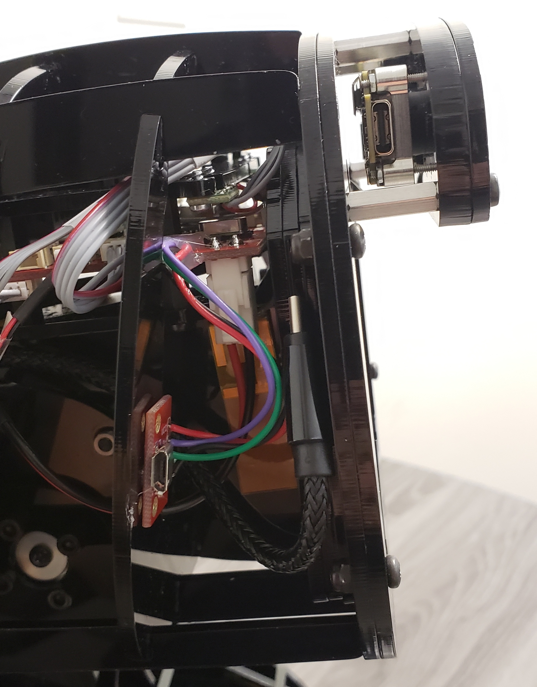
2. Connect the loose end of the cable into the sensor's open USB port on Misty's right side. Make sure you feel a click when inserting the cable, to ensure it is fully seated. 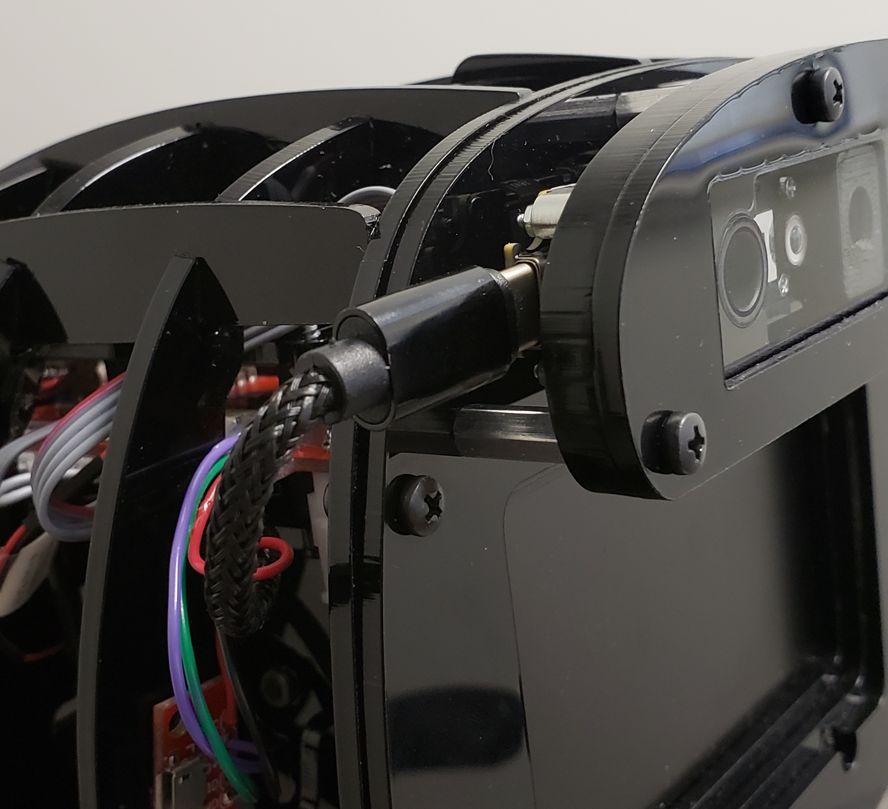

**Note**: When the Occipital Structure Core depth sensor is starting up, the LED in the depth sensor will flash blue and red for up to 10 seconds. Once the depth sensor is fully online, the LED should be solid blue. When the depth sensor's firmware is updating, the LED will flash red and blue for about a minute then reboot. If the depth sensor LED appears solid red, there is an error. If the LED remains red after restarting the robot, please contact support for assistance.

**Important!** There is a laser sensor located in the Occipital Structure Core depth sensor, above the right side of Misty's display screen. Never stare directly into the laser. Do not directly touch the laser or remove the protective cover over the laser. Oils on your finger can cause the light to disperse into your eyes and increase the risk of physical damage. 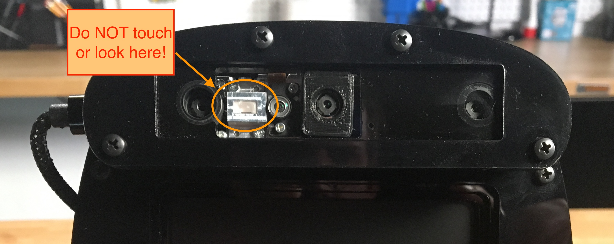

Now that you've put your robot together, you can set up Misty's internet connection with the [Misty App](../../apps/misty-app/).

## Cleaning the Time-of-Flight Sensors

**Note**: This is **not** something you need to do with your robot on arrival or perhaps ever, but it's good to know about, just in case.

A Misty I Developer Edition Prototype robot has a total of four time-of-flight sensors: three on the front and one on the back. These sensors obtain distance data for objects in Misty's environment and allow her to avoid obstacles as she moves. 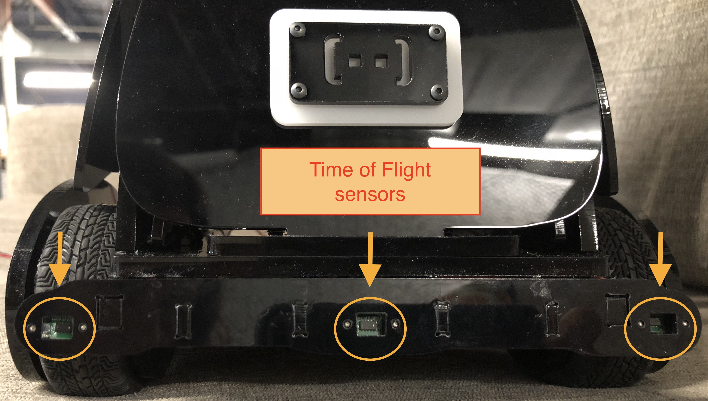

In some environments, the time-of-flight sensors may become dusty over time, which can cause them to return inaccurate distance data. If your robot has started running into objects that she would normally avoid, it's important to test the time-of-flight sensors to ensure they're functioning properly.

1. Open up the [Command Center](../../apps/command-center) in a browser and connect it to your robot.
2. In the Command Center, scroll down to the **Sensor Data** section and find the **Time of Flights** section. **Note:** Misty I robots do not have downward-facing time-of-flight sensors.
3. Locate a ruler with centimeter markings and lay it so that the 0cm mark is even with one of Misty's time-of-flight sensors. (In the photo, we've started the test with the back sensor.) Place an object with a flat surface on the ruler facing the sensor at the 10cm mark. 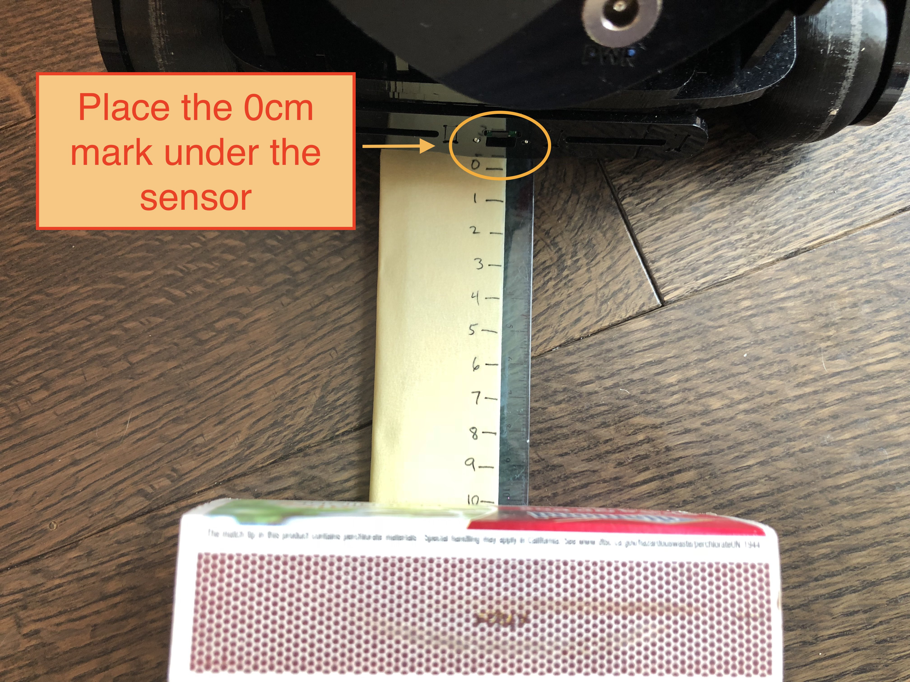
4. Use the Command Center to subscribe to the time-of-flight sensor you are testing. Confirm that the sensor reading is reasonably close to 0.1 meters (10cm). **Note: Because it's challenging to place objects exactly 10cm from a sensor, values between 0.08 meters (8cm) and 0.12 meters (12cm) are typically close enough.**
5. Repeat this process for each of the four time-of-flight sensors. If any sensor consistently gives inaccurate readings, proceed with cleaning that sensor.
6. To clean a time-of-flight sensor, use a can of compressed air to blow any dust off.
7. After cleaning, re-test the sensor. If a time-of-flight sensor continues to provide inaccurate data after cleaning, contact us for assistance.

## Misty I Fast Facts

Your Misty I Developer Edition robot has been lovingly hand-built by the Misty team.

Some quick facts. She...
* Is about 14” tall.
* Has a 4K camera for face and object recognition.
* Can listen with a 3x far-field microphone array.
* Moves her head via a servo for pitch (up and down) articulation.
* Includes a 4.3" LCD screen on the front of her head.
* Uses an Occipital Structure Core depth sensor to navigate.
* Has 2 Qualcomm Snapdragon processors: one running Windows 10 IoT Core and one running Android 7.
* Uses real-time and motor controllers.
* Avoids obstacles with 4 time-of-flight sensors (3 front, 1 rear).
* Gets flashy with a multicolor LED behind her name plate in front
* Is powered via a barrel connector charger jack in the back, as well as a 2200 milliamp hour lithium polymer battery (power adapter included).
* Has USB and serial expansion ports for easy hardware expandability.

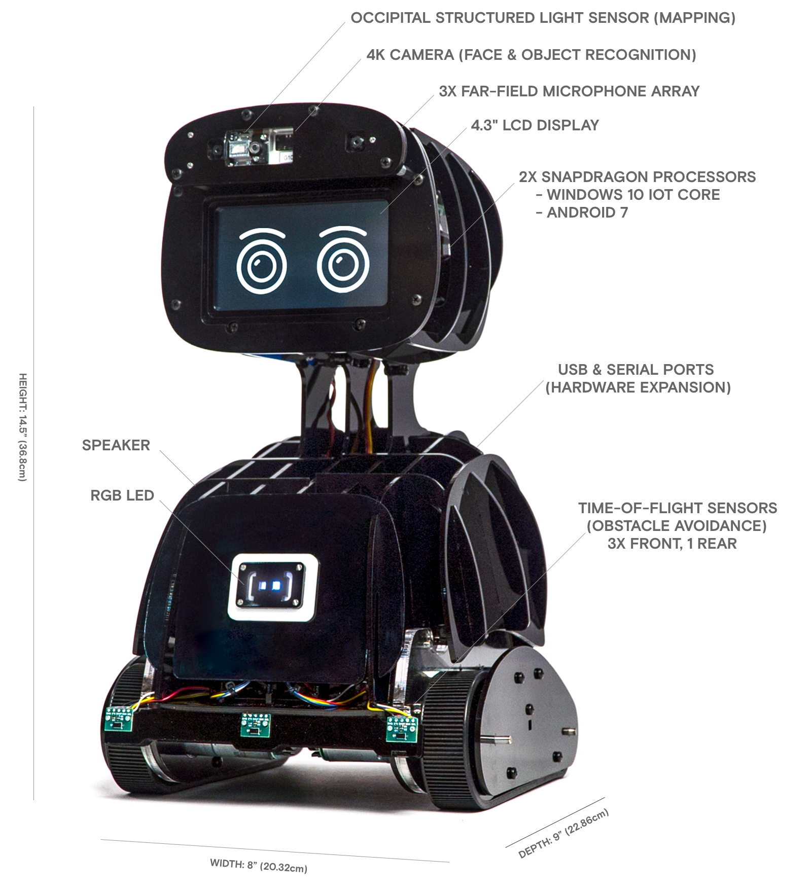

We recommend powering up Misty on the floor, if possible, to avoid the risk of driving your robot off the edge of a table or other high surface. If you are experimenting with Misty on a table top, considering placing either a couple of books underneath her, between her wheels, or 3D printing this handy [stand for Misty I](https://github.com/MistyCommunity/assets/blob/master/M1_Robot_Stand.STL) and using that to keep her wheels safely raised.

## Powering Up & Down

### Turning Misty On

1. Flip the power switch on Misty’s back (located above and to the left of the power adaptor). 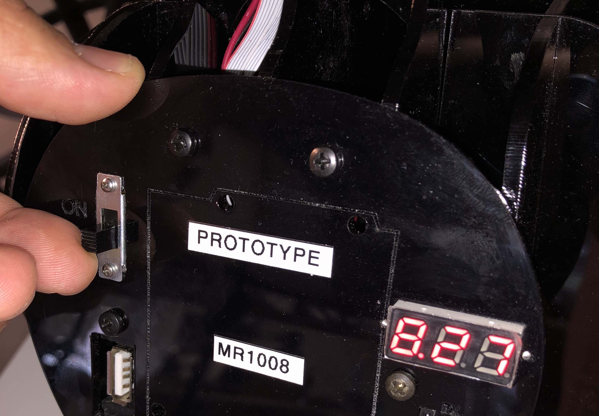
2. The light on Misty’s chest should come on, as should a blue LED connector light on the front-right side of Misty's head. 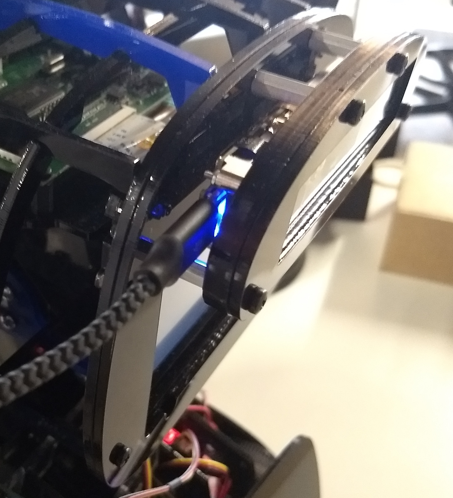
3. Misty's eyes should appear on screen, beginning in a closed state. The eyes gradually open more fully. 
4. When the eyes appear fully open, Misty is done booting up. This should take a little more than a minute. **Important! If after a few minutes, Misty's eyes still do not appear fully open, contact technical support for assistance.**  

**Note:** If you want to charge the robot while it’s turned on, you’ll need to **first** let the robot fully boot up, **then** plug the power adaptor into the robot’s back.

### Restarting Misty

1. If you need to restart Misty, turn off the power switch on Misty’s back.
2. Wait 10 seconds.
3. Turn on the power switch on Misty's back again.
4. Once you see the blue LED light and Misty's eyes fully re-open, you're ready.

**Note:** If Misty is charging during a restart, after she has fully restarted you must unplug the adaptor from the power port on her back, then plug it back in again for charging to continue.

### Turning Misty Off

Just turn off the power switch on Misty’s back.

**Note:** There is no graceful shutdown at this time. When Misty’s battery gets below about 7 volts she abruptly powers down.

**Note:** At this time, critical updates of Misty's underlying operating system platforms (e.g. Windows IoT Core) may occur without warning. If you see an image of gears on Misty's screen, be aware that she is going through a system update.

## System Updates

Misty checks for available system updates every time you turn her on or restart her. If you've not restarted her recently, you can check for and perform updates for Misty with the [Misty App](../../apps/misty-app/#updating-misty) or [Command Center](../../apps/command-center/#system-updates).

Updates can include:

* Image and/or sound assets
* Motor controller firmware
* Real-time controller firmware 
* Occipital Structure Core depth sensor firmware
* Home Robot application (running on Windows IoT Core)
* Sensory Services application (running on Android)
* OS updates

We recommend you check for updates on a weekly basis.

**Important:** Please keep Misty **plugged in** for the entire duration of the update and **do not attempt to send commands** to her during this time.

