# {{title}}

Welcome! Your Misty II Field Trial robot has been designed and built by the Misty Robotics team. Start here for a quick guide to setting up your robot.

**Important!** Misty II features a built-in carrying handle on the back of her head. Grip this handle to carry your robot.

**Note:** To avoid the risk of driving Misty off a high surface, we recommend either working with your robot on the floor or temporarily elevating the treads so the robot cannot drive. To do this, you can place books or blocks between Misty's treads.

## What's in the Box?

Misty II arrives with her magnetic headpiece and "backpack" attached. In addition to Misty, your package arrives with the following items:

* charging pad
* charging pad AC power supply
* Misty II AC power supply
* this Getting Started guide

Some Field Trial robots may also arrive with a USB-to-Ethernet adapter.

**Note:** Misty's packaging has been specially designed to protect your robot during shipping. Because you will need to return this Field Trial unit, please keep all original packaging for use in shipment.

## Powering Up & Powering Down

We recommend powering up Misty on the floor, if possible, to avoid the risk of driving your robot off the edge of a table or other high surface. If you are experimenting with Misty on a table top, consider placing books or blocks between her treads to elevate them above the surface of the table.

### Turning Misty On

1. Toggle the power switch on Misty's base (located between the treads beneath the rear time-of-flight sensor).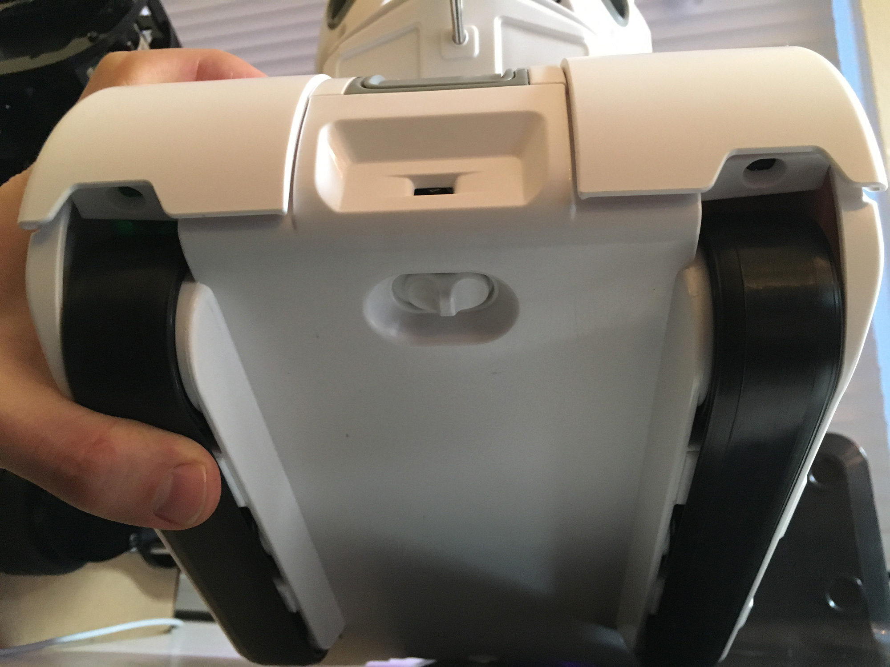
2. The Misty Robotics logo first appears on the screen. Then Misty’s eyes appear, beginning in a closed state. The eyes gradually open as Misty boots up.
3. When the eyes appear fully open, Misty is done booting up. This should take a little more than a minute. **Important!** If after a few minutes, Misty's eyes still do not appear fully open, contact technical support for assistance.

**Note:** Your Misty II prototype arrives with her battery charged and should not require additional charging before first use. When her battery is low, Misty may fail to respond to some API commands. If this happens you can restore functionality by connecting your robot to a power source and performing a manual reboot.

### Restarting Misty
If you need to restart Misty:
1. Turn off the power switch on Misty's base.
2. Wait 10 seconds.
3. Turn on the power switch on Misty's base again. Misty has rebooted when her eyes are fully open.

### Turning Misty Off
To turn off your robot, turn off the power switch on Misty’s base.

**Note:** There is no graceful shutdown at this time. When Misty’s battery gets below about 7 volts, she abruptly powers down.

**Note:** At this time, critical updates of Misty's underlying operating system platforms (e.g. Windows IoT Core) may occur without warning. If you see an image of gears on Misty's screen, be aware that she is going through a system update.

## Connecting to Wi-Fi

Now that you've turned on your robot, you can set up Misty's internet connection with the [Misty App](../../apps/misty-app/#connecting-misty-to-bluetooth-and-wi-fi) or the [Command Center](../../apps/command-center/#connecting-wi-fi).

## Charging Misty II

There are two ways to charge Misty II. You can use the wireless charging pad that comes with your robot, or you can plug the power supply directly into the power port on Misty's base.

Note that Misty does not need to be turned on during charging.

### Wireless Charging

To use Misty's wireless charging pad, follow these steps:

1. Connect the power supply to the power port on the back of the charging pad. 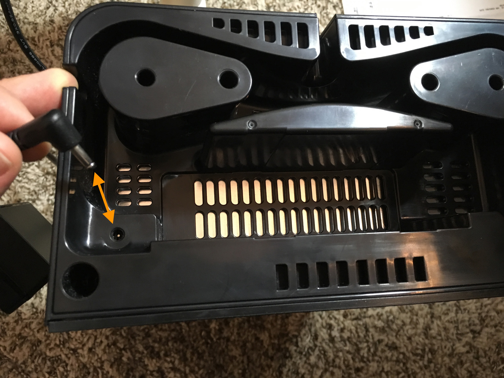
2. To prevent tripping hazards, place the power brick inside the charging pad and wrap any extra length of the power cable around the nodes inside the rear compartment, as seen in the photo below. 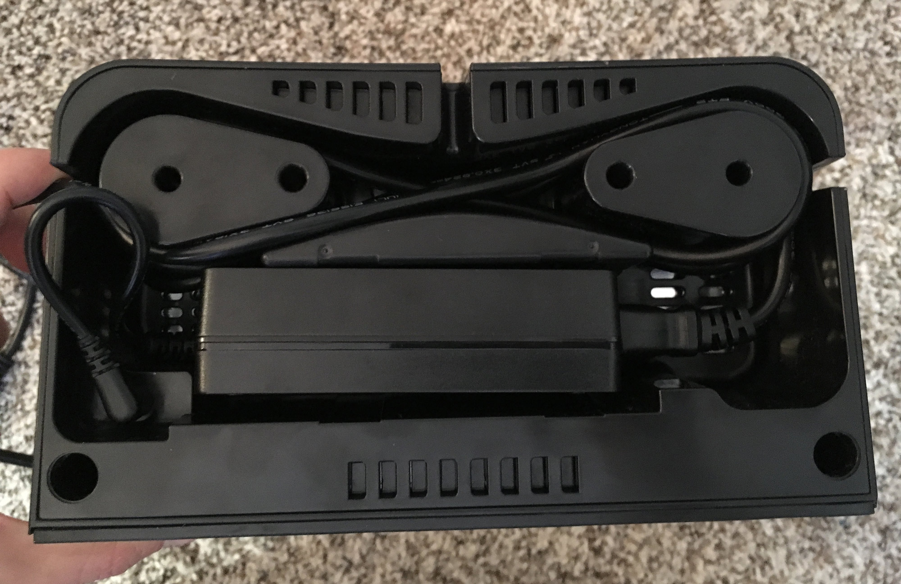
3. Place the charging pad on the floor.
4. Plug the power cable into the wall.
5. Place Misty on the center of the charging pad. Position her to be facing out, with her back against the rear compartment of the charging pad. 

**Note:** When Misty is turned on and charging the speed of her fan increases. If you don't hear the fan speed change, try adjusting her position on the pad.

### Wired Charging

You can also charge Misty by plugging the power supply directly into the power port. On Field Trial units, the power port is either on the back of Misty's base or on the bottom of Misty, next to her power switch.

### Misty's Battery

In the event that you need to check or reconnect Misty's battery, please read the following important notes:

* Always use the battery that came with your Misty II.
* Always use the same power supply that came with Misty II. Using a differently configured power supply creates a high risk of fire.

Follow the steps below to access the battery compartment and connect Misty's battery:

1. Remove the bump sensor covers from Misty's base. Use the indentation at the edge of the bump sensor covers to pry each cover off of Misty's base. Misty II has two front-facing and two rear-facing bump sensor covers. All four bump sensor covers must be removed.

   **Rear-Facing Bump Sensor Cover Removal:** 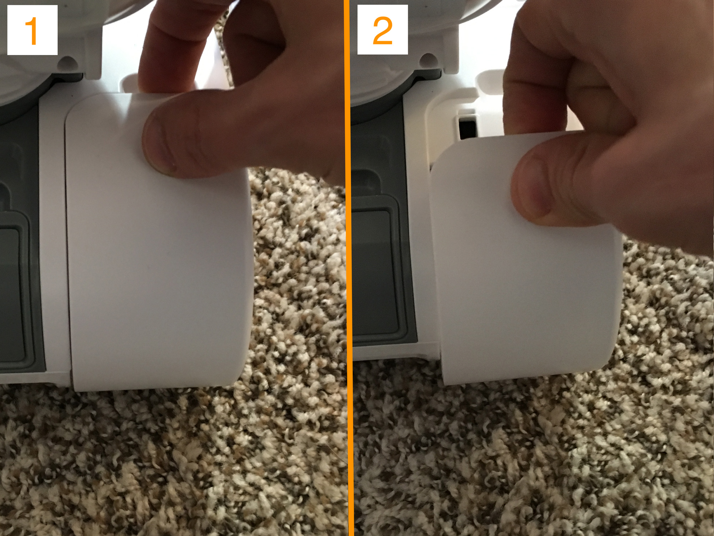 **Front-Facing Bump Sensor Cover Removal:** 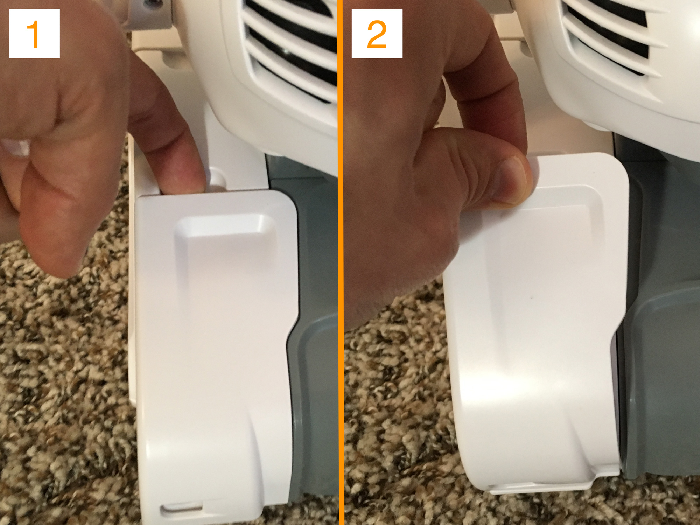

2. Once you’ve removed all four bump sensor covers, remove the screws that secure the white panels on each side of Misty's base. Each side panel is secured to the base by six screws, three beneath the front-facing bump sensor cover and three beneath the rear-facing bump sensor cover. 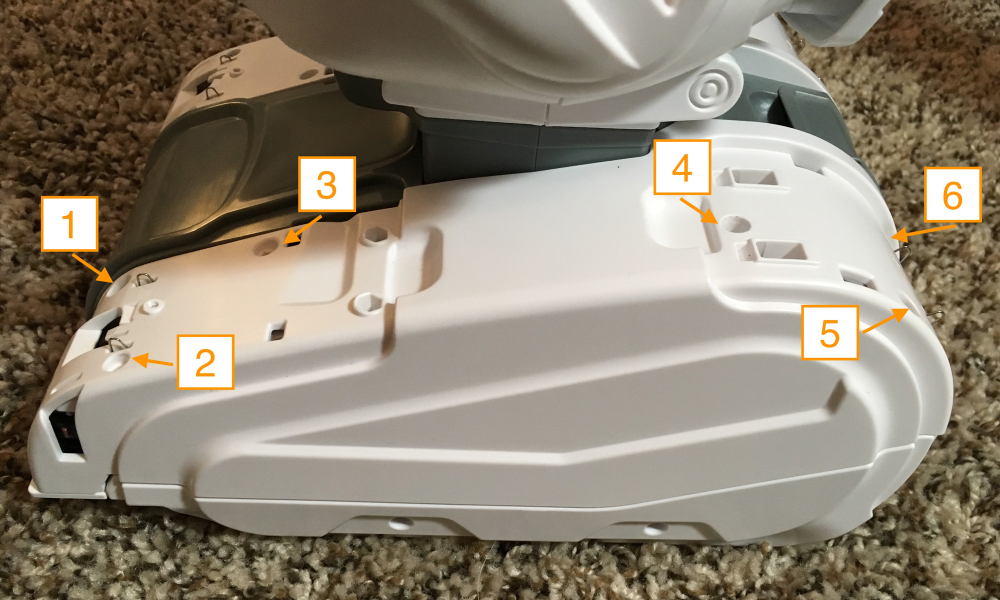
3. After you take out the screws, gently lift each side panel up and away from the robot. **Note:** If Misty's arms prevent you from removing the side panels, gently rotate them to an upward position to move them out of the way. 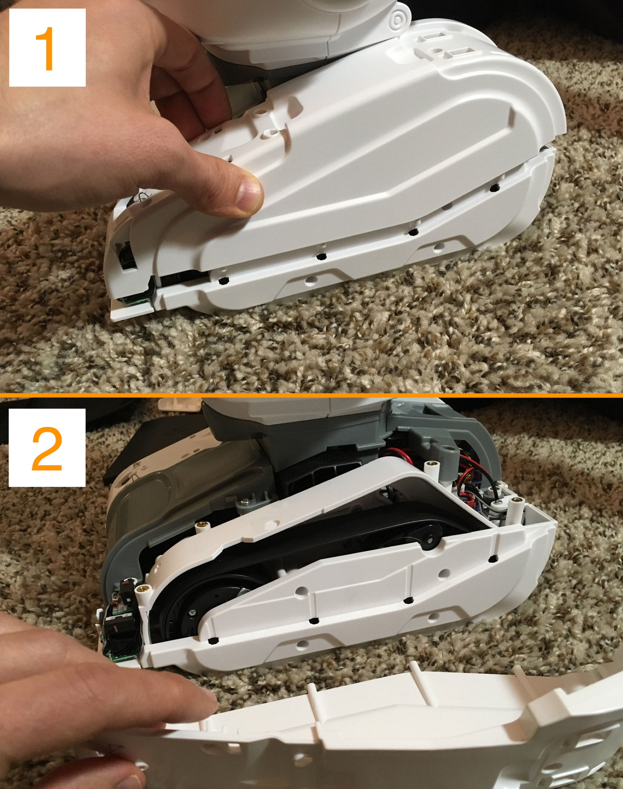
4. Remove the screws securing the gray panel beneath Misty's chest to the base. This panel has two screws, one either side of Misty's base. 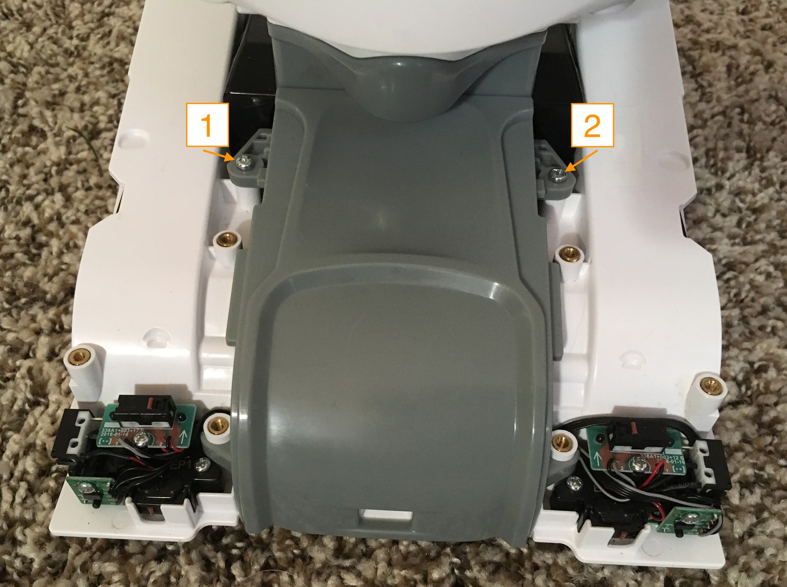
5. Remove the gray panel from the front of Misty's base to reveal the disconnected battery. 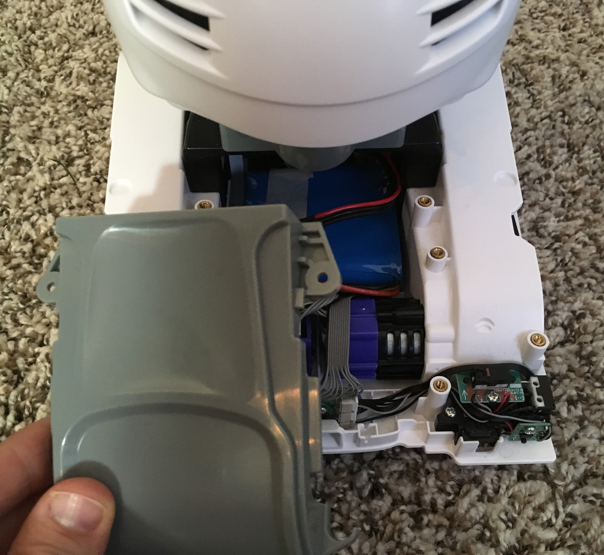
6. Remove the battery from Misty's base. 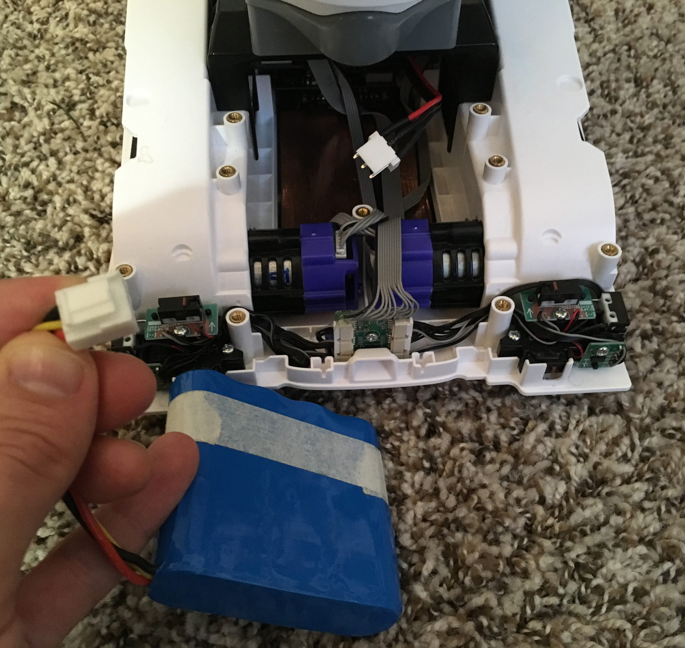
7. Connect the battery to Misty by pushing the white connectors together until you hear them click. 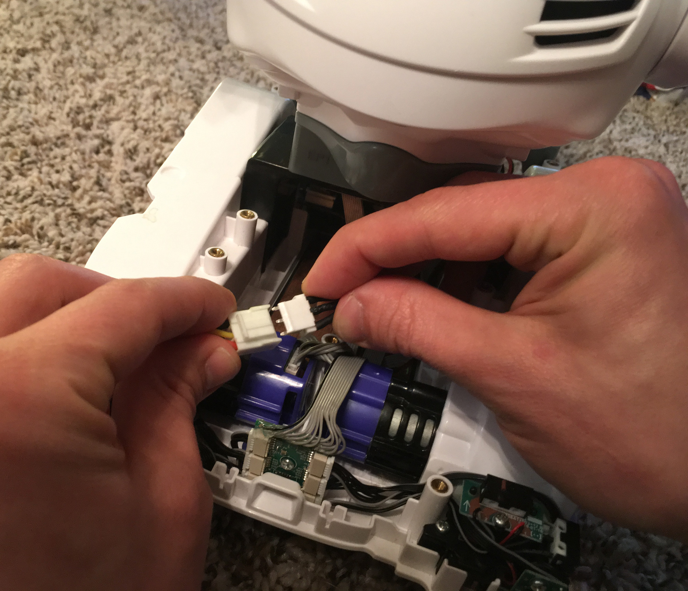
8. Place the battery back into the battery compartment. 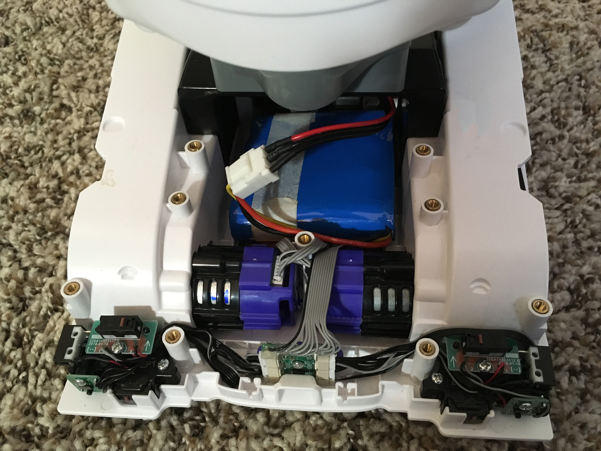
9. Starting with the front gray panel, replace each of Misty's base panels. Secure each panel with screws as you progress.
10. Replace the bump sensor covers. Line up the pegs on each cover with the holes in the side base panels and apply pressure until the covers click into place.

    **Front-Facing Bump Sensor Cover Placement** 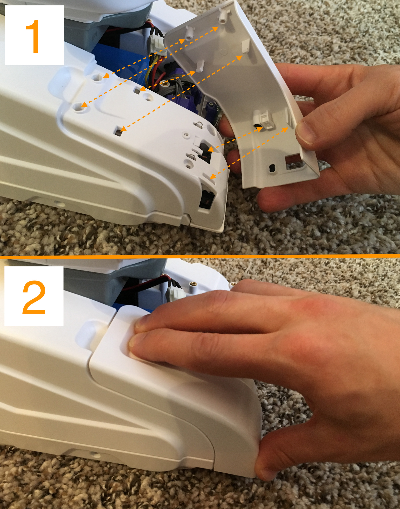
    **Rear-Facing Bump Sensor Cover Placement** 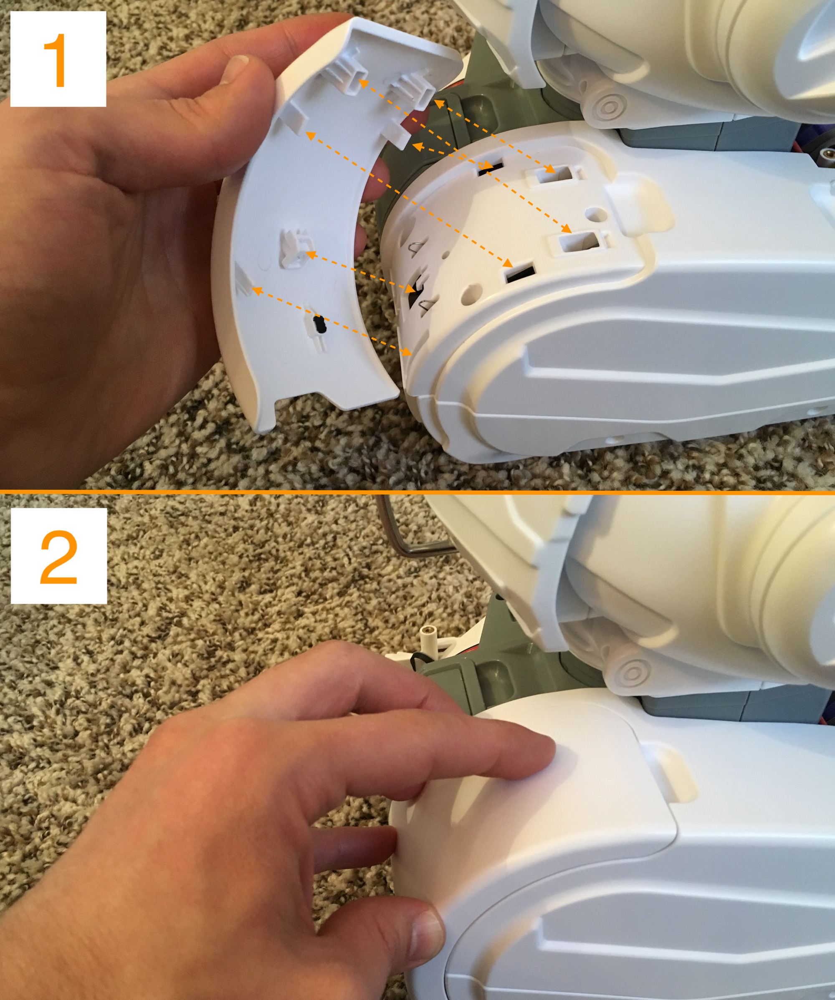

## Misty II Specs

Misty is packed with sophisticated hardware and software features that contribute to her ruggedness and extensibility as a platform.

### Size
* Height: 35.56 cm / 14 in
* Depth: 25.4 cm / 10 in
* Width: 20.32 cm / 8 in
* Weight: 2.7 kg / 6 lbs

### Processors
* Qualcomm® Snapdragon 820™ mobile processor
* Qualcomm® Snapdragon 410™ processor

### Computer Vision
* Occipital Structure Core depth sensor for 3D maps
* 166° diagonal field of view wide-angle Structure Core camera (106° horizontal x 60° vertical)
* 4K camera
* Facial recognition
* Deep-learning AI using Qualcomm® Snapdragon™ Neural Processing

### Sound
* 3 far-field microphones using Qualcomm® FluenceTM PRO 
* 2 high-fidelity speakers with engineered sound box and bass port

### Touch
* 6 capacitive touch sensors on head and chin

### Distance and Obstacle Detection
* 8 IR-based time-of-flight sensors (3 forward, 1 rear, 4 edge/downward)
* 10 bump sensors (3 tied in parallel on each front corner, 2 tied in parallel on each rear corner)

### Movement
* Patent-pending 3-degree of freedom neck
* Easily customizable moving arms
* Sturdy track-driving tread system
* Trailer hitch to pull a payload

### Display & Light
* 4” LCD image display/screen
* Bright LED flashlight
* Multi-color LED chest light

### Connectivity
* 2.4 and 5 Ghz WiFi connection
* Bluetooth and Bluetooth Low Energy capabilities 

### Extensibility

* USB/Serial-connected backpack for hardware extension
* Arduino-compatible Backpack (optional)
* Magnetic helmet connection point

### Operating Systems
* Windows IoT Core™ (Main)
* Android™ 8 (navigation/computer vision)

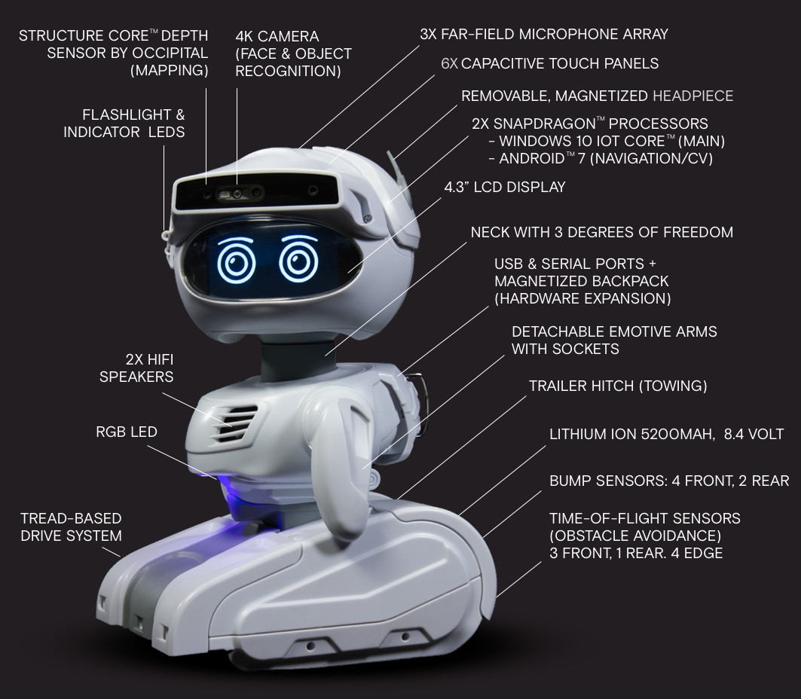

## System Updates

Misty checks for available system updates every time you turn her on or restart her. If you've not restarted her recently, you can check for and perform updates for Misty with the Misty App or Command Center.

Updates can include:

* Image and/or sound assets
* Motor controller firmware
* Real-time controller firmware
* Occipital Structure Core depth sensor firmware
* Home Robot application (running on Windows IoT Core)
* Sensory Services application (running on Android)
* OS updates

We recommend you check for updates on a weekly basis.

**Important:** Please keep Misty plugged in for the entire duration of the update and do not attempt to send commands to her during this time.

## Hazards System & Obstacle Avoidance

Misty's native hazards system is intended to prevent Misty from executing drive commands that would cause her harm, such as driving into obstacles or off of high surfaces.

The current version of the hazards system integrates with Misty's bump sensors to stop Misty from driving when a bump sensor is active. Future updates to the hazards system will incorporate data from Misty's front, rear, and downward facing time-of-flight sensors to help Misty avoid obstacles and to prevent her from executing commands that would drive her off of high surfaces.

## Hardware Extensibility

You can augment Misty's native capabilities by using external microcontrollers, sensors, and other third party hardware in your skills.

External hardware can connect to the Universal Asynchronous Receiver-Transmitter (UART) serial and Universal Serial Bus (USB) ports on Misty's back. Remove the magnetic backpack attachment to access these ports.

The USB port can be used with a USB-to-Ethernet adapter to connect Misty to your local network. Misty’s API/SDK does not currently have access to the USB port’s data interface, but this port can be used to supply power to external devices. The UART serial port enables communication between Misty's skills and an external device. The configuration of the pins on this port simplifies connection between Misty and her [Arduino-compatible backpack](../../../docs/robots/misty-ii/#misty-arduino-compatible-backpack). You can also connect your own microcontroller, a Raspberry Pi, or other UART serial-enabled hardware.

The UART serial and USB port channels have separate, isolated power controllers that allow Misty to supply power to external hardware. The USB port can provide up to 500 mA, and the pins for the UART serial port are configured as follows:

* **RX (receiver)**: Receives messages sent to Misty from an external device.
* **GND (ground)**: The grounding pin for the electrical circuit.
* **TX (transmitter)**: Transmits messages from Misty to connected hardware.
* **3V**: Supplies up to 1A of power to the connected hardware at 3.3v.

## Misty (Arduino-Compatible) Backpack

The Misty (Arduino-Compatible) Backpack is a microcontroller designed to connect to the UART serial port on Misty’s back in a plug-and-play fashion, without any modification.

**Note:** If you did not purchase the Misty (Arduino-Compatible) Backpack, the "backpack" shipped with your robot does not contain a microcontroller. You can still use Misty's generic backpack to extend her hardware by connecting your own external device to her UART serial port.

### Programming the Misty (Arduino-Compatible) Backpack

The Misty (Arduino-Compatible) Backpack uses a microcontroller pre-programmed with a bootloader that allows you to upload code exactly as you would with a normal Arduino, without requiring an external hardware programmer.

Follow these steps to use the [Arduino IDE](https://www.arduino.cc/en/Main/Software) to write programs for the Misty (Arduino-Compatible) Backpack:
1. Install the [Arduino IDE](https://www.arduino.cc/en/Main/Software).
2. Connect the Misty backpack to your computer via the backpack's USB micro port.
3. Open the IDE and select **Tools** from the top menu.
   * From the **Board** sub-menu, select **Arduino Pro or Pro Mini**.
   * From the **Processor** sub-menu, select **ATmega328P (3.3V, 8MHz)**. 
4. Write your sketch and upload it to the microcontroller.

For more information about writing a sketch, see the [reference materials](https://www.arduino.cc/reference/en/) and [tutorials](https://www.arduino.cc/en/Tutorial/HomePage) hosted on the Arduino website.

In the code you write for Misty's Arduino-compatible backpack (or any other Arduino microcontroller), you use the [Serial](https://www.arduino.cc/reference/en/language/functions/communication/serial/) library to configure communication between the microcontroller and Misty. In the `setup()` function of your sketch, use the [`Serial.begin()`](https://www.arduino.cc/reference/en/language/functions/communication/serial/begin) function to set the data transfer rate to 9600 baud. Then, in the `loop()` function, use [`Serial.println()`](https://www.arduino.cc/reference/en/language/functions/communication/serial/println) to send data to Misty.

```C++
void setup() {
  Serial.begin(9600);
}
  
void loop() {
    delay(1000);
    Serial.println("{\"message\":\"Hello!\"}");
}
```

We recommend formatting data you send as JSON string to make it easier to parse in your skill code.

To read messages sent to Misty, you register for [`SerialMessage`](../../../docs/reference/sensor-data/#serialmessage) events in your skill code. `SerialMessage` events occur when Misty receives a message through the RX pin of her UART serial port. By default, the data for `SerialMessage` events is processed by a `_SerialMessage()` callback function. You define how this callback handles the message in your skill code.

```JS
// Return the value of the "SerialMessage" property 
// in the SerialMessage data object
misty.AddReturnProperty("SerialMessage", "SerialMessage");

// Register for SerialMessage events.
// Set the debounce rate to 0, or use the 
// rate defined in the sketch.
// Set `keepAlive` to `true`, so the event 
// does not unregister after the first
// _SerialMessage() callback. 
misty.RegisterEvent("SerialMessage", "SerialMessage", 0, true);

function _SerialMessage(data) {
    try {
        if(data !== undefined && data !== null) {
            var obj = JSON.parse(data.AdditionalResults[0].Message);
            var message = obj.message;
        }
    }
    catch(exception) {
        misty.Debug("Exception" + JSON.stringify(exception));
    }
}
```

To send messages from Misty to an external device, you can use the [`misty.WriteSerial()`](../../../docs/reference/javascript-api/#misty-writeserial) function. If you are running your skill on a remote device, you can send a request to the REST endpoint for the [`WriteSerial`](../../../docs/reference/rest/#writeserial) command.
