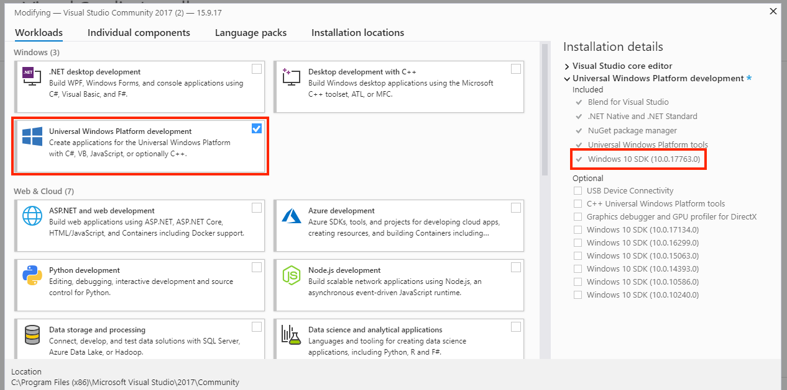

# {{title}}

Misty's .NET SDK provides a powerful set of tools for building and debugging skills using Visual Studio. This guide provides instructions on setting up Visual Studio and installing the C# skill template, so you can quickly start building your own .NET skills for Misty.

## Setting Up Visual Studio

Follow the steps below to install Visual Studio and the components required to build .NET skills for Misty.

{{box op="start" cssClass="boxed tipBox"}}
**Note:** The focus of this guide is setting up Visual Studio for .NET skill development on a PC or virtual machine running Windows 10. If you need more information about configuring Visual Studio to work with your environment, consult [Microsoft's guide to installing Visual Studio](https://docs.microsoft.com/en-us/visualstudio/install/install-visual-studio?view=vs-2019).
{{box op="end"}}

1. Download Microsoft [Visual Studio 2017](https://visualstudio.microsoft.com/vs/older-downloads/). Misty's .NET SDK is compatible with Visual Studio Community, which is freely available.
2. Install and run the Visual Studio Installer.
3. When choosing the workloads and components to install with your Visual Studio installation, check the box to install the **Universal Windows Platform development workload**. Under **Installation details**, make sure there is a checkmark next to the required **Windows 10 SDK** library (build 10.0.17763). 
4. Choose any additional workloads and components you'd like to use with Visual Studio and click **Install**.

{{box op="start" cssClass="boxed noteBox"}}
**Note:** If you already have Visual Studio installed, you may need to modify your installation to include the UWP development workload and the Windows 10 SDK library required to build .NET skills for Misty (see **step 3** above). To install these components, launch the Visual Studio Installer and click **Modify**. See Microsoft's documentation for [more details about modifying Visual Studio](https://docs.microsoft.com/en-us/visualstudio/install/modify-visual-studio?view=vs-2017).
{{box op="end"}}


With Visual Studio set up, you're ready to start building .NET skills for Misty. Follow the instructions below to install the C# skill template, or download the `IntroSkillsTask` solution to explore a sandbox of pre-built .NET skills!

## Using the C# Skill Template

The quickest way to build a .NET skill from scratch is to use the C# skill template for Visual Studio. When you use this template, Visual Studio installs Misty's .NET SDK libraries and creates a new C# project with the background task and skill code files you need to build a .NET skill.

### Installing the Template

Follow these steps to install the .NET skill template from Visual Studio:

1. Launch Visual Studio 2017.
2. Select **Tools &rarr; Extensions and Updates** from the top menu.
3. Select **Online** from the left menu, and type **misty robotics** into the search bar.
4. Locate **MistyRobotics.MistySkillExtension** in the results. Click **Download**.

When the download completes, you must restart Visual Studio for your changes to take effect. Close Visual Studio and follow the prompts in the VSIX installer to finish installing the template.

### Creating a .NET Skill Project

With the template installed, you can follow these steps to create a new project for your C# skill:

<!-- TODO: Update Misty Native Skill to new project name. -->
1. Launch Visual Studio 2017
2. Select **Create a new project…** from the **New project** section.
3. Navigate to **Installed &rarr; Visual C#** in the left menu. Select **Misty Native Skill** from the results.
4. Enter a name for you project and solution.
5. Click **OK** to create the project.

Visual Studio uses the template to create a solution and project for your C# skill. The project is structured as follows:

```
|-- <MySkillName>
|	|-- Properties
|	|	|-- AssemblyInfo.cs
|	|	|-- Default.rd.xml
|	|-- References  // MistyRobotics SDK & other libraries
|	|-- MistyNativeSkill.cs // Your skill code
|	|-- <MySkillName>_TemporaryKey.pfx
|	|-- Package.appxmanifest
|	|-- StartupTask.cs // Background task wrapper for your skill
```

