# {{title}}

When you use the API Explorer in your browser, you can use Misty's API endpoints to try Misty out, without writing any code. We recommend using the API Explorer with the following browsers: Safari, Chrome, Firefox, and Microsoft Edge (latest versions).

**Note: It's not generally recommended for multiple users to each use a separate instance of the API Explorer to connect and send commands to a single Misty robot. If more than one person does connect to Misty at the same time, as in a class or group development environment, people will need to take turns sending commands, or Misty may appear to respond unpredictably.**

## Setting up the API Explorer
As with the companion app and Blockly, when using the API Explorer, **make sure your computer and Misty are on the same Wi-Fi network** and using Bluetooth. 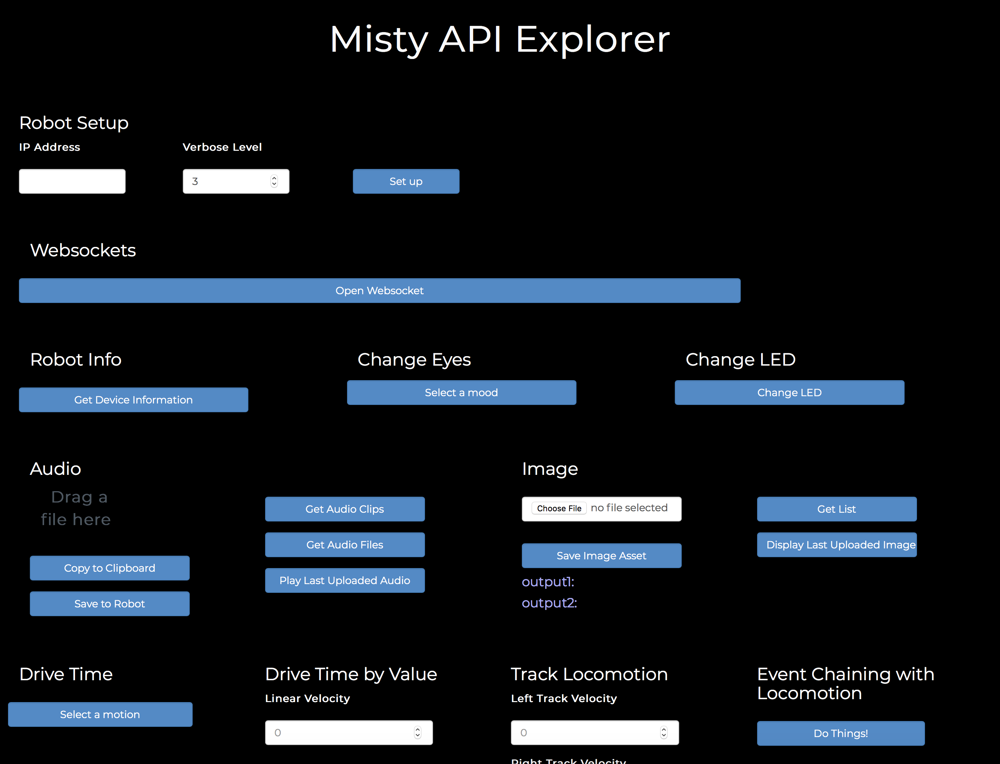

1. [Open up the API Explorer](http://api-explorer.mistyrobotics.com) in a browser window. The API Explorer should look like the screenshot above.
2. Enter the IP address of your robot from the Info tab of the companion app and click the **Connect** button. Look for the message "Connected successfully" to appear at the bottom of the API Explorer window.
3. Experiment with changing the color of the LED on Misty's chest or changing her eyes by selecting a different mood.
4. To view data provided by the **Get Device Information** or **Get Log Information** buttons, open the JavaScript console for the browser window. (Note that how you open the console varies among browsers and platforms.)

## Managing Audio and Image Files
Misty comes with a number of default system image files that display on her screen, as well as default audio files that she can play. To add your own sounds and images to Misty, follow these steps.

**Note: The processes for working with audio and image files on Misty are the same, with the exception that image files can be downloaded to your computer from the API Explorer.**
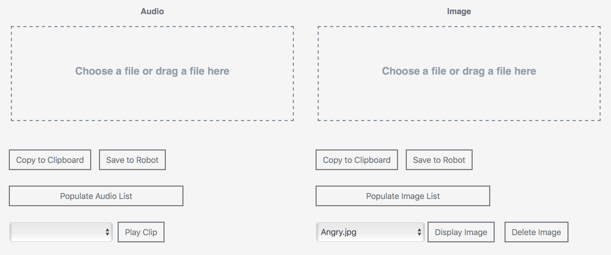

### Adding a custom audio or image file to Misty
Would you like to have Misty sing a song or play a particular sound when her face recognition identifies someone in particular? What about giving her some custom eyes or other interesting images for her display?

**Note:**
* **For images, valid file types are .jpg, .jpeg, .gif, and .png. Because Misty does not adjust the scaling of images, for best results use an image with proportions similar to that of Misty's screen (480 x 272 pixels).**
* **For audio, you can upload all file format types, however Misty cannot currently play OGG files.**
* **The maximum size for both audio and image files is 3 MB.**

1. To select a file to upload to Misty, either drag a file into the rectangular drop area or click the **Choose a file...** text and browse for the file on your computer.
2. After you choose a file, select the **Save to Robot** button. A message pops up to confirm the file is being saved.
3. Once the upload is complete, you can confirm your file has been saved by clicking the **Populate Audio List** or **Populate Image List** button. Scroll through the list to find the file you just saved.

### Playing audio files
1. Click the **Populate Audio List** button to get a list of the current audio files saved to your robot.
2. Choose the listed file to play. 
3. Click the **Play Clip** button to hear Misty play the clip, or click the **Play Clip in Browser** button to hear it in your browser.

### Displaying and downloading images
1. Click the **Populate Image List** button to get a list of the current image files saved to your robot.
2. Choose the listed file to display or download.
3. Click the **Display Image on Robot** button to see the image appear on Misty's screen, or click the **Show Image Below** button to view the image in your browser.
4. Click the **Download Image** button to download the chosen image to your computer.

### Deleting a custom audio or image file from Misty
Misty getting a bit overloaded with custom files? It's easy to tidy her up again.

1. Click **Populate Audio List** or **Populate Image List** to obtain a list of the audio or image files you've saved to Misty.
2. Choose a listed file to delete. **Note: You can only delete audio or image files that you have previously uploaded to Misty. The API Explorer posts an error if you attempt to remove one of Misty's default system files.** 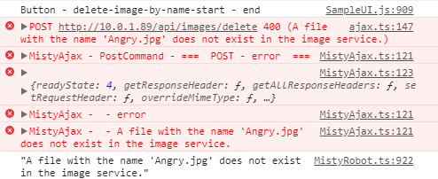
3. Click the **Delete Clip** button to delete the audio file, or the **Delete Image** button to delete an image file.
4. Refresh your screen and reconnect API Explorer to your robot.
5. Click the **Populate Audio List** or **Populate Image List** button. The file you deleted should no longer be included in the list.

### Using the API Explorer to obtain byte array strings from audio or image file data 
There is an option in the API explorer to convert audio or image file data to a byte array string and copy it to the clipboard. This is handy if you are using the REST or JavaScript commands `SaveAudioAssetToRobot` or `SaveImageAssetToRobot`, because these APIs require you to pass in raw file data.

1. To select a file to convert, either drag a file into the rectangular drop area or click the **Choose a file...** text and browse for the file on your computer.
2. After you choose a file, a checkbox appears under the white rectangle. Click that checkbox to confirm the file to convert.
3. Click the **Copy to Clipboard** button. A message pops up to confirm that your file is being copied.

## Driving Misty
There are a variety of ways to use the API Explorer to drive Misty.
 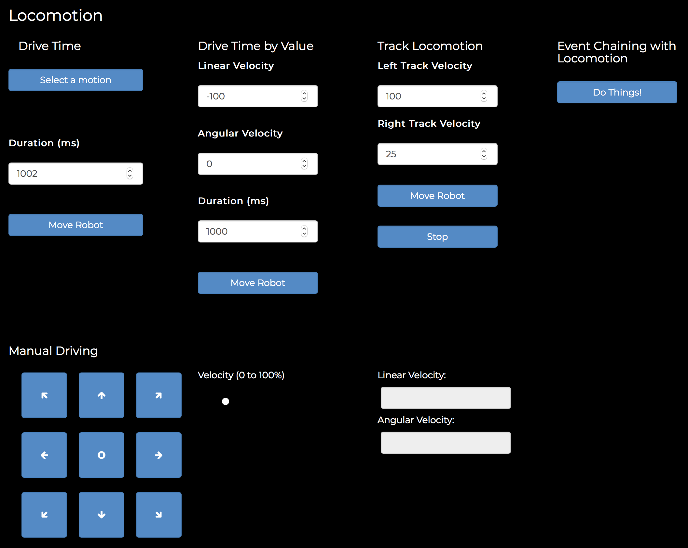

### Drive Time
1. First, use **Select a motion** to select the driving motion you want Misty to perform.
2. Use the **Duration (ms)** control to specify the amount of time Misty should drive.
3. Click **Move Robot**. Misty will stop driving automatically when the time is up.

### Drive Time by Value
Using this command allows you to drive Misty forward or backward at a set speed, with a given rotation, for a specified amount of time.

When using **Drive Time by Value**, it helps to understand how linear velocity (speed in a straight line) and angular velocity (speed and direction of rotation) work together:

* Linear velocity (-100) and angular velocity (0) = driving straight backward at full speed.
* Linear velocity (100) and angular velocity (0) = driving straight forward at full speed.
* Linear velocity (0) and angular velocity (-100) = rotating clockwise at full speed.
* Linear velocity (0) and angular velocity (100) = rotating counter-clockwise at full speed.
* Linear velocity (non-zero) and angular velocity (non-zero) = Misty drives in a curve.

1. Use the **Linear Velocity** control to set the speed Misty travels in a straight line. The control can be set from -100 (full speed backward) to 100 (full speed forward).
2. Use the **Angular Velocity** control to set the speed and direction of Misty's rotation. The control can be set from -100 (full speed rotation clockwise) to 100 (full speed rotation counter-clockwise). **Note: For best results when using angular velocity, we encourage you to experiment with using small positive and negative values to observe the effect on Misty's movement.**
3. Use the **Duration (ms)** control to specify the amount of time Misty should drive.
3. Click **Move Robot**. Misty stops driving automatically when the time is up.

### Manual Driving
You can use these controls to drive Misty in a variety of directions.
 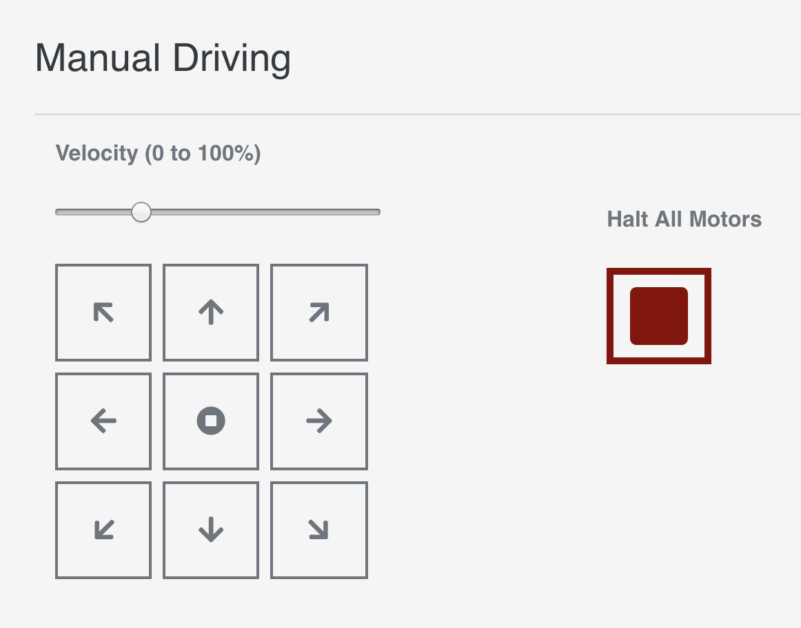

1. Click a directional button, and Misty will start driving.
2. Adjust the **Velocity** level, if she is going too quickly or too slowly.
3. Use the center control to stop driving.

## Opening a WebSocket
Real-time data from Misty is sent via WebSocket connections and includes:
* movement, location, and proximity information
* battery status
* face detection and recognition

The data that's sent over WebSocket connections is described in detail [here](/onboarding/creating-skills/writing-skill/#websocket-connections). See [our GitHub repo](https://github.com/MistyCommunity/MistyI/tree/master/Skills) for examples of [programmatically subscribing](/onboarding/creating-skills/writing-skill/#sending-commands-and-subscribing-to-websockets) to WebSocket data to [create skills](/onboarding/creating-skills/writing-skill) for Misty.

When you use the API Explorer to open WebSocket connections, you can view live data from Misty in your browser's JavaScript console. (How you open the console will vary among browsers and platforms.)

Select **Show Sensors** to view the available sensor websockets.
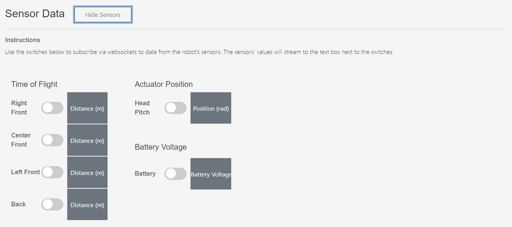

### Subscribing to Time of Flight data
You can view a stream of distance data from Misty I's four time-of-flight sensors in the API Explorer. For an example of obtaining time-of-flight data from Misty programmatically, see [this article](https://community.mistyrobotics.com/t/using-websockets-in-js-to-subscribe-to-time-of-flight-data/313).

1. In the **Sensor Data** area, locate the **Time of Flight** controls.
2. Toggle the switch on for the sensor position for which you want to view distance data.
3. You can see the time-of-flight sensor's data in the corresponding **Distance (meters)** field.

### Subscribing to Battery data

1. In the **Sensor Data** area, find the **Battery Voltage** controls.
2. Toggle the **Battery** switch on.
3. You can see data from Misty's battery sensor in the **Battery Voltage** field.

### Subscribing to Other WebSocket data

1. Find the **Other WebSockets** controls in the API Explorer. 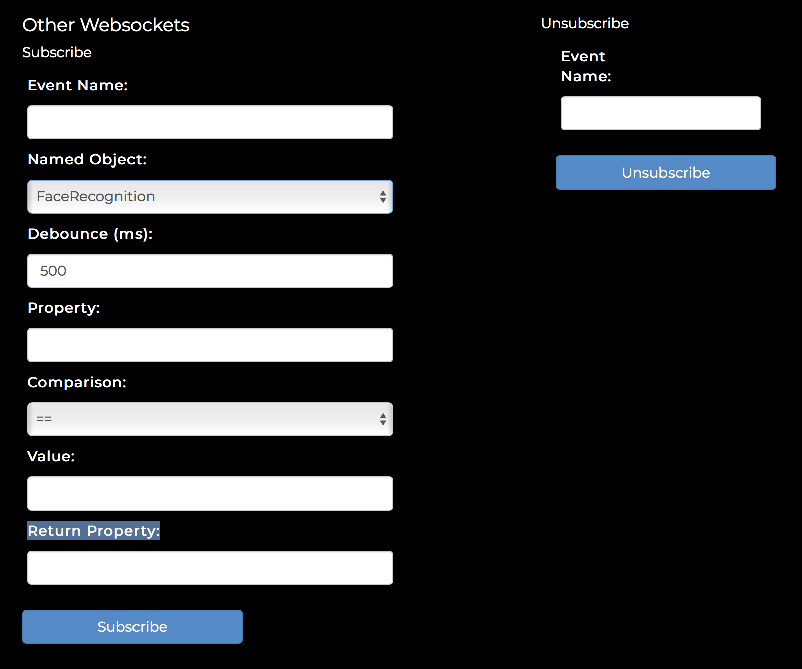
2. Select a WebSocket to monitor from the **Named Object** list. **Note: Named Object is the only required field.** The other fields are optional:
   * **Event Name**: [Optional] Provide a name for this subscription. If no name is specified, the value for **Named Object** is also used for the **Event Name**.
   * **Debounce**: [Optional] Provide the minimum amount of time between data events.
   * **Property, Comparison, Value, Return Property**: [Optional] These allow you to set filters for the data of interest and the data returned. See the instructions in the API Explorer for more details. 
3. Click **Subscribe**.
4. When you are finished, go to the **Unsubscribe** controls. In the **Event Name** field, enter the name of the Named Object to which you subscribed (or the Event Name if you provided one). 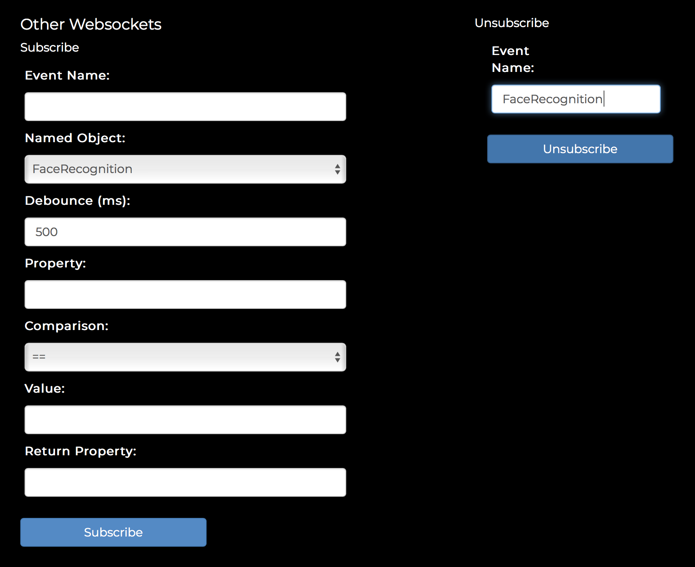
5. Click **Unsubscribe**.

## Face Training & Recognition - BETA
Misty's ability to recognize faces is under development. To try face training and recognition, follow these steps.

1. Make sure that your robot is connected to the API Explorer and that the light on Misty’s HD camera (located above her eyes on Misty I) is solid blue.
2. In the **Beta Commands** section, go to **Computer Vision** and enter a name in the **Face Training** input box. 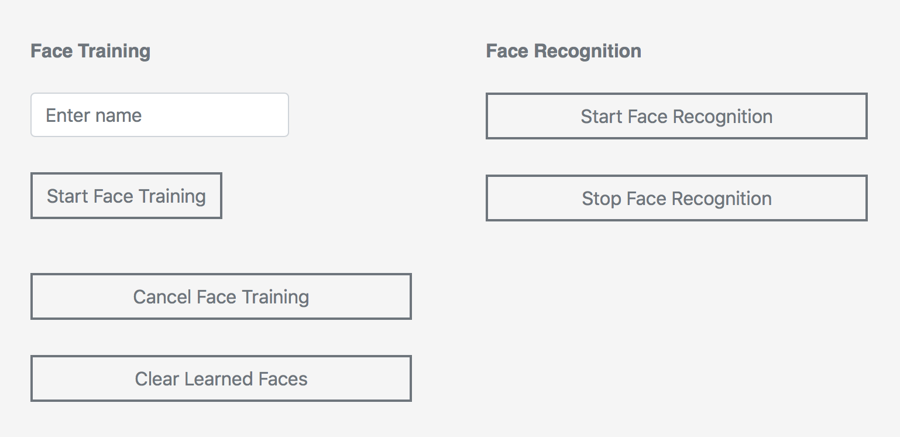
3. Position a single person’s face in a well-lit area 1-6 feet from Misty’s camera. Do not attempt to train Misty to recognize more than one person at the same time.
4. Click **Start Face Training** and wait 10-15 seconds. There is no need to click **Cancel Face Training**, unless you want to stop the process before it completes. You can observe the main API Explorer browser tab (not the JavaScript console) for pop-up status messages during the face training process. **Note**: Due to network variability, there can be up to several seconds of lag time between when you begin face training and when any status messages appear.
5. Once you've trained Misty on a person's face, you can click **Start Face Recognition**.
6. Position the person’s face in a well-lit area front of the camera.
7. Open the JavaScript console for the browser window. (Note that how you open the console varies among browsers and platforms.) Watch the browser console for face recognition data to come through. Face recognition data is sent at a rate of about once per second, but this timing may vary significantly.
8. When finished, click **Stop Face Recognition**.

**Note: The face detection and recognition data that Misty sends is described in detail [here](/onboarding/creating-skills/writing-skill/#websocket-connections).**

## Moving Misty's Head - BETA
You can use the API Explorer to move Misty's head with the following controls:
* **Move Head**
* **Set Head Position**

**Note: Misty I only provides movement along one axis: pitch. This means that up and down motions are all that can be controlled for Misty I.**
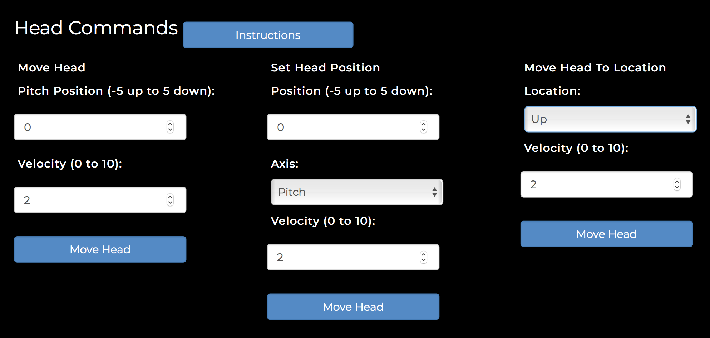

## Taking Pictures - ALPHA

Misty can take pictures with her 4K camera as well as the ultra-wide vision camera on her Occipital Structure Core depth sensor. 

**Note: Images captured with these cameras are not saved to Misty's memory. To save photos taken with one of these cameras to Misty, follow the directions below to download these photos to your computer, then use the **Asset Management** controls in the API Explorer to save them to your robot.**

Use the **Camera** controls to take a picture with Misty's 4K camera.
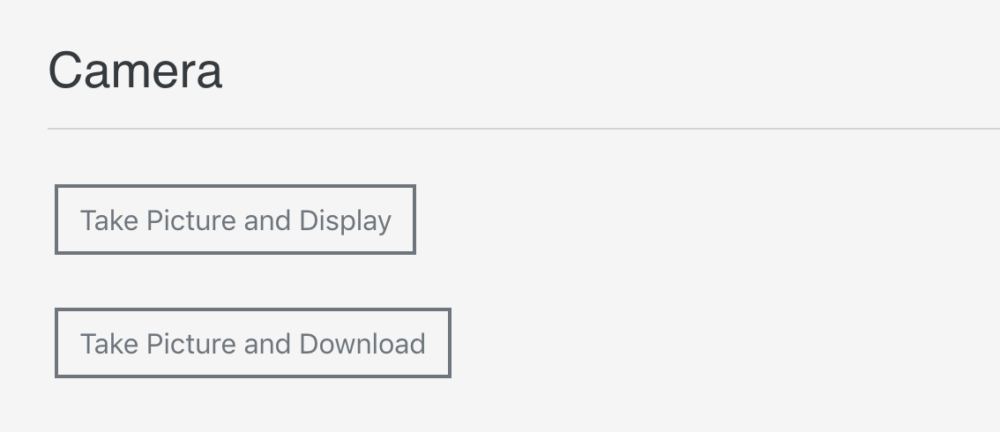

Click **Take Picture and Display** to take a picture and display it in your browser, or click **Take Picture and Download** to download the picture to your computer.

Use the **Depth Sensor Data** controls to take a black-and-white photo with the camera on Misty's Occipital Structure Core depth sensor.
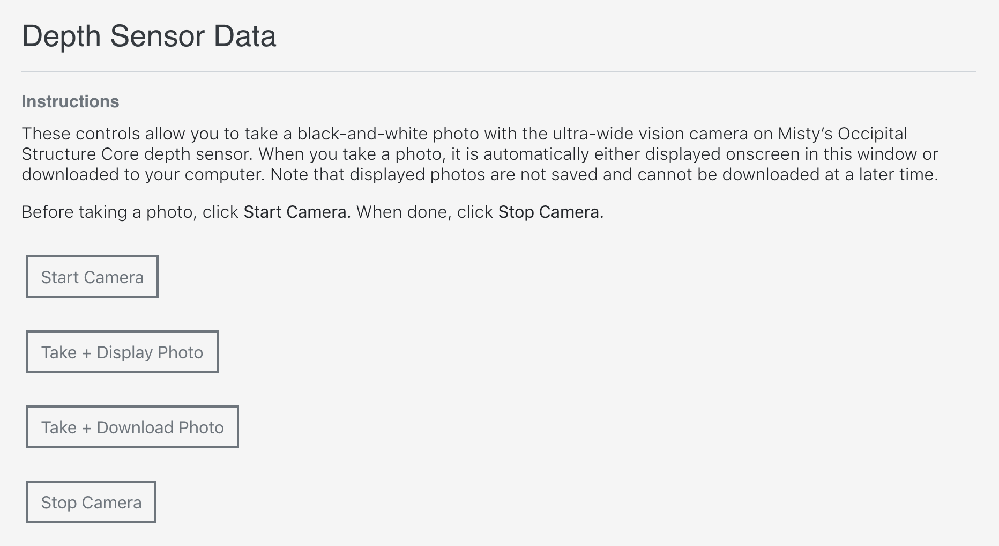
Follow these steps to take a photo with this camera:
1. Click **Start Camera** to turn on the data stream from the depth sensor.
2. Click **Take + Display Photo** to take a photo and display it in your browser, or click **Take + Download Photo** to download the photo to your computer.
3. Click **Stop Camera** to turn off the data stream when you are done using this camera.

## Mapping & Tracking - ALPHA

Misty can generate a map of your home or office, track her location on a map, and follow a path you specify. The first step in any of these is to ensure that Misty has "pose". Having pose means Misty knows her location and orientation in space, in X,Y coordinates.

**Note: The software that runs the Occipital sensor for mapping and tracking is alpha. Experiment with mapping, but recognize that it is unreliable at this time.**

**Important! For Misty's maps, the origin is at the bottom right corner. X is the direction the robot is looking at the start of mapping and is read from the bottom of the map to the top of the map. Y is read from right to left, with zero being on the right side of the map.**

### Obtaining Pose
Before attempting to map or track, you must obtain pose.

1. If the API Explorer is not already connected to your robot: At the top of the API Explorer window, enter the IP address of your robot (from the Info tab of the companion app) and click the **Connect** button. Look for the message "Connected successfully" to appear at the bottom of the API Explorer window. 
2. Ensure Misty is in a well-lit (not dark) environment.
3. Scroll down to **Alpha** and find the **Mapping** section. 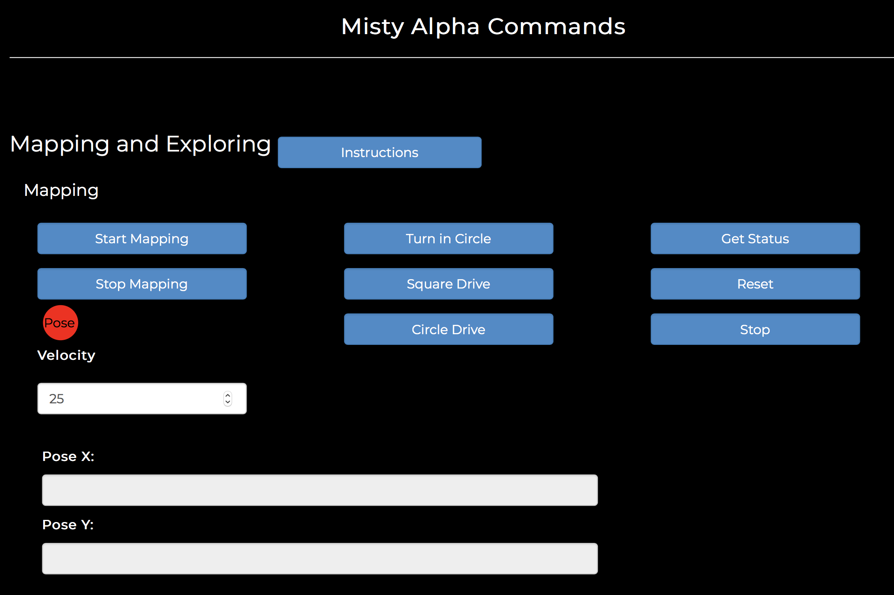
4. Click **Get Status** and see what Misty's status is. You can see the results of clicking **Get Status** either from a status message that pops up on the bottom of the page or by opening the browser's JavaScript console (how you open the console varies among browsers and platforms). 
5. If Misty's status is other than "Ready", click **Reset**, then click **Get Status** again. _Note: If Misty's status does not return as ready after multiple **Reset** and **Get Status** commands, [restart Misty](../../get-started/powering-up-down/#restarting-misty) and start these instructions over._
6. You are now ready to follow the instructions below and start either mapping or tracking. Once you do begin mapping or tracking, if the **Pose** indicator stays red:
  * Verify that the mapping sensors are working. The Occipital Structure Core depth sensor near Misty’s right eye should be glowing blue.
  * Increase the lighting.
  * Confirm that Misty has not lost her Wi-Fi or Bluetooth connection. To do this, open Misty's companion app. If she has lost Bluetooth, the app will ask you to reconnect.

### Mapping
When mapping, drive slowly to give the mapping system the best chance to fill in all details. Slowing Misty down increases mapping effectiveness. When possible, making wider turns also improves mapping results.

**Note: Every time you create a new map, the former map is deleted. You can use the API to get a map and back it up, if desired.**

**Note: If Misty loses pose after generating a map, she will need to generate a new map and start over.**

1. Follow the above instructions to obtain pose.
2. Click **Start Mapping**. After a few seconds, the **Pose** light should turn from red to green. If it does not turn green, follow the instructions to obtain pose above, then try again.
3. Select one of the drive options (**Turn in Circle**, etc.) or use the **Locomotion: Manual Driving** controls to drive Misty yourself. Move Misty SLOWLY around a small space (start with an area no more than 20’ x 20’).
4. If **Pose** stays green, allow Misty to build a complete map of the area she's in. _If **Pose** turns from green to red while you are mapping, try the following:_
    * Click **Stop**, then try driving Misty backward for a second. Wait a few seconds and see if she gets pose again.
    * If that doesn't work, click **Stop Mapping**, then click **Start Mapping** again.
5. When done driving, click **Stop**.
6. Click **Stop Mapping**.
7. Scroll down to the **Map** section and click **Get Map**. 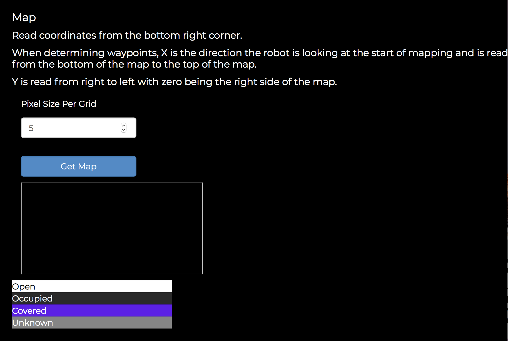

### Tracking & Following a Path - ALPHA
You can have Misty track where she is on a map that she has already created or track without a map. You can also have Misty follow a set path by giving her X,Y map data from a map she has previously generated.

**Important! For Misty's maps, you read coordinates from the bottom right corner. X is the direction the robot is looking at the start of mapping and is read from the bottom of the map to the top of the map. Y is read from right to left, with zero being on the right side of the map.**

To track: 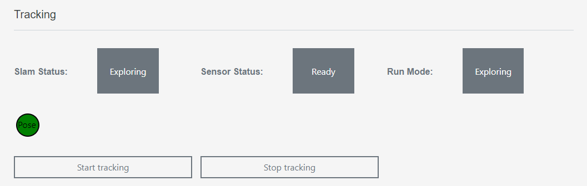
1. Follow the above instructions to obtain pose.
2. Click **Start Tracking** and begin driving Misty. Activating tracking provides pose data in the SelfState websocket for where Misty is on the map you previously generated. Or, if you have not previously generated a map, Misty sets her beginning tracking position as 0,0.
3. If **Pose** turns from green to red while Misty is moving, try backing Misty up for a second and see if she gets pose again.
4. Click **Stop Tracking**.

To follow a path on a map: 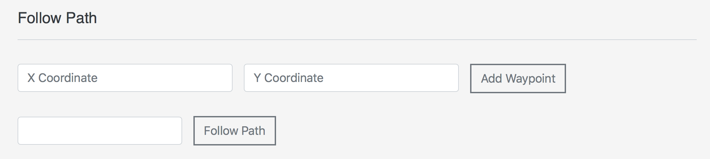
1. Ensure that Misty still has pose.
2. Either:
  * Supply individual X,Y value pairs and click the **Add Waypoint** button to add these individual waypoints to a path.
  * Use the field next to the **Follow Path** button to input an entire path of X,Y values, then click **Follow Path**. A path of waypoints should be entered in the form of X1:Y1,X2:Y2,X3:Y3.

## System Updates
You can use the API Explorer to perform over-the-air (OTA) updates for Misty. We recommend you check for updates weekly. To find the version number(s) for the most recent system updates, see the release notes on our [Community site](https://community.mistyrobotics.com/c/development/misty-I). 

**Important: Please keep Misty plugged in for the entire duration of the update and do not attempt to send commands to her during this time.**

To perform an update:
1. First make sure that Misty is plugged into a power source and is connected to the Internet.
2. If the API Explorer is not already connected to your robot: At the top of the API Explorer window, enter the IP address of your robot (from the Info tab of the companion app) and click the **Connect** button. Look for the message "Connected successfully" to appear at the bottom of the API Explorer window. 
3. Scroll down to the bottom of the API Explorer window and find the **System Updates** section. Click **Check for Updates**. It may take a few seconds, but a message will pop up on the bottom of the window telling you if your Misty has any updates available. 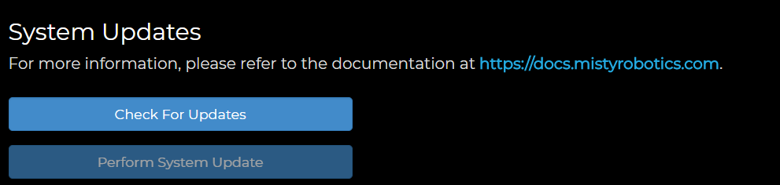
4. If there are updates available, click **Perform System Update**. Misty will begin downloading the update in the background. The download itself may take several minutes to an hour, depending on the speed of your Internet connection. **Note: During the download and update, Misty is still functional, however it is NOT recommended to send any commands to Misty or drive her during this process.**
5. The update process may take up to a half hour total. **The update process is not complete until Misty restarts and her happy eyes re-appear.**  
6. If your robot consistently fails to update, there may be a loose or faulty connection on Misty's headboard or real-time controller board. To check these connections, visually inspect the connectors on the headboard first, near the location indicated below.  Then check the connectors on the real-time controller board, indicated below. 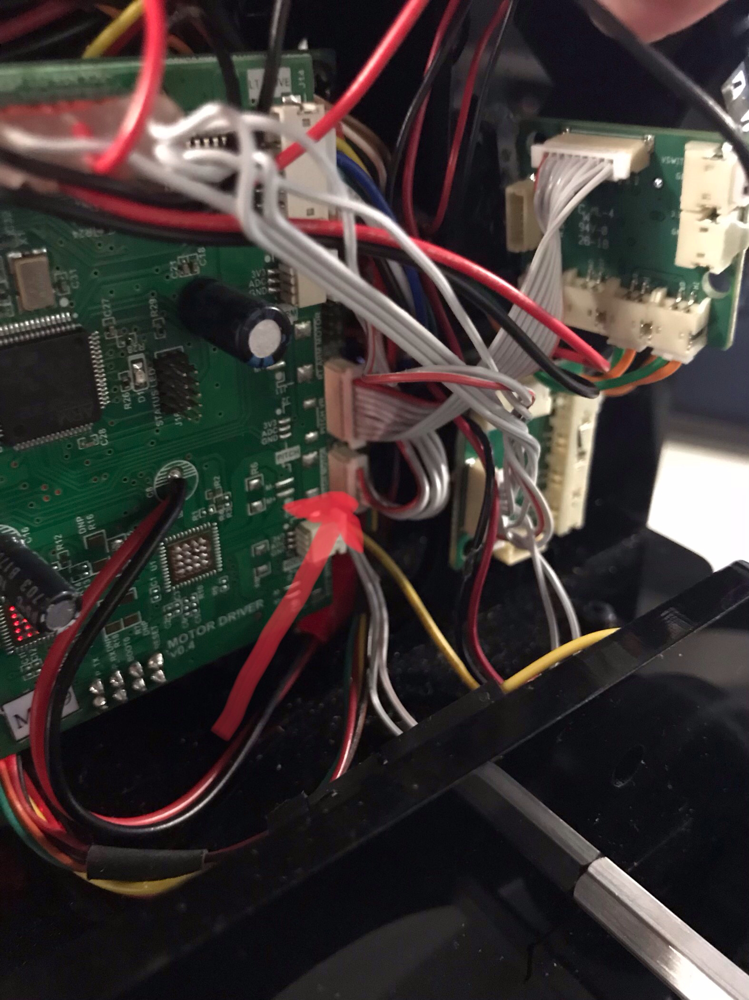
Please contact Misty's support team if the connections on either of these boards appear loose or broken.

## Connecting WiFi
While it’s usually easiest to use the [Misty Companion App](/onboarding/3-ways-to-interact-with-misty/companion-app) to connect Misty to your home WiFi network, sometimes there can be issues with this method. In that case, you can use the API Explorer and the USB-to-Ethernet adaptor that came with your robot to connect Misty instead.

1. Connect the adapter from your network router to your computer. Do not connect the adapter to Misty yet.
2. Use the command line to find the IP address of the adapter.
  * On Apple/Unix, open a command-line tool, enter `ifconfig` and find the Ethernet adapter and its IP address in the list of results. **Note**: On a Mac you may also be able to find the IP address under **System Preferences > Network**.
  * On Windows, open the command prompt, enter `ipconfig`, and find the Ethernet adapter and its IP address in the list of results.
3. Once you have the IP address for the adapter, unplug the USB end of the adapter from your computer and re-plug it into the USB port on the back of your robot. Keep the other end plugged into your router.
4. Open the API Explorer and connect to your robot by entering the IP address and clicking **Connect**. Look for the message "Connected successfully" to appear at the bottom of the API Explorer window.
5. Scroll down to the bottom of the API Explorer page to the **Connect WiFi** section. Enter your WiFi network credentials here and click **Connect to WiFi.** The process can take a few minutes. 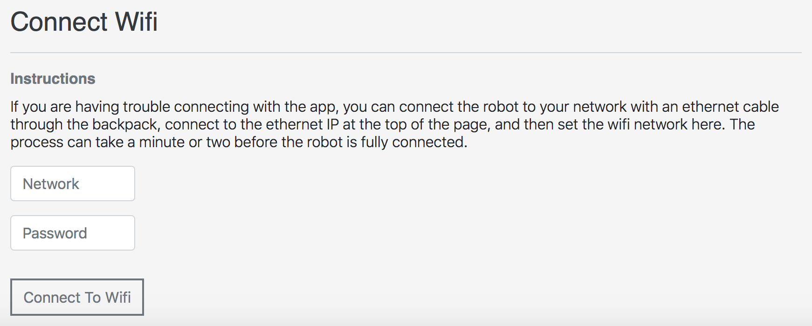

**Note: Occasionally the IP address for the adapter changes after the first use. If this happens you can use the MAC address printed on the adapter and enter the following commands to obtain the IP address:**
  * Apple/Unix: `arp -a | grep <MAC ADDRESS>`
  * Windows (in a Powershell window): `arp -a | select-string <MAC ADDRESS>`

