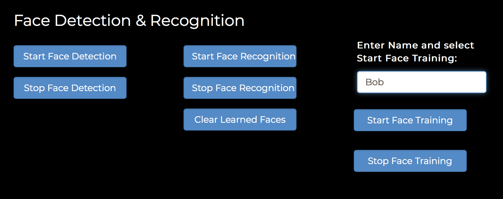
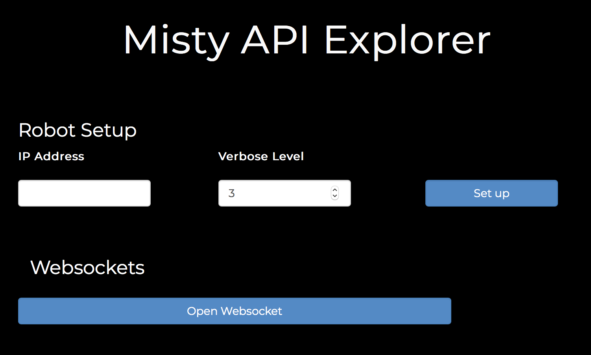

# {{title}}

Misty currently has 51 API endpoints. When you use the API Explorer in your browser, you can use these endpoints to try Misty out, without writing any code. We recommend using the API Explorer with the following browsers: Safari, Chrome, Firefox, and Microsoft Edge (latest versions).

## Programming Misty with the API Explorer

As with the companion app and Blockly, when using the API Explorer, make sure your computer and Misty are on the same Wi-Fi network and using Bluetooth.

1. [Download the API Explorer](https://s3.amazonaws.com/docs.mistyrobotics.io/assets/files/Misty.API.zip). Unzip the download and open the index.html file into your browser. You should see the API Explorer looking like the screenshot above.
2. Get the IP address of your robot from the Info tab of the companion app. Enter that IP address and hit the “Set up” button.
3. Confirm the browser is connected to your robot via its IP address:
    * Open your browser’s JavaScript console. (How you do this will vary among browsers and platforms.)
    * Click “Get Device Information” in the API Explorer.
    * You should see information relevant to your robot (such as the IP address) in the browser console. This confirms you’re connected.
4. Select the amount of console messages you’ll receive by setting the Verbose Level (1-3). Selecting 3 will give you a console message for each method in all 3 classes, for example. The console messages can be really helpful when getting started.
5. Experiment with setting Misty’s eyes, LED color, and movement.

Ready for more?

* Reference the `Misty.API` classes in your HTML:
    * `MistyAjax.js` - Sends AJAX calls to Misty.
    * `MistyAPI.js` - Maps one-to-one to Misty's API endpoints and constructs payloads to pass to `MistyAJAX.js`. You can call it directly once you have created a new `MistyRobot` by inputting the robot's IP address, port, and verbose level.
    * `MistyRobot.js` - Builds the server URL based on the robot you are attempting to interact with and provides a wider and more user-friendly range of commands than `MistyAPI.js`.
* Use `SampleUI.js` to see examples of all of the event listeners linked to the various buttons rendered in index.html. For example, Select a mood or Change LED.
* To get a map or a path, follow the SLAM instructions at the bottom of the index.html page. For full details, see the “Mapping” section below.

## Face Recognition with the API Explorer

To try face recognition, follow these steps.
**Note: Facial recognition works best in a well-lit area.**
1. Make sure the 820 Dev Kit board mounted on Misty’s right side is on.
2. Make sure that the light on Misty’s HD camera (located above her eyes) is solid blue.
3. Connect to Misty from the API Explorer.
4. Enter a name in the Face Training input box. 
5. Position the person’s face about a foot or two away from Misty’s camera.
6. Click Start Face Training and wait a few seconds.
7. Click Stop Face Training.
8. Click the Open Websocket button. 
9. Click Start Face Recognition.
10. Position the person’s face in front of the camera.
11. Watch the browser console for face information to come through.

## Mapping & Tracking with the API Explorer

For best control, we recommend that mapping be done at this time via the API Explorer instead of with Blockly or the companion app.

**Note: The software that runs the Occipital sensor for mapping is alpha. Experiment with mapping, but recognize that it is unreliable at this time.**

### Mapping
1. Click the Open Websocket button.
2. Scroll down to the SLAM: Explore & Get a Map section and click the Get Status button.

3. Verify that the status returns "ready". If the status does not return as ready, click the Reset button in the API Explorer and try again.
4. Verify that the red light on the Occipital sensor (on Misty's forehead) is on. **Note: If after repeated tries, you cannot obtain a status of "ready" or if the Occipital light is not red, restart Misty and try again.**
5. Click the Subscribe To Pose button. The Current Pose fields may not contain data until Misty starts moving.
6. Click the Start Mapping button.
7. Drive Misty SLOWLY around a small space (start with an area no more than 20’ x 20’). Verify that the Current Pose fields contain data that updates as Misty moves.
8. When done driving, click the Stop Mapping button.
9. Click the Get Map button and scroll down to see the map your robot generated. The red dot on the map is Misty. The blue-green areas should reflect the driveable terrain for Misty. The white areas are obstacles.

**Note: Without going through the steps above, Misty may not know her position in the world (her "pose"). Having pose means Misty knows her location and orientation on the map, in X,Y coordinates.**

### Mapping Tips
Having mapping issues? Try these tips:
* Verify that the mapping sensors are working. The Occipital laser near Misty’s right eye should be glowing blue.
* Drive slowly to give the mapping system the best chance to fill in all details. Slowing Misty down increases mapping effectiveness.
* Make wider turns (in arcs) to improve mapping results.
* If Misty loses pose after generating a map, she will need to generate a new map and start over.
* Every time you create a new map, the former map is deleted. You can use the API to get a map and back it up, if desired.
* Mapping coordinates are currently inverted (X is vertical, Y is horizontal).
* Confirm that Misty has not lost her Wi-Fi or Bluetooth connection while mapping. To do this, open Misty's companion app. If she has lost Bluetooth, the two dots disappear from the companion app’s Bluetooth icon. If she has lost her connection, close the companion app and restart it, then reconnect as before.

### Tracking
1. Once you have successfully generated a map, click the Start Tracking button and start driving Misty. Activating tracking should provide data in the Current Pose fields for where Misty is on the map you generated.
2. Observe the Current Pose fields as Misty moves to ensure she is successfully tracking. If the Current Pose data stops while Misty is moving, try backing Misty up for one second. Misty may find her way again.
3. Click the Stop Tracking button.
