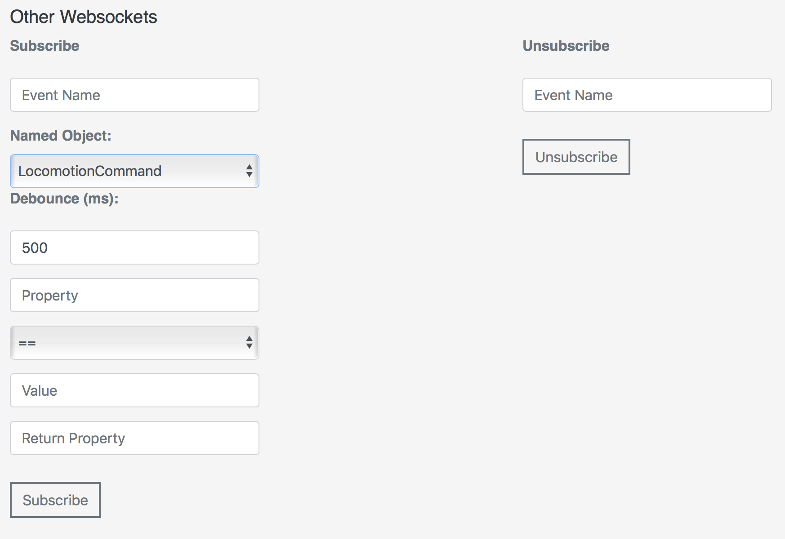

# {{title}}

When you use the API Explorer in your browser, you can use Misty's API endpoints to try Misty out, without writing any code. We recommend using the API Explorer with the following browsers: Safari, Chrome, Firefox, and Microsoft Edge (latest versions).

**Note: It's not generally recommended for multiple users to each use a separate instance of the API Explorer to connect and send commands to a single Misty robot. If more than one person does connect to Misty at the same time, as in a class or group development environment, people will need to take turns sending commands, or Misty may appear to respond unpredictably.**

## Setting up the API Explorer
As with the companion app and Blockly, when using the API Explorer, make sure your computer and Misty are on the same Wi-Fi network and using Bluetooth. 

1. [Download the latest version of the API Explorer](https://s3.amazonaws.com/misty-releases/Misty-0.7/latest/api-explorer.zip). Unzip the download and open the index.html file into your browser. The API Explorer should look like the screenshot above.
2. Enter either the IP address of your robot (from the Info tab of the companion app) or its name and click the **Connect** button. The message "Connected successfully" should appear at the bottom of the API Explorer window. **IMPORTANT: If you have a Misty I Beta version and see the following message, please confirm that you have installed** [**this system update.**](../../3-ways-to-interact-with-misty/api-explorer/#system-updates)

3. Select the amount of console messages you’ll receive by setting the console log level (0-3). Selecting 3 will give you a console message for each method in all 3 classes, for example. The console messages can be really helpful when getting started.
4. Experiment with changing Misty’s eyes, LED color, screen image, and sounds.

## Driving Misty
There are a variety of ways to use the API Explorer to drive Misty.
 

### Drive Time
1. First, use **Select a motion** to select the driving motion you want Misty to perform.
2. Use the **Duration (ms)** control to specify the amount of time Misty should drive.
3. Click **Move Robot**. Misty will stop driving automatically when the time is up.

### Drive Time by Value
Using this command allows you to drive Misty forward or backward at a set speed, with a given rotation, for a specified amount of time.

When using **Drive Time by Value**, it helps to understand how linear velocity (speed in a straight line) and angular velocity (speed and direction of rotation) work together:

* Linear velocity (-100) and angular velocity (0) = driving straight backward at full speed.
* Linear velocity (100) and angular velocity (0) = driving straight forward at full speed.
* Linear velocity (0) and angular velocity (-100) = rotating clockwise at full speed.
* Linear velocity (0) and angular velocity (100) = rotating counter-clockwise at full speed.
* Linear velocity (non-zero) and angular velocity (non-zero) = Misty drives in a curve.


1. Use the **Linear Velocity** control to set the speed Misty travels in a straight line. The control can be set from -100 (full speed backward) to 100 (full speed forward).
2. Use the **Angular Velocity** control to set the speed and direction of Misty's rotation. The control can be set from -100 (full speed rotation clockwise) to 100 (full speed rotation counter-clockwise). **Note: For best results when using angular velocity, we encourage you to experiment with using small positive and negative values to observe the effect on Misty's movement.**
3. Use the **Duration (ms)** control to specify the amount of time Misty should drive.
3. Click **Move Robot**. Misty stops driving automatically when the time is up.


### Manual Driving
You can use these controls to drive Misty in a variety of directions.

1. Click a directional button, and Misty will start driving.
2. Adjust the **Velocity** level, if she is going too quickly or too slowly.
3. Observe the **Current Velocity Values** data to see how fast Misty is going and in what direction. The fields include information for **Linear Velocity** (straight line) and **Angular Velocity** (rotation).
3. Use the center control to stop driving.


## Opening a WebSocket
Once you open a WebSocket, you can subscribe to real-time data from Misty, including:
* Time-of-flight sensor data
* Battery voltage
* Face detection
* Face recognition
* Driving (and stopping) commands

You can view the WebSocket data that you subscribe to in your browser's JavaScript console. (Note that how you open the console will vary among browsers and platforms.)


### Subscribing to Time of Flight data
You can view a stream of data from Misty's four time-of-flight sensors in the API Explorer. To obtain time-of-flight data from Misty programmatically, see [this article](https://community.mistyrobotics.com/t/using-websockets-in-js-to-subscribe-to-time-of-flight-data/313).

1. In the **Sensor Reading WebSockets** area, find the **Time of Flight** controls and click **Subscribe**.
2. You can see the time of flight data in the **Distance (meters)** field.
3. Click **Unsubscribe** when you are finished.

### Subscribing to Battery data

1. In the **Sensor Reading WebSockets** area, find the **Battery Charge** controls and click **Subscribe**.
2. You can see data from Misty's battery sensor in the **Battery Voltage** field.
3. Click **Unsubscribe** when you are finished.

### Subscribing to Other WebSocket data

1. Find the **Other WebSockets** controls in the API Explorer. 
2. Select a WebSocket to monitor from the **Named Object** list. **Note: Named Object is the only required field.** The other fields are optional:
   * **Event Name**: [Optional] Provide a name for this subscription. If no name is specified, the value for **Named Object** is also used for the **Event Name**.
   * **Debounce**: [Optional] Provide the minimum amount of time between data events.
   * **Property, Comparison, Value, Return Property**: [Optional] These allow you to set filters for the data of interest and the data returned. See the instructions in the API Explorer for more details. 
3. Click **Subscribe**.
4. When you are finished, go to the **Unsubscribe** controls. In the **Event Name** field, enter the name of the Named Object to which you subscribed (or the Event Name if you provided one). 
5. Click **Unsubscribe**.


## Face Training & Recognition - BETA
Misty's ability to recognize faces is under development. To try face training and recognition, follow these steps.

1. If you are using Misty 1 Beta version, make sure the Intrinsyc Open-Q 820 Development Kit board mounted on Misty’s right side is on.
2. Make sure that the light on Misty’s HD camera (located above her eyes on Misty I Beta) is solid blue.
3. At the top of the API Explorer window, enter either the IP address of your robot (from the Info tab of the companion app) or its name and click the **Connect** button. The message "Connected successfully" should appear at the bottom of the window.  **IMPORTANT: If you have a Misty I Beta version and see the following message, please confirm that you have installed** [**this system update.**](../../3-ways-to-interact-with-misty/api-explorer/#system-updates)

4. Scroll down to the **Misty Alpha & Beta Commands** section of the API Explorer and click **I understand...** if you have not already done so. Clicking "I understand..." indicates that you are aware that Misty's Alpha and Beta features are currently not complete and may not function as intended.  
5. In the **Misty Beta Commands** section, go to **Computer Vision** and enter a name in the **Face Training** input box. 
6. Position the person’s face in a well-lit area about a foot or two away from Misty’s camera.
7. Click **Start Face Training** and wait 10-15 seconds. (There is no need to click **Cancel Face Training**, unless you want to stop the process before it completes.)
8. Scroll up the API Explorer page to the **Websockets** section and click the **Open Websocket** button. 
9. Scroll back down to the **Computer Vision** section of the API Explorer and click **Start Face Recognition**. 
10. Position the person’s face in a well-lit area front of the camera.
11. Watch the browser console for face recognition data to come through. Face recognition data is sent at a rate of about once per second, but this timing may vary significantly.
12. When finished, click **Stop Face Recognition**.


## Moving Misty's Head - BETA
You can use the API Explorer to move Misty's head with the following controls:
* **Move Head**
* **Set Head Position**
* **Move Head to Location**

**Note: Full control of Misty's head is currently under development.**


## Mapping - ALPHA
For best control, we recommend that mapping be done at this time via the API Explorer instead of with Blockly or the companion app.

**Note: The software that runs the Occipital sensor for mapping is alpha. Experiment with mapping, but recognize that it is unreliable at this time.**

1. If you are using Misty 1 Beta version, make sure the Intrinsyc Open-Q 820 Development Kit board mounted on Misty’s right side is on.
2. At the top of the API Explorer window, enter either the IP address of your robot (from the Info tab of the companion app) or its name and click the **Connect** button. The message "Connected successfully" should appear at the bottom of the window.  **IMPORTANT: If you have a Misty I Beta version and see the following message, please confirm that you have installed** [**this system update.**](../../3-ways-to-interact-with-misty/api-explorer/#system-updates)

3. Scroll down the API Explorer page to the **Websockets** section and click the **Open Websocket** button. 
4. Scroll down to the **Misty Alpha & Beta Commands** section of the API Explorer and click **I understand...** if you have not already done so. Clicking "I understand..." indicates that you are aware that Misty's Alpha and Beta features are currently not complete and may not function as intended.  
5. Scroll down to **Misty Alpha Commands** and find the **Mapping and Exploring** section. 
6. Click **Start Mapping**. After a few seconds, the **Pose** light should turn green. Having pose means Misty knows her location and orientation on the map, in X,Y coordinates. _If the **Pose** light STAYS red, try the following:_
   * Click **Get Status** and see what Misty's status is. You can see the results of clicking **Get Status** either from a status message that pops up on the bottom of the page or by opening the browser's JavaScript console (how you do this will vary among browsers and platforms). 
   * If Misty's status is other than "Ready", click **Reset**, then click **Get Status** again. _Note: If Misty's status does not return as ready after multiple **Reset** and **Get Status** commands, [restart Misty](../../get-started/powering-up-down) and start these instructions over._
7. Select one of the drive options (**Turn in Circle**, etc.) or use the **Locomotion: Manual Driving** controls to drive Misty yourself. Move Misty SLOWLY around a small space (start with an area no more than 20’ x 20’).
8. Observe the **Pose X** and **Pose Y** fields for data. _Note: If you do not see pose data updating, try turning up the lights; sometimes the lighting is too low for Misty._
9. If **Pose** stays green and data keeps updating, allow Misty to build a complete map of the area she's in. _If **Pose** turns red AND if the pose data stops updating, try the following:_
   * Click **Stop**, then try driving Misty backward for a second. Wait a few seconds and see if she gets pose again.
   * If that doesn't work, click **Stop Mapping**, then click **Start Mapping** again.
10. When done driving, click **Stop**.
11. Click **Stop Mapping**.
12. Scroll down to the **Map** section and click **Get Map**. 


### Additional Mapping Tips
Having mapping issues? Try these tips:

* If you do not see pose data updating, it is possible the lighting is too low for Misty.
* Verify that the mapping sensors are working. The Occipital Structure Core depth sensor near Misty’s right eye should be glowing blue.
* Drive slowly to give the mapping system the best chance to fill in all details. Slowing Misty down increases mapping effectiveness.
* Make wider turns (in arcs) to improve mapping results.
* If Misty loses pose after generating a map, she will need to generate a new map and start over.
* Every time you create a new map, the former map is deleted. You can use the API to get a map and back it up, if desired.
* Mapping coordinates are currently inverted (X is vertical, Y is horizontal).
* Confirm that Misty has not lost her Wi-Fi or Bluetooth connection while mapping. To do this, open Misty's companion app. If she has lost Bluetooth, the two dots disappear from the companion app’s Bluetooth icon. If she has lost her connection, close the companion app and restart it, then reconnect as before.


## Tracking & Following a Path - ALPHA
Once you've generated a map, you can:
* Try out Misty's ability to track where she is on the map.
* Have Misty follow a path from X,Y coordinates on the map.
 

### Tracking
1. Once you have successfully generated a map, click **Start Tracking** and begin driving Misty. Activating tracking should provide data in the Pose fields for where Misty is on the map you generated.
2. Observe the Pose fields as Misty moves to ensure she is successfully tracking. If the Pose data stops while Misty is moving, try backing Misty up for one second. Misty may find her way again.
3. Click **Stop Tracking**.

### Following a Path
You can have Misty follow a set path by giving her X,Y map data from a map she has previously generated.
* You can supply X,Y values and click the **Add Waypoint** button to add individual waypoints to a path.
* Use the field above the **Follow Path** button to input an entire path of X,Y values, then click **Follow Path**.


## System Updates
You can use the API Explorer to perform over-the-air (OTA) updates for Misty, including:

* Image assets
* Sound assets
* Motor controller firmware
* Real-time controller firmware 
* Occipital Structure Core depth sensor firmware
* Home Robot application (running on Windows IoT Core)
* Sensory Services application (running on Android)

**Important! Before attempting to update Misty, always make sure that she is plugged into a power source and is connected to the Internet.**

To perform an update:
1. At the top of the API Explorer window, enter either the IP address of your robot (from the Info tab of the companion app) or its name and click the **Connect** button. The message "Connected successfully" should appear at the bottom of the window.  **IMPORTANT: If you have a Misty I Beta version, you will see the following message. Ignore it and continue with the system update process.**

2. Scroll down to the **Misty Alpha & Beta Commands** section of the API Explorer and click **I understand...** if you have not already done so. Clicking "I understand..." indicates that you are aware that Misty's Alpha and Beta features are currently not complete and may not function as intended. 
3. Scroll down to the bottom of the API Explorer window and find the **System Updates** section. Click **Check for Updates**. It may take a few seconds, but a message will pop up on the bottom of the window telling you if your Misty has any updates available. 
4. If there are updates available, click **Perform System Update**. Misty will begin downloading the update in the background. This may take several minutes to an hour, depending on the speed of your Internet connection. **Note: During the download and update, Misty is still functional, however it is NOT recommended to send any commands to Misty or drive her during this process.**
5. After the update has successfully downloaded, a message appears on Misty's screen, asking whether you want to update and restart Misty. To click okay, you need to do **one** of the following (instructions for both methods of completing an update follow below):
   * **Open Misty up and plug a USB mouse into the DragonBoard 410c development board**. 
   * **Connect to the Windows IoT Core remote server (Windows only)**. 

### Completing a system update by plugging a mouse into the DragonBoard 410c development board


1. First, carefully slide up Misty's front panel (the black plastic panel with the LED behind the logo). **Important! Never pull the panel forward! This may result in the front mount breaking.** 
2. Fully remove the front panel. Misty should look like this: 
3. Carefully slide up the black plastic panel on Misty's left side up. **Important: Pull up, not forward. Pulling the panel forward may break the panel.** 
4. Fully remove the side panel. This exposes the DragonBoard 410c development board. 
5. Plug a USB mouse directly into the board as shown. 
6. Once you have connected the mouse to Misty, click **Okay** on the message on her screen that asks you to update and restart. 
7. Misty will restart, and the Misty Robotics logo will appear. Misty's eyes may briefly display before they are replaced by an **Updating...** image. **Note: The update process may take up to a half hour.** 
8. If the update is successful, Misty will play a cheerful sound and her eyes will appear happy for 2 seconds, before changing back to their default appearance. If the update failed, Misty plays a sad sound and her eyes appear sad for seconds. **Note: If the update fails, do not hesitate to reach out for assistance on any of the Misty Robotics support channels. If the update experience has other issues or is not as described in these steps, we encourage you [to comment in this thread](https://community.mistyrobotics.com/t/report-system-upgrade-issues-here/355).**


### Completing a system update by connecting to the Windows IoT Core remote server (Windows only)

1. Open your browser and navigate to the **Remote Settings** tab in the Windows IoT Core device portal at: ```http://<IP address of your robot>:8080/#Remote```
2. Enter a username and password. The default administrator username is _administrator_. The default password is _p@ssw0rd_. **Note: You should change these credentials to improve the security of your Misty robot.**
3. Click the **Enable Windows IoT Remote Server checkbox**. 
4. [Download the Windows IoT Remote Client app](https://www.microsoft.com/store/apps/9nblggh5mnxz) and install it.
5. Open up the Windows IoT Remote Client app, enter the IP address of your robot, and click **Connect**. 
6. You should now see the same content that is visible on Misty’s screen.  Click **Okay** on the message that asks you to update and restart. 
7. Misty will restart, and the Misty Robotics logo will appear. Misty's eyes may briefly display before they are replaced by an **Updating...** image. **Note: The update process may take up to a half hour.** 
8. If the update is successful, Misty will play a cheerful sound and her eyes will appear happy for 2 seconds, before changing back to their default appearance. If the update failed, Misty plays a sad sound and her eyes appear sad for seconds.  **Note: If the update fails, do not hesitate to reach out for assistance on any of the Misty Robotics support channels. If the update experience has other issues or is not as described in these steps, we encourage you [to comment in this thread](https://community.mistyrobotics.com/t/report-system-upgrade-issues-here/355).**


## Exploring the JavaScript Code
Check out the following files to see the JavaScript code that is used with the API Explorer.

* Reference the `Misty.API` classes in your HTML:
    * `MistyAjax.js` - Sends AJAX calls to Misty.
    * `MistyAPI.js` - Maps one-to-one to Misty's API endpoints and constructs payloads to pass to `MistyAJAX.js`. You can call it directly once you have created a new `MistyRobot` by inputting the robot's IP address, port, and verbose level.
    * `MistyRobot.js` - Builds the server URL based on the robot you are attempting to interact with and provides a wider and more user-friendly range of commands than `MistyAPI.js`.
* Use `SampleUI.js` to see examples of all of the event listeners linked to the various buttons rendered in index.html. For example, Select a mood or Change LED.
