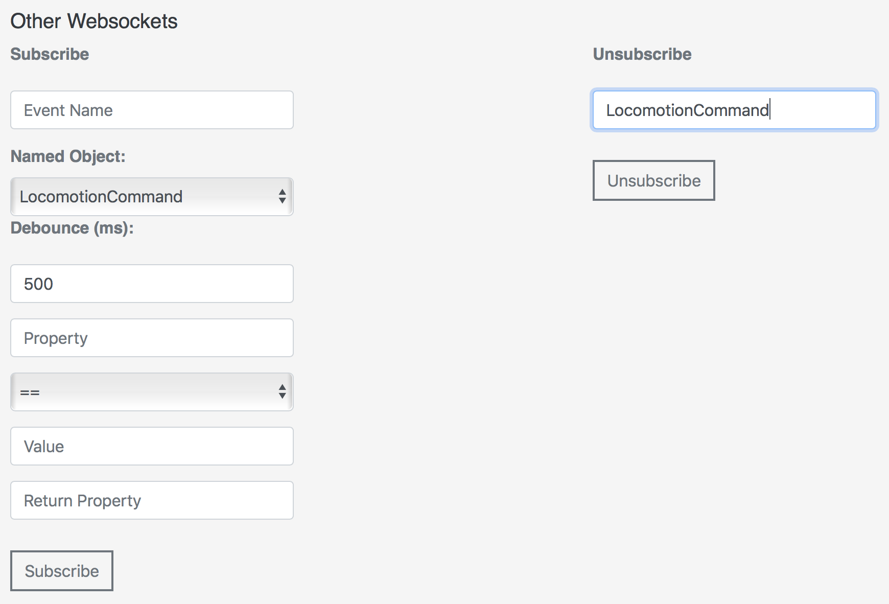

# {{title}}

When you use the API Explorer in your browser, you can use Misty's API endpoints to try Misty out, without writing any code. We recommend using the API Explorer with the following browsers: Safari, Chrome, Firefox, and Microsoft Edge (latest versions).

**Note: It's not generally recommended for multiple users to each use a separate instance of the API Explorer to connect and send commands to a single Misty robot. If more than one person does connect to Misty at the same time, as in a class or group development environment, people will need to take turns sending commands, or Misty may appear to respond unpredictably.**

## Setting up the API Explorer
As with the companion app and Blockly, when using the API Explorer, **make sure your computer and Misty are on the same Wi-Fi network** and using Bluetooth. 

1. [Open up the API Explorer](http://api-explorer.mistyrobotics.com) in a browser window. The API Explorer should look like the screenshot above.
2. Enter the IP address of your robot from the Info tab of the companion app and click the **Connect** button. Look for the message "Connected successfully" to appear at the bottom of the API Explorer window.
3. Experiment with changing the color of the LED on Misty's chest or changing her eyes by selecting a different mood.
4. To view data provided by the **Get Device Information** or **Get Log Information** buttons, open the JavaScript console for the browser window. (Note that how you open the console varies among browsers and platforms.)

## Managing Audio and Image Files
Misty comes with a number of default system image files that display on her screen, as well as default audio files that she can play. To add your own sounds and images to Misty, follow these steps.

**Note: The processes for working with audio and image files on Misty are the same.**

### Adding a custom audio or image file to Misty
Would you like to have Misty sing a song or play a particular sound when her face recognition identifies someone in particular? What about giving her some custom eyes or other interesting images for her display?

**Note:**
* **For images, valid file types are .jpg, .jpeg, .gif, and .png. Because Misty does not adjust the scaling of images, for best results use an image with proportions similar to that of Misty's screen (480 x 272 pixels).**
* **For audio, you can upload all file format types, however Misty cannot currently play OGG files.**
* **The maximum size for both audio and image files is 3 MB.**

1. To select a file to upload to Misty, either drag a file into the rectangular drop area or click the **Choose a file...** text and browse for the file on your computer.
2. After you choose a file, a checkbox appears under the rectangle. Click that checkbox to confirm the file to upload. 
3. To save the file onto Misty, select the **Save to Robot** button. A message pops up to confirm the file is being saved.
4. Once the upload is complete, you can confirm your file has been saved by clicking the **Populate Audio List** or **Populate Image List** button. Scroll through the list to find the file you just saved.

### Playing or displaying a file

1. Click the **Populate Audio List** or **Populate Image List** button to get a list of the current files saved to your robot.
2. Choose the listed file to play or display.
3. Click the **Play Clip** or **Display Image** button. You should immediately hear Misty play the audio clip or see the image appear on her screen.

### Deleting a custom audio or image file from Misty
Misty getting a bit overloaded with custom files? It's easy to tidy her up again.

1. Click **Populate Audio List** or **Populate Image List** to obtain a list of the audio or image files you've saved to Misty.
2. Choose a listed file to delete. **Note: You can only delete audio or image files that you have previously uploaded to Misty. The API Explorer posts an error if you attempt to remove one of Misty's default system files.** 
3. Click the **Delete Clip** button to delete the audio file, or the **Delete Image** button to delete an image file.
4. Refresh your screen and reconnect API Explorer to your robot.
5. Click the **Populate Audio List** or **Populate Image List** button. The file you deleted should no longer be included in the list.

### Using the API Explorer to obtain byte array strings from audio or image file data 
There is an option in the API explorer to convert audio or image file data to a byte array string and copy it to the clipboard. This is handy if you are using the REST or JavaScript commands `SaveAudioAssetToRobot` or `SaveImageAssetToRobot`, because these APIs require you to pass in raw file data.

1. To select a file to convert, either drag a file into the rectangular drop area or click the **Choose a file...** text and browse for the file on your computer.
2. After you choose a file, a checkbox appears under the white rectangle. Click that checkbox to confirm the file to convert.
3. Click the **Copy to Clipboard** button. A message pops up to confirm that your file is being copied.

## Driving Misty
There are a variety of ways to use the API Explorer to drive Misty.
 

### Drive Time
1. First, use **Select a motion** to select the driving motion you want Misty to perform.
2. Use the **Duration (ms)** control to specify the amount of time Misty should drive.
3. Click **Move Robot**. Misty will stop driving automatically when the time is up.

### Drive Time by Value
Using this command allows you to drive Misty forward or backward at a set speed, with a given rotation, for a specified amount of time.

When using **Drive Time by Value**, it helps to understand how linear velocity (speed in a straight line) and angular velocity (speed and direction of rotation) work together:

* Linear velocity (-100) and angular velocity (0) = driving straight backward at full speed.
* Linear velocity (100) and angular velocity (0) = driving straight forward at full speed.
* Linear velocity (0) and angular velocity (-100) = rotating clockwise at full speed.
* Linear velocity (0) and angular velocity (100) = rotating counter-clockwise at full speed.
* Linear velocity (non-zero) and angular velocity (non-zero) = Misty drives in a curve.

1. Use the **Linear Velocity** control to set the speed Misty travels in a straight line. The control can be set from -100 (full speed backward) to 100 (full speed forward).
2. Use the **Angular Velocity** control to set the speed and direction of Misty's rotation. The control can be set from -100 (full speed rotation clockwise) to 100 (full speed rotation counter-clockwise). **Note: For best results when using angular velocity, we encourage you to experiment with using small positive and negative values to observe the effect on Misty's movement.**
3. Use the **Duration (ms)** control to specify the amount of time Misty should drive.
3. Click **Move Robot**. Misty stops driving automatically when the time is up.

### Manual Driving
You can use these controls to drive Misty in a variety of directions.

1. Click a directional button, and Misty will start driving.
2. Adjust the **Velocity** level, if she is going too quickly or too slowly.
3. Use the center control to stop driving.

## Opening a WebSocket
Real-time data from Misty is sent via WebSocket connections and includes:
* movement, location, and proximity information
* battery status
* face detection and recognition

The data that's sent over WebSocket connections is described in detail [here](/onboarding/creating-skills/writing-skill/#websocket-connections). See [our GitHub repo](https://github.com/MistyCommunity/MistyI/tree/master/Skills) for examples of [programmatically subscribing](/onboarding/creating-skills/writing-skill/#sending-commands-and-subscribing-to-websockets) to WebSocket data to [create skills](/onboarding/creating-skills/writing-skill) for Misty.

When you use the API Explorer to open WebSocket connections, you can view live data from Misty in your browser's JavaScript console. (Note that how you open the console will vary among browsers and platforms.)

### Subscribing to Time of Flight data
You can view a stream of data from Misty's four time-of-flight sensors in the API Explorer. For an example of obtaining time-of-flight data from Misty programmatically, see [this article](https://community.mistyrobotics.com/t/using-websockets-in-js-to-subscribe-to-time-of-flight-data/313).

1. In the **Sensor Reading WebSockets** area, find the **Time of Flight** controls and click **Subscribe**.
2. You can see the time of flight data in the **Distance (meters)** field.
3. Click **Unsubscribe** when you are finished.

### Subscribing to Battery data

1. In the **Sensor Reading WebSockets** area, find the **Battery Charge** controls and click **Subscribe**.
2. You can see data from Misty's battery sensor in the **Battery Voltage** field.
3. Click **Unsubscribe** when you are finished.

### Subscribing to Other WebSocket data

1. Find the **Other WebSockets** controls in the API Explorer. 
2. Select a WebSocket to monitor from the **Named Object** list. **Note: Named Object is the only required field.** The other fields are optional:
   * **Event Name**: [Optional] Provide a name for this subscription. If no name is specified, the value for **Named Object** is also used for the **Event Name**.
   * **Debounce**: [Optional] Provide the minimum amount of time between data events.
   * **Property, Comparison, Value, Return Property**: [Optional] These allow you to set filters for the data of interest and the data returned. See the instructions in the API Explorer for more details. 
3. Click **Subscribe**.
4. When you are finished, go to the **Unsubscribe** controls. In the **Event Name** field, enter the name of the Named Object to which you subscribed (or the Event Name if you provided one). 
5. Click **Unsubscribe**.

## Face Training & Recognition - BETA
Misty's ability to recognize faces is under development. To try face training and recognition, follow these steps.

1. Make sure that your robot is connected to the API Explorer and that the light on Misty’s HD camera (located above her eyes on Misty I) is solid blue.
2. In the **Beta Commands** section, go to **Computer Vision** and enter a name in the **Face Training** input box. 
3. Position the person’s face in a well-lit area about a foot or two away from Misty’s camera.
4. Click **Start Face Training** and wait 10-15 seconds. There is no need to click **Cancel Face Training**, unless you want to stop the process before it completes.
5. Once you've trained Misty on a person's face, you can click **Start Face Recognition**.
6. Position the person’s face in a well-lit area front of the camera.
7. Open the JavaScript console for the browser window. (Note that how you open the console varies among browsers and platforms.) Watch the browser console for face recognition data to come through. Face recognition data is sent at a rate of about once per second, but this timing may vary significantly.
8. When finished, click **Stop Face Recognition**.

**Note: The face detection and recognition data that Misty sends is described in detail [here](/onboarding/creating-skills/writing-skill/#websocket-connections).**

## Moving Misty's Head - BETA
You can use the API Explorer to move Misty's head with the following controls:
* **Move Head**
* **Set Head Position**
* **Move Head to Location**

**Note: Misty I only provides movement along one axis: pitch. This means that up and down motions are all that can be controlled for Misty I.**

## Mapping & Tracking - ALPHA

Misty can generate a map of your home or office, track her location on a map, and follow a path you specify. The first step in any of these is to ensure that Misty has "pose". Having pose means Misty knows her location and orientation in space, in X,Y coordinates.

**Note: The software that runs the Occipital sensor for mapping and tracking is alpha. Experiment with mapping, but recognize that it is unreliable at this time.**

**Note: Misty's coordinate system is currently inverted (X is vertical, Y is horizontal).**

### Obtaining Pose
Before attempting to map or track, you must obtain pose.

1. If the API Explorer is not already connected to your robot: At the top of the API Explorer window, enter the IP address of your robot (from the Info tab of the companion app) and click the **Connect** button. Look for the message "Connected successfully" to appear at the bottom of the API Explorer window. 
2. Ensure Misty is in a well-lit (not dark) environment.
3. Scroll down to **Alpha** and find the **Mapping and Exploring** section. 
4. Click **Get Status** and see what Misty's status is. You can see the results of clicking **Get Status** either from a status message that pops up on the bottom of the page or by opening the browser's JavaScript console (how you open the console varies among browsers and platforms). 
5. If Misty's status is other than "Ready", click **Reset**, then click **Get Status** again. _Note: If Misty's status does not return as ready after multiple **Reset** and **Get Status** commands, [restart Misty](../../get-started/powering-up-down/#restarting-misty) and start these instructions over._
6. You are now ready to follow the instructions below and start either mapping or tracking. Once you do begin mapping or tracking, if the **Pose** indicator stays red:
  * Verify that the mapping sensors are working. The Occipital Structure Core depth sensor near Misty’s right eye should be glowing blue.
  * Increase the lighting.
  * Confirm that Misty has not lost her Wi-Fi or Bluetooth connection. To do this, open Misty's companion app. If she has lost Bluetooth, the app will ask you to reconnect.

### Mapping
When mapping, drive slowly to give the mapping system the best chance to fill in all details. Slowing Misty down increases mapping effectiveness. When possible, making wider turns also improves mapping results.

**Note: Every time you create a new map, the former map is deleted. You can use the API to get a map and back it up, if desired.**

**Note: If Misty loses pose after generating a map, she will need to generate a new map and start over.**

1. Follow the above instructions to obtain pose.
2. Click **Start Mapping**. After a few seconds, the **Pose** light should turn from red to green. If it does not turn green, follow the instructions to obtain pose above, then try again.
3. Select one of the drive options (**Turn in Circle**, etc.) or use the **Locomotion: Manual Driving** controls to drive Misty yourself. Move Misty SLOWLY around a small space (start with an area no more than 20’ x 20’).
4. Observe the **Pose X** and **Pose Y** fields for data. _Note: If you have pose, but do not see pose data updating, try turning up the lights._
5. If **Pose** stays green and data keeps updating, allow Misty to build a complete map of the area she's in. _If **Pose** turns from green to red AND if the pose data stops updating, try the following:_
    * Click **Stop**, then try driving Misty backward for a second. Wait a few seconds and see if she gets pose again.
    * If that doesn't work, click **Stop Mapping**, then click **Start Mapping** again.
6. When done driving, click **Stop**.
7. Click **Stop Mapping**.
8. Scroll down to the **Map** section and click **Get Map**. 

### Tracking & Following a Path - ALPHA
You can have Misty track where she is on a map that she has already created or track without a map.

You can also have Misty follow a set path by giving her X,Y map data from a map she has previously generated. 

To track:
1. Follow the above instructions to obtain pose.
2. Click **Start Tracking** and begin driving Misty. Activating tracking should provide data in the Pose fields for where Misty is on the map you generated. If you have not previously generated a map, Misty sets her beginning tracking position as 0,0.
3. Observe the Pose fields as Misty moves to ensure she is successfully tracking. If the Pose data stops while Misty is moving, try backing Misty up for one second. Misty may find her way again.
4. Click **Stop Tracking**.

To follow a path on a map:
1. Ensure that Misty still has pose.
2. Either:
  * Supply X,Y values and click the **Add Waypoint** button to add individual waypoints to a path.
  * Use the field next to the **Follow Path** button to input an entire path of X,Y values, then click **Follow Path**.

## System Updates
You can use the API Explorer to perform over-the-air (OTA) updates for Misty. We recommend you check for updates weekly. To find the version number(s) for the most recent system updates, see the release notes on our [Community site](https://community.mistyrobotics.com/c/development/misty-I). 

**Important: Please keep Misty plugged in for the entire duration of the update and do not attempt to send commands to her during this time.**

To perform an update:
1. First make sure that Misty is plugged into a power source and is connected to the Internet.
2. If the API Explorer is not already connected to your robot: At the top of the API Explorer window, enter the IP address of your robot (from the Info tab of the companion app) and click the **Connect** button. Look for the message "Connected successfully" to appear at the bottom of the API Explorer window. 
3. Scroll down to the bottom of the API Explorer window and find the **System Updates** section. Click **Check for Updates**. It may take a few seconds, but a message will pop up on the bottom of the window telling you if your Misty has any updates available. 
4. If there are updates available, click **Perform System Update**. Misty will begin downloading the update in the background. The download itself may take several minutes to an hour, depending on the speed of your Internet connection. **Note: During the download and update, Misty is still functional, however it is NOT recommended to send any commands to Misty or drive her during this process.**
5. The update process may take up to a half hour total, during which time Misty restarts _twice_. **The update process is not complete until you see Misty's happy eyes appear.**  

