# {{title}}

Blockly is a block-based, visual programming language editor that runs in your browser. We recommend the following browsers for running Blockly with Misty: Chrome, Safari, Firefox, and Microsoft Edge (latest versions). [Download Blockly for Misty here.](https://s3.amazonaws.com/docs.mistyrobotics.io/assets/files/Blockly.zip)

Read on to set Blockly up with Misty, try a few simple Blockly programs, and get detailed information on Misty's Blockly commands. 

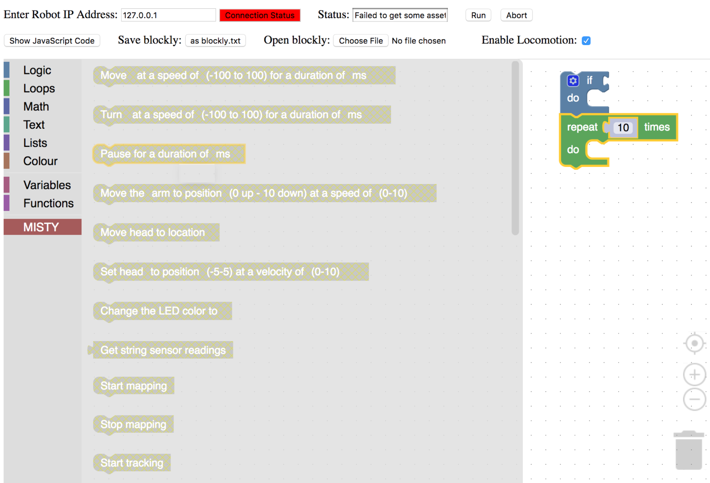

## Blockly Controls

The following controls are available on Misty's Blockly editor.

* **Enter Robot IP Address**: Misty's IP address; you can obtain this value from the Companion App.
* **Connection Status**: Indicates whether Blockly can communicate with Misty (green is success, and red is failure).
* **Status**: Current status information.
* **Run**: Run the Blockly blocks on the workspace.
* **Abort**: Stop the currently running blocks.
* **Show JavaScript Code**: Display the JavaScript code generated by Blockly.
* **Save Blockly**: Save the current blocks on the workspace as blockly.txt to ~/Downloads folder.
* **Open Blockly**: Open a saved Blockly file onto the workspace.
* **Enable Locomotion**: Enable/disable locomotion blocks on the workspace. This is useful when you are testing a sequence of blocks and want to skip the blocks that would make Misty move away or off a table.

## Set up Blockly

Follow the steps below to set up Blockly with Misty:

1. Make sure Misty and your computer are on the same Wi-Fi network and that your computer has Bluetooth turned on.
2. If you haven't already, [download Blockly.](https://s3.amazonaws.com/docs.mistyrobotics.io/assets/files/Blockly.zip) Unzip the Blockly download and open the index.html file in your browser.
3. Enter the IP address of your robot from the Info tab in the companion app, and hit Return. The connection status field should become green. **Note: If the status field stays red, double-check that Misty and your computer are on the same network. If necessary, reload the page.**
4. Select some programming Logic or Loops to use, then add in some blocks from the MISTY category on the left.
5. Test that Blockly is set up by clicking Run and seeing how Misty reacts. **Note: After clicking Run, there currently can be a 2-3 second delay before Misty reacts, and up to a 5-second delay between actions.**

## Experiment with Blockly

Try the following quick "programs" to start controlling Misty with Blockly. For detailed information, see the "Blockly Commands" section.

### Change the Color of Misty's LED

Want to change the light behind the logo on Misty's chest? Try this.

1. Choose the "Change LED" block and click to select a color.
2. Click Run.

### Change the Image on Misty's Face

Are Misty's eyes looking a bit tired? Try uploading your own image to Misty's screen. It's a two-part process, but each part is very easy!

_Note: Misty's screen is 480 x 272 pixels in size. Because Misty does not adjust the scaling of images, for best results use an image with proportions similar to this._

First:
1. Choose the "Save image file" block.
2. Add the "Browse for file" block. When you click on this block, you can select an image file on your computer to upload onto Misty. Valid image file types are .jpg, .jpeg, .gif, .png. and the maximum file size is 3 MB.
3. Click Run.

Then:
1. Choose the "Display image file" block.
2. Add the "List image files" block and select your file.
3. Click Run.

### Have Misty Play a Different Sound

Want Misty to say something new or make some noise other than her default sounds? It's another very simple, two-part process.

First:
1. Choose the "Save audio file" block.
2. Add the "Browse for file" block. When you click on this block, you can browse for an audio file on your computer to upload onto Misty. All audio file types are valid, however Misty cannot currently play OGG files. The maximum file size is 3 MB.
3. Click Run.

Then:
1. Choose the "Play audio file" block.
2. Add the "List audio files" block and select your file.
3. Click Run.

### Other Things to Try
* Move Misty's head (beta).
* Train Misty to recognize faces, then use this training with the API.
* Mapping - For best results at this time, we recommend you try mapping with the [API Explorer](../../3-ways-to-interact-with-misty/api-explorer), rather than with Blockly or the Companion App.

## Blockly Commands

The following are descriptions of the Misty-specific Blockly commands.

**Note: When using Blockly, after clicking Run, there currently can be a 2-3 second delay before Misty reacts, and up to a 5-second delay between actions.**

**Important: Commands noted as "Beta" may behave unpredictably. "Alpha" Commands may be partially or entirely non-functional at this time.**

### Move at speed for duration
Drives Misty forward or backward at a certain speed for a duration specified in milliseconds.

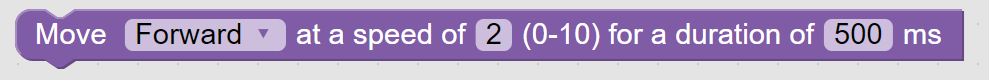

Parameters
* Direction: Forward or backward.
* Speed: A value from 0 (stopped) to 10 (full speed).
* Duration: A value in milliseconds, using 100 ms increments, with a maximum value of 10 seconds.

### Turn at speed for duration
Turns Misty left or right at a given speed for a duration specified in milliseconds.

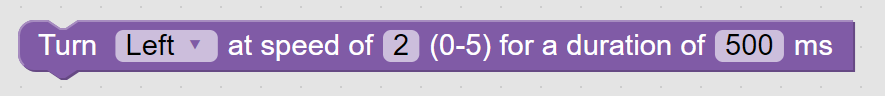

Parameters
* Direction: Left or right.
* Speed: A value from 0 (stopped) to 5 (full speed).
* Duration: A value in milliseconds, using 100 ms increments, with a maximum value of 10 seconds.

### Pause for duration
Pauses Misty for a duration specified in milliseconds.

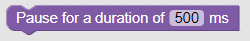

Parameters
* Duration: A value in milliseconds, using 100 ms increments, with a maximum value of 10 seconds.

### Change LED color
Changes the color of the LED behind the logo on Misty's torso.

Parameters
* Color: A color selected from the block's options.

### Browse for file
Browse for a file on your computer. Connect this with a "Save audio file" block or a "Save image file" block to select a file to upload to Misty.

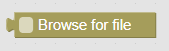

Parameters
* File: When you click on this block, a browse file dialog is displayed to allow for file selection. Valid image file types are .jpg, .jpeg, .gif, .png. All audio file types are valid, however Misty cannot currently play OGG files. Maximum file size is 3 MB.

### List audio files
Lists the existing audio files on Misty. Connect this block to a "Play audio file" block to select a sound to play.

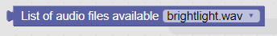

Parameters
* File: An existing audio file stored on Misty.

### Play audio file
Plays an audio file that has been previously uploaded to Misty. This block **must** connect with the "List audio files" block, to select the audio file to play.

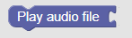

Parameters
* File: The audio file to play. Connect the "List audio files" block to this block in order to select an audio file.

### Save audio file
Saves an audio file onto Misty. This block **must** connect with the "Browse for file" block, to select the audio file to be saved.

Parameters
* File: The audio file to save to Misty from the "Browse for file" block. This command accepts all audio format types, however Misty cannot currently play OGG files. The maximum file size is 3 MB.

### Save image file
Saves an image file to Misty. This block **must** connect with the "Browse for file" block, to select the image file to be saved.

Parameters
* File: The image file to save to Misty from the "Browse for file" block. Valid image file types are .jpg, .jpeg, .gif, .png. Maximum file size is 3 MB. Misty's screen is 480 x 272 pixels in size. Because Misty does not adjust the scaling of images, for best results use an image with proportions similar to this.

### Display image file
Sets the current image being displayed on Misty's screen. This block **must** connect with the "List image files" block, to select the image file to display.

Parameters
* Filename: The name of the file containing the image to display, selected from the "List image files" block.

### List image files
Obtains a list of the images currently stored on Misty. Connect this with a "Display image file" block to select a file to display on Misty's screen.

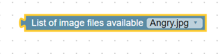

Parameters
* None

### Revert display image
Changes Misty's screen to display the previous image.

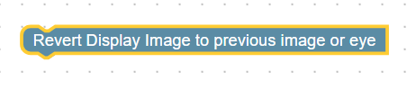

Parameters
* None

----------
## Beta/Experimental Commands

### Move head to location - BETA
Moves Misty's head to a given location.

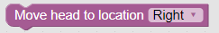

Parameters
* Location: Left, right, up, down, or center.

### Set head to position - BETA
Moves Misty's head in one of three axes (tilt, turn, or up-and-down).

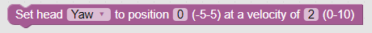

Parameters
* Axis: Yaw (turning left or right), pitch (moving up and down) or roll (tilting Misty's head toward her shoulder).
* Position: A value from -5 to 5 specifying the amount of movement.
* Velocity: A value from 0 (stopped) to 10 (full speed).

### Start / Stop mapping - BETA
Starts or stops Misty's mapping of an area.

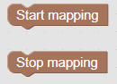

Parameters
* None

### Start / Stop tracking - BETA
Starts or stops Misty tracking her location on a previously generated map.

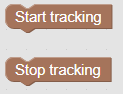

Parameters
* None

### Follow path - BETA
Drives Misty on a specified path.

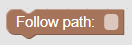

Parameters
* Path: A string of (x,y) coordinates for the path to follow. These must be obtained from a previously generated map.

----------
## Alpha/Not Recommended Commands

### Set affect - ALPHA
Not currently recommended for use.

### Change the eye - ALPHA
Not currently recommended for use. Use the "Display image file" block to change Misty's eyes.

### Hallucinate object - ALPHA
Not currently recommended for use.

### Get string sensor readings - ALPHA
Not currently recommended for use.

### Move arm to position - ALPHA
Not currently recommended for use.
