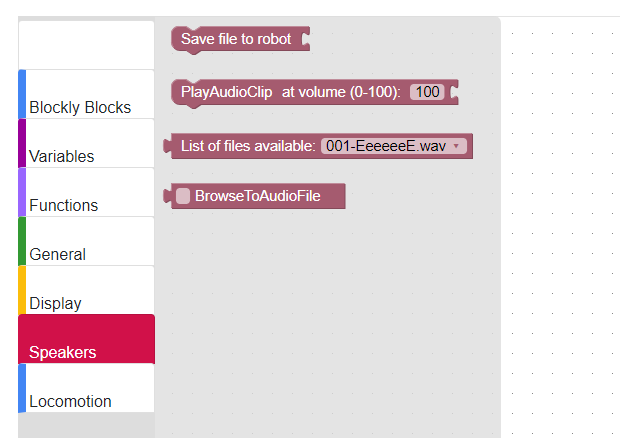
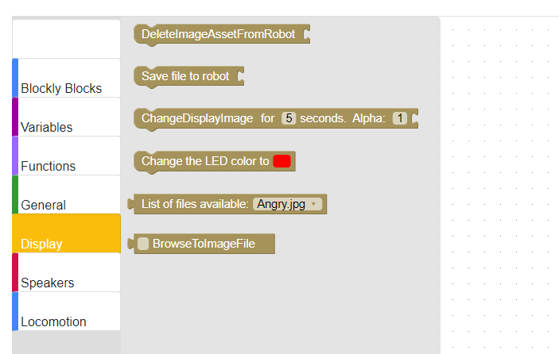

# {{title}}

Blockly is a block-based, visual programming language editor that runs in your browser.

**Note: We recommend the following browsers for running Blockly with Misty: Chrome, Safari, Firefox, and Microsoft Edge (latest versions).**

## Blockly Controls

The following controls are available on Misty's Blockly editor.

* **Robot IP Address**: Enter your Misty's IP address here; you can get this value from the Companion App.
* **Connect/Connected button**: Indicates whether Blockly can communicate with Misty. After entering Misty's IP address, click the **Connect** button. When Misty is connected to Blockly, the button changes to **Connected**.
* **Run**: Runs the blocks on the workspace.
* **Abort**: Stops the currently running blocks.
* **Save Project**: Saves the blocks on the workspace as blockly.txt to your computer's **Downloads** folder.
* **Show JavaScript**: Displays the JavaScript code generated by the blocks on the workspace.
* **Load Project**: Opens a saved Blockly file onto the workspace.

## Set up Blockly
Follow the steps below to set up Blockly with Misty.

**Note: It's not generally recommended for multiple users to each use a separate instance of Blockly to connect with and send commands to a single Misty robot. If more than one person does connect to Misty at the same time, as in a class or group development environment, people will need to take turns sending commands, or Misty may appear to respond unpredictably.**

1. Make sure Misty and your computer are on the same Wi-Fi network and that your computer has Bluetooth turned on.
2. Download and unzip Blockly. If the version of HomeRobot app on your Misty is 1.0.3.0 or later, download the [latest version of Blockly.](https://s3.amazonaws.com/misty-releases/Misty-0.7/latest/blockly.zip) You can also download [an earlier version of Blockly.](https://s3.amazonaws.com/misty-releases/Misty-0.7/latest/legacy-blockly.zip)
3. Open the index.html file from the Blockly download in your browser.
4. Enter the IP address of your robot in Blockly and click **Connect**. You can get Misty's IP address from the **Info** tab in the companion app. The **Connect** button should change to **Connected**. **Note: If you cannot connect, double-check that Misty and your computer are on the same WiFi network. If necessary, reload the page.**
5. Open your browser's JavaScript console. Misty has some Blockly commands for which the results are shown in the console. For Chrome, select **View** > **Developer** > **JavaScript Console**. For Safari, go to **Preferences...**, then click the checkbox for **Show Develop menu in menu bar**, then go to the **Develop** menu and select **Show JavaScript Console**. If the Blockly controls disappear when you open the JavaScript console, select the icon in the upper left side of the page to display them again. 
6. Select a simple Misty-specific block such as "ChangeEyes" (in the "Display" category).
7. Test that Blockly is set up by clicking **Run** and seeing how Misty reacts. **Note: After clicking Run, there can be a 2-3 second delay before Misty reacts, and up to a 5-second delay between actions when there are several in a row.**

## Experiment with Blockly

Try the following quick "programs" to start controlling Misty with Blockly.

**Note: When using Blockly, after clicking Run, there can be a 2-3 second delay before Misty reacts, and up to a 5-second delay between actions when there are several in a row.**

### Change the Color of Misty's LED

Want to change the light behind the logo on Misty's chest? Try this.

1. Choose the "ChangeLEDColor" block and click to select a color.
2. Click **Run**.

### Change the Image on Misty's Face

Are Misty's eyes looking a bit tired? Try uploading your own image to Misty's screen. It's a two-part process, but each part is very easy!

_Note: Misty's screen is 480 x 272 pixels in size. Because Misty does not adjust the scaling of images, for best results use an image with proportions similar to this._

First:
1. Choose the "SaveFileToRobot" block.
2. Add the "BrowseToImageFile" block. When you click on this block, you can select an image file on your computer to upload onto Misty. Valid image file types are .jpg, .jpeg, .gif, .png. and the maximum file size is 3 MB.
3. Click **Run**.

Then:
1. Choose the "ChangeDisplayImage" block.
2. Add the "ListFilesAvailable" block and select your file.
3. Click **Run**.

### Have Misty Play a Different Sound

Want Misty to say something new or make some noise other than her default sounds? It's another very simple, two-part process.

First:
1. Choose the "SaveFileToRobot" block.
2. Add the "BrowseToAudioFile" block. When you click on this block, you can browse for an audio file on your computer to upload onto Misty. All audio file types are valid, however Misty cannot currently play OGG files. The maximum file size is 3 MB.
3. Click **Run**.

Then:
1. Choose the "PlayAudioClip" block.
2. Add the "ListFilesAvailable" block and select your file.
3. Click **Run**.

## General Commands

These commands are mainly informational. To see results with some commands, you must have the JavaScript Console for the Blockly page open. For Chrome, select **View** > **Developer** > **JavaScript Console**. For Safari, go to **Preferences...**, click the checkbox for **Show Develop menu in menu bar**, then go to the **Develop** menu and select **Show JavaScript Console**.

### SetNetworkConnection
Connects Misty to a specified WiFi source.

Parameters
* NetworkName: The WiFi network name (SSID).
* Password: The WiFi network password.

### GetAvailableWifiNetworks
Displays a list of the WiFi networks currently in range of Misty.

Parameters
* None

Returns
* A list of WiFi networks currently in range of Misty. Open your browser's JavaScript console to view the results of this command.

### GetBatteryLevel
Displays Misty's current battery level.

Parameters
* None

Returns
* A value between 0 and 100 corresponding to the current battery level. Open your browser's JavaScript console to view the results of this command.

### GetDeviceInformation
Displays hardware and version information for your Misty robot.

Parameters
* None

Returns
* A set of data about your Misty robot. Open your browser's JavaScript console to view the results of this command. Information includes Windows OS version, Real Time Controller hardware version, Real Time Controller firmware version, IP address, and sensor capabilities.

### GetHelp
Displays information about Misty's available commands. Calling GetHelp with no parameters returns a list of all the commands that are available.

Parameters
* Command: Enter a specific command name or leave empty for a list of all commands.

Returns
* Information about a specific command or a list of all available commands. Open your browser's JavaScript console to view the results of this command.

## Speaker Commands
These commands direct Misty to play different sounds and allow you to upload custom sounds to Misty.

### SaveFileToRobot
Saves an audio file onto Misty. This block **must** connect with the "Browse for file" block, to select the audio file to be saved.

Parameters
* File: The audio file to save to Misty from the "Browse for file" block. This command accepts all audio format types, however Misty cannot currently play OGG files. The maximum file size is 3 MB.

### PlayAudioClip
Plays an audio file that has been previously uploaded to Misty. This block **must** connect with the "ListFilesAvailable" or "GetListOfAudioClips" block, to select the audio file to play.

Parameters
* File: The audio file to play. Connect the "ListFilesAvailable" or "GetListOfAudioClips" block to this block in order to select an audio file.

### GetListOfAudioClips
Lists the existing audio files on Misty. Connect this block to a "PlayAudioClip" block to select a sound to play.

Parameters
* None

### ListFilesAvailable
Lists the existing audio files on Misty. Connect this block to a "PlayAudioClip" block to select a sound to play.

Parameters
* None

### BrowseToAudioFile
Allows you to browse for a file on your computer. Connect this with a "SaveFileToRobot" block to select a file to upload to Misty.

Parameters
* File: When you click on this block, a browse file dialog is displayed to allow for file selection. All audio file types are valid, however Misty cannot currently play OGG files. Maximum file size is 3 MB.

## Display Commands
These commands direct Misty to display different images and allow you to upload custom images to Misty.

### SaveFileToRobot
Saves an image file to Misty. This block **must** connect with the "BrowseToImageFile" block, to select the image file to be saved.

Parameters
* File: The image file to save to Misty from the "BrowseToImageFile" block. Valid image file types are .jpg, .jpeg, .gif, .png. Maximum file size is 3 MB. Misty's screen is 480 x 272 pixels in size. Because Misty does not adjust the scaling of images, for best results use an image with proportions similar to this.

### ChangeDisplayImage
Sets the current image being displayed on Misty's screen. This block **must** connect with the "ListFilesAvailable" block or the BrowseToImageFile" block, to select the image file to display.

Parameters
* Filename: The name of the file containing the image to display, selected from the "BrowseToImageFile" block.

### ChangeEyes
Changes Misty's eyes to another of her default eye expressions.

Parameters
* Mood: One of the following: Angry, Concerned, Confused, Content, Groggy, Happy, Love, Sad, Unamused.

### ChangeLEDColor
Changes the color of the LED behind the logo on Misty's torso.

Parameters
* Color: A color selected from the block's options.

### RevertDisplay
Changes Misty's screen to display the previous image. You can run RevertDisplay repeatedly to "step" backward through the images that Misty has displayed.

Parameters
* None

### ListFilesAvailable
Obtains a list of the images currently stored on Misty. Connect this with a "ChangeDisplayImage" block to select a file to display on Misty's screen.

Parameters
* None

### BrowseToImageFile
Browse for a file on your computer. Connect this with a "SaveFileToRobot" block to select a file to upload to Misty.

Parameters
* File: When you click on this block, a browse file dialog is displayed to allow for file selection. Valid image file types are .jpg, .jpeg, .gif, .png.

## Locomotion Commands
Use these commands to drive Misty forward and backward, straight or in a curve, or stop.

**Note: Before using any locomotion commands, have Misty on a flat surface with plenty of room to move. It's also a good idea to experiment with small velocity values before getting her going at full speed.**

### Drive
Drives Misty forward or backward at a given speed until cancelled. You can use Blockly's **Abort** button to stop this block running.

When using the Drive command, it helps to understand how linear velocity (speed in a straight line) and angular velocity (speed and direction of rotation) work together:
* Linear velocity (-100) and angular velocity (0) = driving straight backward at full speed.
* Linear velocity (100) and angular velocity (0) = driving straight forward at full speed.
* Linear velocity (0) and angular velocity (-100) = rotating clockwise at full speed.
* Linear velocity (0) and angular velocity (100) = rotating counter-clockwise at full speed.
* Linear velocity (non-zero) and angular velocity (non-zero) = Misty drives in a curve.

Parameters
* LinearVelocity: A percent value that sets the speed for Misty when she drives in a straight line. Default value range is from -100 (full speed backward) to 100 (full speed forward).
* AngularVelocity: A percent value that sets the speed and direction of Misty's rotation. Default value range is from -100 (full speed rotation clockwise) to 100 (full speed rotation counter-clockwise). **Note: For best results when using angular velocity, first experiment with using small positive and negative values to observe the effect on Misty's movement.**
* UsePid: 

### Move
Drives Misty forward or backward at a given speed for a duration specified in milliseconds.

Parameters
* Direction: Forward or backward.
* Speed: A value from -100 to 100. -100 is full speed reverse, 0 is stopped, 100 is full speed forward.
* Duration: A value in milliseconds, using 100 ms increments, with a maximum value of 10,000 ms (10 seconds).

### LocomotionTrack
Drives Misty left, right, forward, or backward at a given speed until cancelled. You can use Blockly's **Abort** button to stop this block running.

Parameters
* LeftTrackSpeed: A value for the speed of the left track, ranging from -100 (full speed backward) to 100 (full speed forward).
* RightTrackSpeed: A value for the speed of the right track, ranging from -100 (full speed backward) to 100 (full speed forward).

### Stop
Stops Misty's movement.

Parameters
* None

