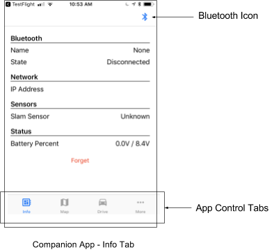
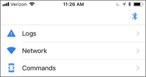
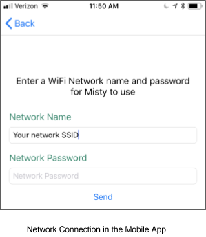
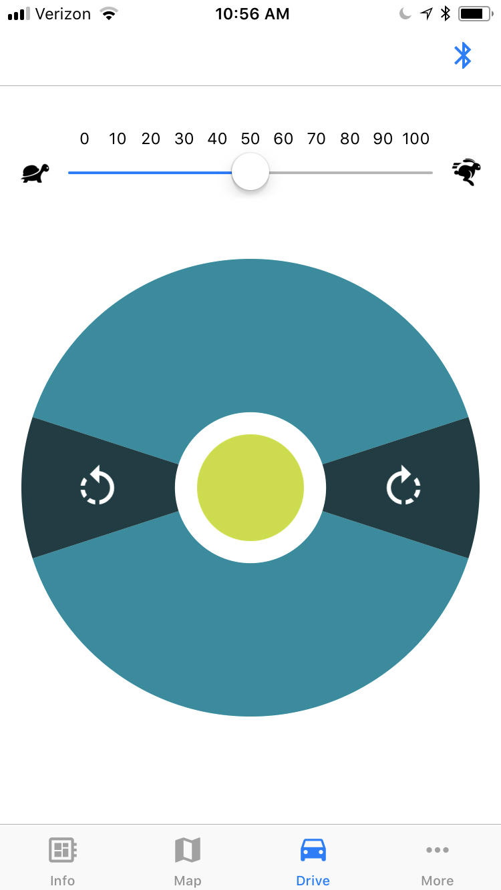

# {{title}} 

If you haven’t already received an email from HockeyApp or TestFlight with instructions on how to download the mobile app, please send a note to **help @ mistyrobotics.com** and let us know which app (iOS or Android) you’d like.

**Note: When using the companion app, you should connect Misty to both Bluetooth and Wi-Fi. Keep reading for connection instructions.**

## Connect to Misty via Bluetooth 

1. Once you’ve downloaded and opened the app, make sure to turn on Bluetooth on your phone.
2. Select the Bluetooth icon in the upper right of the app. The app will search for nearby robots and list those it finds. Your robot’s name should appear in the app.

3. Select your robot’s name to connect to the robot. When connected, two dots will appear in the Bluetooth icon on your phone.

**Note: If your robot name doesn’t show up in the app, or if you lose connection (indicated when the two dots disappear from your Bluetooth icon), close the app and restart it.**

## Connect Misty to Wi-Fi
For now Misty’s Wi-Fi connections are limited to 2.4 GHz networks. It is important to note that **this can fail without error**, and you won’t know what’s going on. If you have a dual-band router, be sure to join the 2.4 GHz version of your network. 

Connection, logs, and commands can be found in the companion app’s More tab:

1. Select Network from the More tab.

2. Enter your Wi-Fi network name (or confirm that the pre-populated Wi-Fi name is the correct network), then your password, and hit Send. You should see a message saying “Success!” appear briefly on screen. **Important: For the companion app, Blockly, and the API client to operate correctly, make sure that both Misty and your phone are connected to the same Wi-Fi network.**

## Drive Misty with the Companion App

1. Select the companion app’s Drive tab.
2. Control the robot’s drive treads by moving one finger around the “joystick” control. Pressing at the points at the top and bottom of the circle drives Misty straight forward or backward. Pressing in the areas to the left and right of the circle (indicated with colored sections as seen at the right) rotates Misty.
3. Control the drive speed with the slider at the top. 

## Get Information from Misty
Information on Misty’s Bluetooth and Wi-Fi connection status, IP address, SLAM sensors, and battery charge level are available from the Info tab. 

**Note: You will need Misty’s IP address for the Blockly and API clients.**
