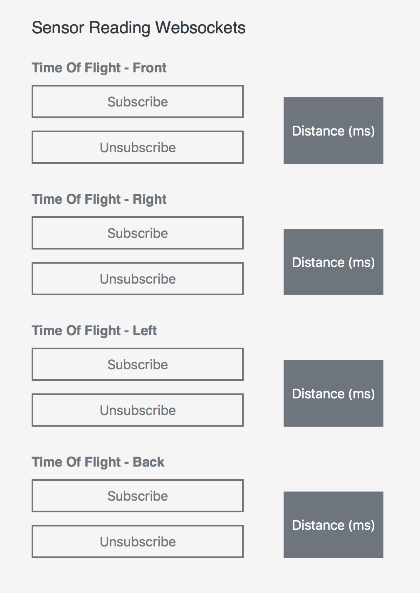
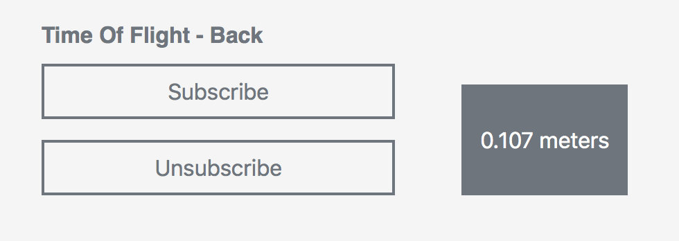

# {{title}}

Welcome! Your Misty I Developer Edition Prototype robot has been hand-built by the Misty Robotics team. Please start here for some quick words of advice on handling her. 

## Laser Safety

Misty uses a laser sensor located above her right eye to see the world.

Never stare directly into the laser. Do not directly touch the laser or remove the protective cover over the laser. Oils on your finger can cause the light to disperse into your eyes and increase the risk of physical damage.

## Fire Safety

**IMPORTANT! For your safety, please note the following:**

1. **Always** use the power supply (12-volt, 3 Amp, **center positive**) that came with Misty. Using a differently configured power supply creates a **high risk of fire**.

2. If you encounter any resistance or difficulty plugging the power supply into the jack on the back of Misty: STOP. Pull the plug out and try again, rotating the plug if necessary, until the plug inserts smoothly. It’s possible to catch the ground leaf spring on the bottom of the jack with the power supply plug and create a short. This renders Misty inoperative.

3. **Never** unplug the power connectors inside Misty. These connectors can be reversed or otherwise improperly re-inserted and create a **high risk of fire**. 

## Handling Misty

While future versions of Misty will be much tougher, it’s important that you handle your Misty I Developer Edition Prototype robot with care. When carrying Misty, support the entire robot from the front and back, below the main chassis between the two tracks.

**Note: If you are powering up Misty on a table top, it’s a good idea to use the small cardboard box that came in Misty’s packaging as a stand.** Simply place the box under Misty, between her tracks. When Misty’s movement is activated, Misty’s tracks will move freely, but she will stay safely in place.

## Cleaning the Time-of-Flight Sensors

A Misty I Developer Edition Prototype robot has a total of four time-of-flight sensors: three on the front and one on the back. These sensors obtain distance data for objects in Misty's environment and allow her to avoid obstacles as she moves. 

In some environments, the time-of-flight sensors may become dusty over time, which can cause them to return inaccurate distance data. If your robot has started running into objects that she would normally avoid, it's important to test the time-of-flight sensors to ensure they're functioning properly.

1. Open up the [API Explorer](../../3-ways-to-interact-with-misty/api-explorer) in a browser and connect it to your robot.
2. In the API Explorer, scroll down to the **Websockets** section and find the **Sensor Reading Websockets**. 
3. Locate a ruler with centimeter markings and lay it so that the 0cm mark is even with one of Misty's time-of-flight sensors. (In the photo, we've started the test with the back sensor.) Place an object with a flat surface on the ruler facing the sensor, say at the 10cm mark. 
4. Use the API Explorer to subscribe to the time-of-flight sensor you are testing (in this case, the back sensor). Confirm that the sensor reading is reasonably close to 0.1 meters (10cm). **Note: Because it's challenging to place objects exactly 10cm from a sensor, values between 0.08 meters (8cm) and 0.12 meters (12cm) are typically close enough.** 
5. Repeat this process for each of the four time-of-flight sensors. If any sensor consistently gives inaccurate readings, proceed with cleaning that sensor.
6. To clean a time-of-flight sensor, use a can of compressed air to blow any dust off.
7. After cleaning, re-test the sensor. If a time-of-flight sensor continues to provide inaccurate data after cleaning, contact us for assistance.

