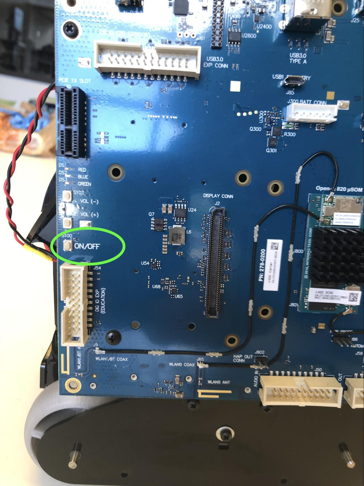

# {{title}}

## Turning Misty On

1. Use the small cardboard box (that came in her packaging) as a stand for Misty while you experiment. Place the box under Misty, between her tracks.
2. Plug Misty in. Her battery will thank you.
3. Flip the switch on Misty’s back.
4. The light on Misty’s chest should come on.
5. Press the ON/OFF button located on the 820 Dev Kit board. The 820 board is mounted on Misty’s right side. The position of the ON/OFF button is as pictured. **Note: Both power sources must be on for Misty to function properly.**

6. A blue LED on the left side (as you face Misty) of the Occipital navigation sensor should come on.
7. Say hello! You’ll know Misty is booted up when you see her eyes. This should take a little more than a minute.

## Restarting Misty

1. If you need to restart Misty, turn off the power switch on Misty’s back.
2. Wait 10 seconds.
3. Turn on the power switch on Misty's back again.
4. Press the ON/OFF button on the 820 Dev Kit board.
5. Once you see the blue LED light up again and Misty's eyes re-appear, you're ready.

## Turning Misty Off

Just flip the power switch on Misty’s back, and both systems will shut down.

**Note: There is no graceful shutdown at this time. When Misty’s battery gets below about 7 volts she abruptly powers down.**

**Note: At this time, updates of Misty's underlying operating system platforms (e.g. Windows IoT Core) may occur without warning. If you see an image of gears on Misty's screen, be aware that she is going through a system update.**

