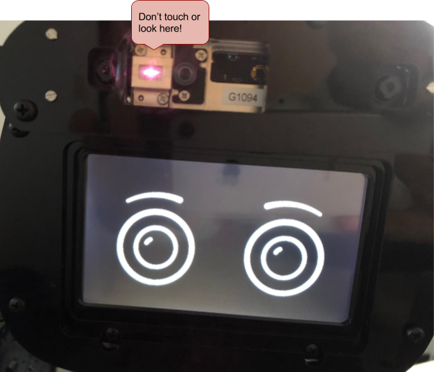

# {{title}}

Welcome! Your Misty I robot has been hand-built by the Misty Robotics team. Please start here for some quick words of advice on handling Misty. 

### SAFETY WARNING

Misty uses a laser sensor to see the world. It is located above her right eye.

**Never look directly into the laser!**

**Do not directly touch this sensor or remove the protective cover over this sensor!**

**Oils on your finger can cause the laser to disperse into your eyes and CAUSE SEVERE PHYSICAL DAMAGE!**

### Handling Misty

While future versions of Misty will be much tougher, it’s important that you handle Misty I Developer Edition with care. When carrying Misty, support the entire robot from the front and back, below the main chassis between the two tracks.

**Note: If you are powering up Misty on a table top, it’s a good idea to use the small cardboard box that came in Misty’s packaging as a stand.** Simply place the box under Misty, between her tracks. When Misty’s movement is activated, Misty’s tracks will move freely, but she will stay safely in place.
