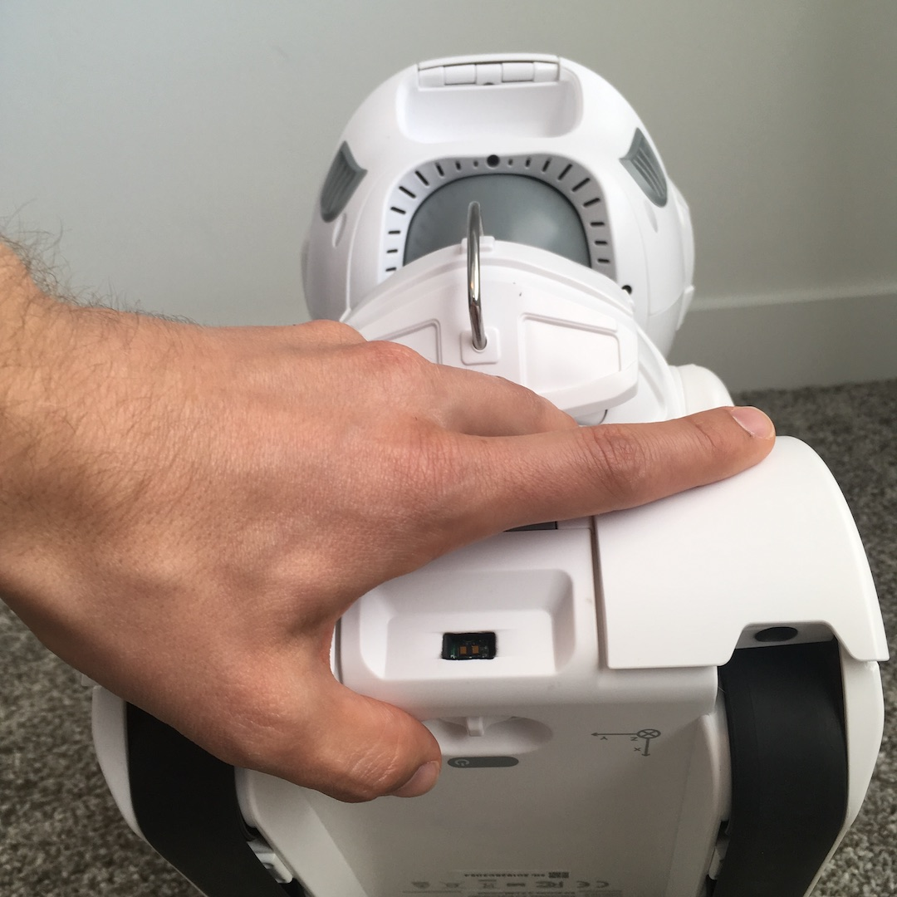

# {{title}}

Welcome! Your Misty II Field Trial robot has been designed and built by the Misty Robotics team. For safety during shipping, Misty II arrives with her battery disconnected. Start here for a quick guide to setting up your robot.

**Important!** Misty II features a built-in carrying handle on the back of her head. Grip this handle to carry your robot.

**Note:** To avoid the risk of driving Misty off a high surface, we recommend either working with your robot on the floor or temporarily elevating the treads so the robot cannot drive. To do this, you can place books or blocks between Misty's treads.

## What's in the Box?
Misty II arrives with her magnetic headpiece and "backpack" attached. In addition to Misty, your package arrives with the following items:
* charging pad
* power supply
* Misty II Getting Started guide

**Note:** Misty's packaging has been specially designed to protect your robot during shipping. Because you will need to return this Field Trial unit, please keep all original packaging for use in shipment.

### Misty's Backpack

Remove the magnetic "backpack" to reveal the ports on Misty's back. These include
* 5v USB port
* 3.3v universal asynchronous receiver-transmitter (UART) serial port

You can use the USB port to power external hardware and to connect Misty to your local network with a USB-to-Ethernet adapter. The UART serial port enables communication between Misty and an external device, such as an Arduino.

If you did not purchase Misty's Arduino backpack, the "backpack" shipped with your robot does not contain any hardware. Note that you can still use Misty's hardware expandability by connecting your own Arduino to her UART serial port. 

## Connecting the Battery
You must connect Misty's battery before turning her on for the first time. Before you connect Misty's battery, please read the following important notes:
* Always use the battery that came with your Misty II.
* Always use a power supply (12-volt, 3 Amp, **center positive**) with the same specifications as that which came with Misty. Using a differently configured power supply creates a high risk of fire.
* If you encounter any resistance or difficulty plugging the power supply into the jack on the back of Misty: **STOP**. Pull the plug out and try again, rotating the plug if necessary, until the plug inserts smoothly. It’s possible to catch the ground leaf spring on the bottom of the jack with the power supply plug and create a short. This renders Misty inoperative.
* **Never** unplug the power connectors inside Misty. These connectors can be reversed or otherwise improperly re-inserted and create a **high risk of fire**.

We ship Misty with her battery disconnected. Follow the steps below to access the battery compartment and connect Misty's battery:

1. Remove the bump sensor covers from Misty's base. Use the indentation at the edge of the bump sensor covers to pry each cover off of Misty's base. Misty II has two front-facing and two rear-facing bump sensor covers. All four bump sensor covers must be removed. 

   **Rear-Facing Bump Sensor Cover Removal:**  **Front-Facing Bump Sensor Cover Removal:** 

2. Once you’ve removed all four bump sensor covers, remove the screws that secure the white panels on each side of Misty's base. Each side panel is secured to the base by six screws, three beneath the front-facing bump sensor cover and three beneath the rear-facing bump sensor cover. 
3. After you take out the screws, gently lift each side panel up and away from the robot. **Note:** If Misty's arms prevent you from removing the side panels, gently rotate them to an upward position to move them out of the way. 
4. Remove the screws securing the gray panel beneath Misty's chest to the base. This panel has two screws, one either side of Misty's base. 
5. Remove the gray panel from the front of Misty's base to reveal the disconnected battery. 
6. Remove the battery from Misty's base. 
7. Connect the battery to Misty by pushing the white connectors together until you hear them click. 
8. Place the battery back into the battery compartment. 
9. Starting with the front gray panel, replace each of Misty's base panels. Secure each panel with screws as you progress.
10. Replace the bump sensor covers. Line up the pegs on each cover with the holes in the side base panels and apply pressure until the covers click into place.

    **Front-Facing Bump Sensor Cover Placement** 
    **Rear-Facing Bump Sensor Cover Placement** 

## Connecting to Wi-Fi

Now that you've connected your robot's battery, you can set up Misty's internet connection with the [Companion app](../../apps/companion-app/#connecting-misty-to-bluetooth-and-wi-fi) or the [API Explorer](../../apps/api-explorer/#connecting-wifi).

## Charging Misty II
There are two ways to charge Misty II. You can use the wireless charging pad that comes with your robot, or you can plug the power supply directly into the power port on Misty's base.

Note that Misty does not need to be turned on during charging. Misty continues to use some power even when switched off, so her battery levels will drop even when she is powered down. 

### Wireless Charging
To use Misty's wireless charging pad, follow these steps:

1. Connect the power supply to the power port on the back of the charging pad. 
2. **Optional:** To prevent tripping hazards, place the power brick inside the charging pad and wrap any extra lenght of the power cable around the nodes inside the rear compartment, as seen in the photo below. 
3. Place the charging pad on a flat surface. **Note:** To avoid the risk of driving Misty off a high surface, we recommend charging Misty on the floor.
4. Plug the power cable into the wall.
5. Place Misty on the center of the charging pad. Position her to be facing out, with her back against the rear compartment of the charging pad. 

**Note:** When Misty is turned on and charging the speed of her fan increases. If you don't hear the fan speed change, try adjusging her position on the pad.

### Wired Charging

You can also charge Misty by plugging the power supply directly into the power port on the back of Misty's base. 

## Misty II Specs

Misty is packed with sophisticated hardware and software features that contribute to her ruggedness and extensibility as a platform.

### Size
* Height: 35.56 cm / 14 in
* Depth: 25.4 cm / 10 in
* Width: 20.32 cm / 8 in
* Weight: 2.7 kg / 6 lbs

### Processors
* Qualcomm® Snapdragon 820™ mobile processor
* Qualcomm® Snapdragon 410™ processor

### Computer Vision
* Occipital Structure Core depth sensor for 3D maps
* 166° diagonal field of view wide-angle Structure Core camera (106° horizontal x 60° vertical)
* 4K camera
* Facial recognition
* Deep-learning AI using Qualcomm® Snapdragon™ Neural Processing

### Sound
* 3 far-field microphones using Qualcomm® FluenceTM PRO 
* 2 high-fidelity speakers with engineered sound box and bass port

### Touch
* 6 capacitive touch sensors on head and chin

### Distance and Obstacle Detection
* 8 IR-based time-of-flight sensors (3 forward, 1 rear, 4 edge/downward)
* 10 bump sensors (3 tied in parallel on each front corner, 2 tied in parallel on each rear corner)

### Movement
* Patent-pending 3-degree of freedom neck
* Easily customizable moving arms
* Sturdy track-driving tread system
* Trailer hitch to pull a payload

### Display & Light
* 4” LCD image display/screen
* Bright LED flashlight
* Multi-color LED chest light

### Connectivity
* 2.4 and 5 Ghz WiFi connection
* Bluetooth and Bluetooth Low Energy capabilities 

### Expandability
* USB/Serial-connected backpack for hardware expansion
* Arduino backpack (optional)
* Magnetic helmet connection point

### Operating Systems
* Windows IoT Core™ (Main)
* Android™ 7 (navigation/computer vision)

## Powering Up & Powering Down

We recommend powering up Misty on the floor, if possible, to avoid the risk of driving your robot off the edge of a table or other high surface. If you are experimenting with Misty on a table top, considering placing books or blocks between her treads to elevate them above the surface of the table.

### Turning Misty On
1. Toggle the power switch on Misty's base (located between the treads beneath the rear time-of-flight sensor).
2. The Misty Robotics logo first appears on the screen. Then Misty’s eyes appear, beginning in a closed state. The eyes gradually open as Misty boots up.
3. When the eyes appear fully open, Misty is done booting up. This should take a little more than a minute. **Important!** If after a few minutes, Misty's eyes still do not appear fully open, contact technical support for assistance.

### Restarting Misty
If you need to restart Misty:
1. Turn off the power switch on Misty's base.
2. Wait 10 seconds.
3. Turn on the power switch on Misty's base again. Misty has rebooted when her eyes are fully open.

### Turning Misty Off
To turn off your robot, turn off the power switch on Misty’s base.

**Note:** There is no graceful shutdown at this time. When Misty’s battery gets below about 7 volts, she abruptly powers down.

**Note:** At this time, critical updates of Misty's underlying operating system platforms (e.g. Windows IoT Core) may occur without warning. If you see an image of gears on Misty's screen, be aware that she is going through a system update.

## System Updates
Misty checks for available system updates every time you turn her on or restart her. If you've not restarted her recently, you can check for and perform updates for Misty with the Misty Companion app or API Explorer.

Updates can include:

* Image and/or sound assets
* Motor controller firmware
* Real-time controller firmware
* Occipital Structure Core depth sensor firmware
* Home Robot application (running on Windows IoT Core)
* Sensory Services application (running on Android)
* OS updates

We recommend you check for updates on a weekly basis.

**Important:** Please keep Misty plugged in for the entire duration of the update and do not attempt to send commands to her during this time.

