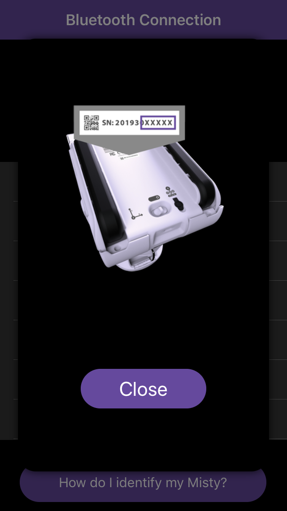
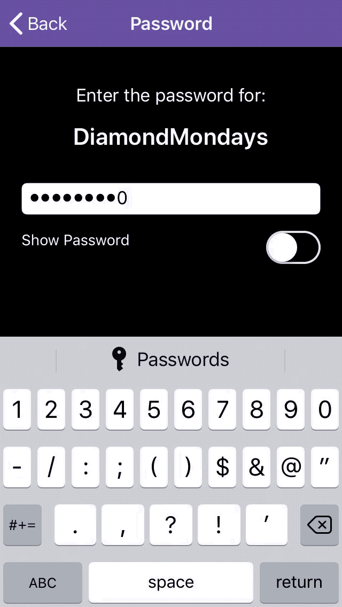
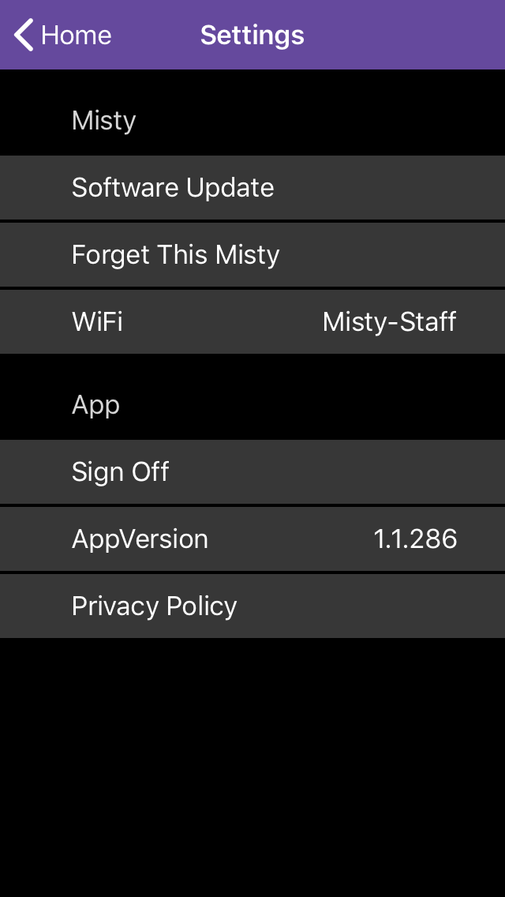

# {{title}}

The Misty App is a mobile app for Android and iOS devices that you can use to set up Misty's Wi-Fi connection. You can also use the app to drive Misty and see information about her software. You can download the Misty App from the [App Store (iOS)](https://apps.apple.com/us/app/misty-app/id1296946424) or [Google Play (Android)](https://play.google.com/store/apps/details?id=com.mistyrobotics.Companion&hl=en_US).

{{box op="start" cssClass="boxed noteBox"}}
**Note:** 
* It's not generally recommended for multiple users to each use a separate instance of the Misty companion app to connect and send commands to a single Misty robot. If more than one person does connect to Misty at the same time, as in a class or group development environment, they will need to take turns sending commands, or Misty may appear to respond unpredictably.
* When using the Misty companion app, **make sure your phone and Misty are on the same Wi-Fi network**.
{{box op="end"}}

## Connecting Misty to Bluetooth and Wi-Fi

{{box op="start" cssClass="boxed noteBox"}}
**Note:** You can only connect Misty to Wi-Fi networks that have password protection. Misty cannot be connected to open networks at this time. Misty does support both 2.4 GHz and 5 GHz Wi-Fi networks. If you are using a network without password protection or one that requires additional layers of authentication, see [this support thread](https://community.mistyrobotics.com/t/nontraditional-network-wifi-ideas/861) or contact us for help.
{{box op="end"}}

1. Power up your Misty robot and wait for her eyes to appear fully open.
2. Turn on Bluetooth on your phone or tablet and make sure your device is connected to your preferred Wi-Fi network. Additionally, because Bluetooth and Wi-Fi broadcasts are considered to be location data, you must enable location services on your device before using the Misty App to connect to your robot.
3. Download the Misty App. If you have trouble downloading the app for your device, please send a note to **help @ mistyrobotics.com**.
4. Open the Misty App. Previous users may be asked to log in. New users will be asked to sign up for a new account.
5. Once you've logged in, connect the app to Misty via Bluetooth by standing close to Misty **with the Misty App open on your device**.
6. When the Bluetooth broadcast succeeds, the app displays a list of Misty robots that your app can connect to. Select your Misty from the list. **Note:** If you are in a room with more than one Misty, you may need to locate your Misty's serial number by checking the label on the bottom of your robot. 
7. When Misty connects to your device, the Misty App displays a list of nearby Wi-Fi networks. Select your network from the list, and follow the prompt to enter your password. The full sequence for connecting Misty looks like this: 
8. If the connection fails initially or at any point when you are using the app, you'll see a screen that allows you to try reconnecting to Misty. If you cannot successfully connect Misty to Wi-Fi, check for and install any updates to the companion app. 
9. Once the Wi-Fi connection succeeds, you should see the Misty companion app **Home** screen. Confirm that the Wi-Fi status is **Connected** and that a valid IP address for Misty appears onscreen. **Note:** You will need the IP address to use Misty with all of her web-based tools. 

{{box op="start" cssClass="boxed noteBox"}}
**Important!** While it’s usually easiest to use the companion app to connect Misty to your home Wi-Fi network, sometimes there can be issues with this method. In that case, you can use the [Command Center](../../../tools-&-apps/web-based-tools/command-center/#connecting-wi-fi) and the USB-to-Ethernet adaptor that came with your robot to connect Misty instead.
{{box op="end"}}

## Getting Information about Misty

The **My Misty** screen provides information on Misty’s Bluetooth and Wi-Fi connections, her IP address, software versions, and more.

1. From the bottom of the **Home** screen, select the **My Misty** icon.
2. The **My Misty** screen allows you to view connectivity, software, and hardware information. 

## Updating Misty

The **Settings** screen provides a way for you to easily start an update to Misty's system software. If you want to find the version information for your robot's currently installed system software, use the **My Misty** screen as described above. To find out the version number(s) for the most recent system updates, see the release notes on our [Community site](https://community.mistyrobotics.com/c/development).

{{box op="start" cssClass="boxed noteBox"}}
**Important:** Please keep Misty plugged in for the entire duration of the update and do not attempt to send commands to her during this time.
{{box op="end"}}

1. Before updating Misty, make sure your robot is plugged into a power source. Your robot should stay connected to her charger until the update is complete.
2. To update Misty, select the **Settings** icon from the bottom of the **Home** screen. 
3. Press the words **Software Update** to start the update process. 
4. Because downloading and installing a system update may take several minutes, you must confirm that you want to start the update process at this time. Press **Yes** to start the update process. **Note: During the download and update, all sommands except for `Halt` and `Stop` are disabled.**
5. The update process may take several minutes. **The update is not complete until Misty restarts and her eyes are fully open.**

{{box op="start" cssClass="boxed noteBox"}}
Because updating Misty can cause Misty to disconnect from Bluetooth, you may need to reconnect Misty to the companion app when her update is complete.
{{box op="end"}}

## Driving Misty with the Misty App

1. From the **Home** screen, select the **Drive** icon at the bottom of the screen. 
2. On the driving control screen, you can see a speed slider control, a "joystick" directional control, and a +/- control (to move Misty's head up or down). Start Misty driving at a slower speed by moving the speed control left, toward the "tortoise". To speed up, move the control to the right, toward the "hare". 
3. Control the direction that Misty drives by moving one finger around the “joystick”. Pressing at the points at the top and bottom of the circle drives Misty straight forward or backward. Pressing in the areas to the left and right of the circle rotates Misty.