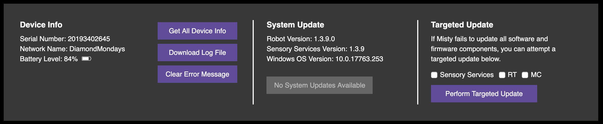
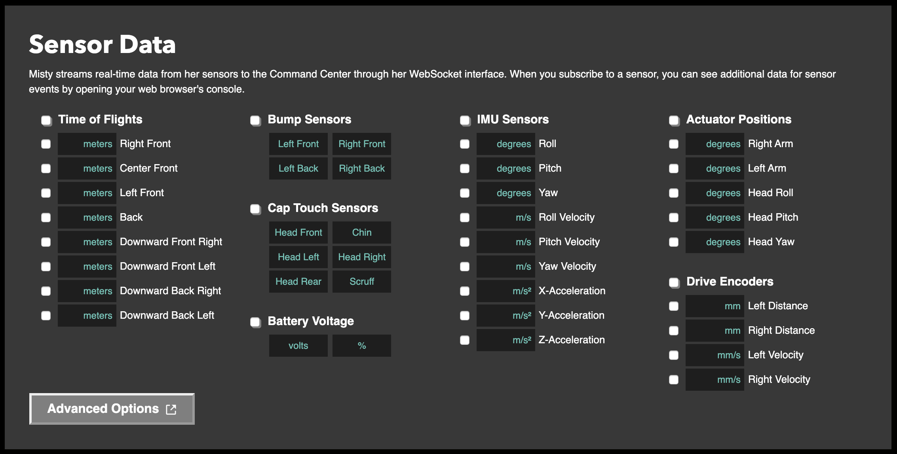

# {{title}}

You can use the [Command Center](http://sdk.mistyrobotics.com/command-center/) in your browser to try Misty’s capabilities and send basic commands to your robot before writing your own code. We recommend using the [Command Center](http://sdk.mistyrobotics.com/command-center/) with the latest version of the Google Chrome browser.

{{box op="start" cssClass="boxed noteBox"}}
**Note:** The Command Center is currently in a pre-release state. As such, not all features are fully functional, and the site may change before the release of Misty's SDK.
{{box op="end"}}

The [Command Center](http://sdk.mistyrobotics.com/command-center/) works by sending requests to Misty's [REST API](../../../misty-ii/reference/rest) endpoints. To see the full response for a request and other information about the commands you send to Misty, open the web console in your browser. **To open the web console in Chrome, use:**

* **Ctrl + Shift + J** (Windows/Linux)
* **Cmd + Option + J** (Mac)

{{box op="start" cssClass="boxed noteBox"}}
**Note:** It's not generally recommended for multiple users to each use a separate instance of the [Command Center](http://sdk.mistyrobotics.com/command-center/) to connect and send commands to a single Misty robot. If more than one person does connect to Misty at the same time (as in a class or group development environment), each person should take turns sending commands, or Misty may appear to respond unpredictably.
{{box op="end"}}

## Setting up the Command Center

Before you connect Misty to an instance of the [Command Center](http://sdk.mistyrobotics.com/command-center/), **make sure your computer and Misty are on the same Wi-Fi network**.

1. [Open up the Command Center](http://sdk.mistyrobotics.com/command-center) in a browser window.
2. Enter the IP address of your robot (you can find your robot's IP address in the Misty companion app) and click the **Connect** button. Watch for the text on the **Connect** button to change to **Connected**.
3. Use the **Quick Commands** in the **System** section to experiment with changing the color of the LED on Misty's chest or changing the image on Misty's display.

1. When Misty is connected, her serial number, battery level, and software version display under **Device Info** in the **System** section. To see all data provided by the **Get All Device Info** button, open the web console for the browser window.

## Movement

Use the **Movement** section to send Misty drive commands, drive Misty manually, and to move Misty's head and arms.

 

{{box op="start" cssClass="boxed tipBox"}}
**Tip:** You can use the red **Halt All Motors** button at any time to disable all of Misty's motor controllers.
{{box op="end"}}

### Locomotion

Use this section to send a [**DriveTime**](../../../misty-ii/reference/rest/#drivetime) command to Misty. Using this command allows you to drive Misty forward or backward at a set speed, with a given rotation, for a specified amount of time.

When using **Drive Time**, it helps to understand how linear velocity (speed in a straight line) and angular velocity (speed and direction of rotation) work together:

* Linear velocity (-100) and angular velocity (0) = driving straight backward at full speed.
* Linear velocity (100) and angular velocity (0) = driving straight forward at full speed.
* Linear velocity (0) and angular velocity (-100) = rotating clockwise at full speed.
* Linear velocity (0) and angular velocity (100) = rotating counter-clockwise at full speed.
* Linear velocity (non-zero) and angular velocity (non-zero) = Misty drives in a curve.

Follow these steps to send Misty a **DriveTime** command:

1. Use the **Linear Velocity** control to set the speed Misty travels in a straight line. The control can be set from -100 (full speed backward) to 100 (full speed forward).
2. Use the **Angular Velocity** control to set the speed and direction of Misty's rotation. The control can be set from -100 (full speed rotation clockwise) to 100 (full speed rotation counter-clockwise). **Note:** For best results when using angular velocity, we encourage you to experiment with using small positive and negative values to observe the effect on Misty's movement.
3. Use the **Duration (ms)** control to specify the amount of time Misty should drive.
4. Click **Drive**. Misty stops driving automatically when the time is up.

### Manual Driving

You can use the **Manual Driving** controls to drive Misty in a variety of directions.
 

1. Click a directional button to drive Misty in that direction. Misty will continue to drive in that direction until you specify a new direction or send a command to halt or stop driving.
2. Adjust the **Velocity** slider to change how fast Misty drives.
3. Use the center button to stop Misty's drive motors.

### Moving Misty's Head & Arms

You can use the [Command Center](http://sdk.mistyrobotics.com/command-center/) to change the position of Misty's head and arms.


When Misty connects to the [Command Center](http://sdk.mistyrobotics.com/command-center/), the position of each slider updates to match the current position of Misty's head and arms. Adjust these sliders and click the associated button to change the position of Misty's head and arms.

{{box op="start" cssClass="boxed noteBox"}}
**Note:** Pitch head movement is all that can be controlled for Misty I robots.
{{box op="end"}}

## Managing Audio and Image Files

Misty comes with a number of default system image files that you can display on her screen, as well as default audio files that she can play. You can use the **Asset** section of the Command Center to upload your own image and audio files to Misty, or to manage the files already on your robot.


### Adding a custom audio or image file to Misty

Please read the following before uploading new image or audio files to Misty:

* For images, valid file types are .jpg, .jpeg, .gif, and .png. Because Misty does not adjust the scaling of images you upload with the [Command Center](http://sdk.mistyrobotics.com/command-center/), for best results use an image with proportions similar to that of Misty's screen (480 x 272 pixels).
* For audio, you can upload all file format types, however Misty cannot currently play OGG files.
* The maximum size for both audio and image files is 3 MB.

Follow these steps to add a custom audio or image file to Misty:

1. To select a file to upload to Misty, either drag a file into the rectangular drop area, or click the text in the drop area browse for the file on your computer.
2. Once the upload is complete, you can locate the file in the dropdown list of images or audio files to confirm the upload was successful.

### Working with audio files

You can use the controls in the **Audio** section to play, download, or delete the audio files on Misty. The list of audio files currently on Misty automatically populates in the **Audio** section when Misty connects to the [Command Center](http://sdk.mistyrobotics.com/command-center/).

* **To have Misty play an audio file**, choose the file to play from the list and click the **Play on Robot** button.
* **To play an audio file in your web browser**, choose the file to play from the list and click the **Play in Browser** button
* **To download an audio file from Misty to your computer**, choose the file to download from the list and click the purple download button.
* **To delete an audio file from Misty**, choose the file to delete from the list and click the red delete button. **Note:** You can only delete audio or image files that you have previously uploaded to Misty.The [Command Center](http://sdk.mistyrobotics.com/command-center/) returns an error to the console in your web browser if you attempt to remove one of Misty's default system files.

### Working with image files

You can use the controls in the **Image** section to display, download, or delete the images on Misty. The list of image files currently on Misty automatically populates in the **Image** section when Misty connects to the [Command Center](http://sdk.mistyrobotics.com/command-center/).

* **To have Misty display an image**, choose the file to display from the list and click the **Display on Robot** button.
* **To display an image in your web browser**, choose the file to display from the list and click the **Display Image** button.
* **To download an image file from Misty to your computer**, choose the file to download from the list and click the purple download button.
* **To delete an image file from Misty**, choose the file to delete from the list and click the red delete button. **Note:** You can only delete audio or image files that you have previously uploaded to Misty. The [Command Center](http://sdk.mistyrobotics.com/command-center/) returns an error to the console in your web browser if you attempt to remove one of Misty's default system files.

## Perception

You can use the **Perception** section of the [Command Center](http://sdk.mistyrobotics.com/command-center/) to interact with Misty's face training and recognition capabilities, to take pictures, and to record audio or record video.

### Face Training & Recognition

To use face training and recognition, follow these steps.

1. Make sure that your robot is connected to the [Command Center](http://sdk.mistyrobotics.com/command-center/).
2. In the **Perception** section, go to **Face Training** and enter a name in the **Name to Train** input box. 
3. Position a single person’s face in a well-lit area 1-6 feet from Misty’s camera. Do not attempt to train Misty to recognize more than one person at the same time.
4. Click **Start Face Training** and wait 10-15 seconds. There is no need to click **Stop Face Training**, unless you want to stop the process before it completes. You can observe the main [Command Center](http://sdk.mistyrobotics.com/command-center/) browser tab (not the JavaScript console) for pop-up status messages during the face training process. **Note**: Due to network variability, there can be up to several seconds of lag time between when you begin face training and when any status messages appear.
5. Once you've trained Misty on a person's face, you can click **Start Face Recognition**.
6. Position the person’s face in a well-lit area front of the camera.
7. Open the web console for the browser window. (Note that how you open the console varies among browsers and platforms.) Watch the browser console for face recognition data to come through. Face recognition data is sent at a rate of about once per second, but this timing may vary significantly.
8. When finished, click **Stop Face Recognition**.

{{box op="start" cssClass="boxed noteBox"}}
**Note:** The face detection and recognition data that Misty sends is described in detail in the [Sensor & Skill Data Types](../../../misty-ii/reference/sensor-data) section.
{{box op="end"}}

### Recording Video

Misty can record a ten second video with her 4K camera. You can use the [Command Center](http://sdk.mistyrobotics.com/command-center/) to start the recording, stop the recording, and download the recording to your web browser.

Note that Misty records videos in MP4 format at a resolution of 1080 × 1920 pixels. Misty only saves the most recent video recording to her local storage. Recordings are saved with the filename `MistyVideo.mp4`, and this file is overwritten with each new recording.


Click **Start Recording Video** to start Misty recording a video, and click **Stop Recording Video** to stop the recording. Note that if you do not click **Stop Recording Video**, Misty automatically stops recording after 10 seconds. Click **Download Recorded Video** to download the most recent recorded video recorded to your web browser.

### Taking Pictures

Misty can take pictures with her 4K camera as well as the ultra-wide vision camera on her Occipital Structure Core depth sensor.

Use the **Take Photo** controls to take a picture with Misty's 4K camera.


Click **Take + Display Photo** to take a picture and display it in your browser, or click **Take + Download Photo** to download the picture to your computer.

Use the **Wide-Angle Vision Camera** controls to take a black-and-white photo with the camera on Misty's Occipital Structure Core depth sensor.


Click **Take + Display Photo** to take a picture and display it in your browser, or click **Take + Download Photo** to download the picture to your computer.

### Recording Audio

Use the **Record Audio** controls to have Misty record an audio file with her microphone array.


Follow these steps to have Misty record an audio file:

1. Enter a name to save the file with on Misty's local storage.
2. Click the **Start Recording Audio** button to have Misty start recording audio.
3. When you're finished recording, click the **Stop Recording Audio** button. **Note:** Misty automatically stops recording after 60 seconds.

The new audio file will appear in the list of Misty's audio files in the **Assets** section of the [Command Center](http://sdk.mistyrobotics.com/command-center/).

## Sensor Data

Misty sends real-time data from her sensors and on-board events to the [Command Center](http://sdk.mistyrobotics.com/command-center/) via WebSocket connections. You can use these WebSockets to receive:

* time-of-flight sensor data
* bump sensor data
* capacitive touch sensor data
* battery voltage levels
* inertial measurement unit (IMU) sensor data
* actuator position data
* drive encoder data

The [Sensor & Event Data](../../../misty-ii/coding-misty/remote-command-architecture/#subscribing-amp-unsubscribing-to-a-websocket) section of this documentation describes the data Misty sends over WebSocket connections in detail. See [Misty's REST API tutorials](../../../misty-ii/coding-misty/remote-command-tutorials) for examples of programmatically subscribing to WebSocket data to code Misty.

### Opening a WebSocket

When you use the [Command Center](http://sdk.mistyrobotics.com/command-center/) to open WebSocket connections, you can view live data from Misty on your screen and in your browser's web console. (How you open the console will vary among browsers and platforms.)



You can open WebSocket connections to Misty by checking the box next to the sensors you want to stream data from. When you check a box, the [Command Center](http://sdk.mistyrobotics.com/command-center/) connects to Misty's WebSocket server and streams data from the selected sensors.

To stream data from all sensors or properties in a category, check the box next to the category name. To receive a subset of data from a category, check the boxes next to the specific sensors or properties you want and leave the rest of the boxes unchecked.

### Streaming Time of Flight Data

Follow these instructions to stream time-of-flight data from Misty's sensors to the [Command Center](http://sdk.mistyrobotics.com/command-center/).

1. In the **Sensor Data** area, locate the **Time of Flights** fields.
2. Check the box next to **Time of Flights** to stream all distance data. Alternatively, check the box next to each individual sensor position you want to receive distance data from.
3. You can see the time-of-flight sensor's data in the corresponding **meters** field.

### Streaming Bump Sensor Data

1. In the **Sensor Data** area, check the box next to the **Bump Sensors** section.
2. The field associated with a bump sensor will change colors when that bump sensor is activated.

### Streaming Cap Touch Data

1. In the **Sensor Data** area, check the box next to the **Cap Touch Sensors** section.
2. The field associated with a cap touch sensor will change colors when that sensor is activated.

### Streaming Battery Voltage Data

1. In the **Sensor Data** area, check the box next to the **Battery Voltage** section.
2. You can see data from Misty's battery sensor in the **volts** and **%** fields.

### Streaming IMU Data

The IMU data stream provides information from Misty's Inertial Measurement Unit (IMU) sensor.
It includes information about:

* the pitch, yaw, and roll orientation angles of the sensor (in degrees)
* the force (in meters per second) currently applied to the sensor along its pitch, yaw, and roll rotational axes
* the force (in meters per second squared) currently applied to the sensor along its X, Y, and Z axes

{{box op="start" cssClass="boxed tipBox"}}
**Tip:** Misty's IMU orients its heading to 0/360 degrees each time Misty boots up or resets her real-time controller. For Misty, a `yaw` value of 0/360 degrees does **not** represent true north unless Misty is facing true north when the IMU orients its heading. Additionally, because the IMU is located in Misty's torso, readings from the IMU only change when Misty's body moves. They do not change relative to the position of Misty's head.
{{box op="end"}}

To stream IMU data from Misty to the [Command Center](http://sdk.mistyrobotics.com/command-center/):

1. In the **Sensor Data** area, locate the **IMU Sensors** section.
2. Check the box next to **IMU Sensors** to stream all IMU sensor data. Alternatively, check the box next to each individual type of data you want to receive.
3. You can see the IMU sensor's data in the corresponding field.

### Streaming Actuator Data

1. In the **Sensor Data** area, locate the **Actuator Positions** section.
2. Check the box next to **Actuator Positions** to stream all actuator position data. Alternatively, check the individual boxes next to the actuators you want to receive data from.
3. You can see the actuator's position data in the corresponding **degrees** field.

### Streaming Drive Encoder Data

1. In the **Sensor Data** area, locate the **Drive Encoders** section.
2. Check the box next to **Drive Encoders** to stream all drive encoder data. Alternatively, check the individual boxes next to the drive encoders you want to receive data from.
3. You can see the encoder's rotation or angular velocity data in the corresponding **degrees** field.

### Subscribing to Other WebSockets

Use the **Advanced Options** modal to customize WebSocket subscriptions and apply filters to the data that WebSockets send. Data you subscribe to using the **Advanced Options** modal streams to the web console in your browser window.


1. Open the **Advanced Options** controls in the **Sensor Data** section of the [Command Center](http://sdk.mistyrobotics.com/command-center/).
2. Select a WebSocket to monitor from the **Named Object** list. **Note: Named Object is the only required field.** The other fields are optional:
   * **Event Name**: [Optional] Provide a name for this subscription. If no name is specified, the value for **Named Object** is also used for the **Event Name**.
   * **Debounce**: [Optional] Provide the minimum amount of time between data events. 
   * **Property, Comparison, Value, Return Property**: [Optional] These allow you to set filters for the data of interest and the data returned. 
     * To filter to specific details in subscription, you can enter the data property path in the `Property` field, which will cause Misty to return that data. The data property path is specified from the Named Object and currently must be discovered by examining the data packet or checking the documentation.
     * For example, if you want to access the value of the Mental State property, which is an object in `SelfState`, you can put `MentalState` in the `ReturnProperty` field. If you want the specific `Valence` value of the `Affect` in `MentalState`, your `ReturnProperty` will be `MentalState.Affect.Valence`. 
     * You may also use the same pattern to filter data. When you do this, Misty only sends data when the filter is true. For example, if you only want to return the above Mental State's `Affect` data if the `Dominance` value in `Affect` is equal to `1`, you would use the following settings:
```json
NamedObject : SelfState
Property: MentalState.Affect.Dominance
Comparison: ==
Value: 1
ReturnProperty: MentalState.Affect
```
3. Click **Subscribe**.
4. When you are finished, go to the **Unsubscribe** controls. In the **Event Name** field, enter the name of the Named Object to which you subscribed (or the Event Name if you provided one)
5. Click **Unsubscribe**.

{{box op="start" cssClass="boxed noteBox"}}
**Note:** Too many socket subscriptions at a fast debounce can cause performance issues, so remember to unsubscribe when you don't need data and to set the debounce as high as is appropriate for your needs. {{box op="end"}}

## Navigation - ALPHA

Misty can generate a map of your home or office, track her location on a map, and follow a path you specify. The first step in any of these is to ensure that Misty has "pose". Having pose means Misty knows her location and orientation in space, in X,Y coordinates.

{{box op="start" cssClass="boxed noteBox"}}
**Important!** If you are mapping with a Misty I or Misty II prototype, please be aware of the following:

* The USB cable connecting the headboard to the Occipital Structure Core depth sensor is known to fail in some Misty prototypes. This can cause intermittent or non-working mapping and localization functionality.
* Misty prototypes can only create and store one map at a time, and a map must be created in a single mapping session.
* Mapping a large room with many obstacles can consume all of the memory resources on the processor used for mapping and crash the device.
* Some Misty I and some Misty II prototypes may generate inaccurate maps due to depth sensor calibration flaws.

**Note:** The software that runs the Occipital sensor for mapping and tracking is alpha. Experiment with mapping, but recognize that it is unreliable at this time.
{{box op="end"}}

{{box op="start" cssClass="boxed tipBox"}}
**Tip:** For Misty's maps, the origin is at the bottom right corner. X is the direction the robot is looking at the start of mapping and is read from the bottom of the map to the top of the map. Y is read from right to left, with zero being on the right side of the map.
{{box op="end"}}

### Obtaining Pose

Before attempting to map or track, you must obtain pose.

1. Make sure Misty is already connected to the [Command Center](http://sdk.mistyrobotics.com/command-center/).
2. Ensure Misty is in a well-lit (not dark) environment.
3. Scroll down to the **Navigation** section of the [Command Center](http://sdk.mistyrobotics.com/command-center/). 
4. Click **Get Depth Sensor Status** and see what Misty's status is. You can see the results of clicking **Get Depth Sensor Status** either from a status message that pops up on the bottom of the page or by opening the browser's web console (how you open the console varies among browsers and platforms).
5. If Misty's status is other than "Ready", click **Reset Depth Sensor**, then click **Get Depth Sensor Status** again. _Note: If Misty's status does not return as ready after multiple **Reset Depth Sensor** and **Get Depth Sensor Status** commands, restart Misty and start these instructions over._
6. You are now ready to follow the instructions below and start either mapping or tracking. Once you do begin mapping or tracking, if the **Pose** indicator stays red:
  * Verify that the mapping sensors are working. The Occipital Structure Core depth sensor near Misty’s right eye should be glowing blue.
  * Increase the lighting.
  * Confirm that Misty has not lost her Wi-Fi or Bluetooth connection. To do this, open Misty's companion app. If she has lost Bluetooth, the app will ask you to reconnect.

### Mapping

When mapping, drive slowly to give the mapping system the best chance to fill in all details. Slowing Misty down increases mapping effectiveness. When possible, making wider turns also improves mapping results.

{{box op="start" cssClass="boxed noteBox"}}
**Note:** Every time you create a new map, the former map is deleted. You can use the API to get a map and back it up, if desired.

If Misty loses pose after generating a map, she will need to generate a new map and start over.

It can be difficult to drive Misty manually and maintain the low speeds required for her to map an area without losing [pose](./#obtaining-pose). If you are unable to successfully map an area with the [Command Center](http://sdk.mistyrobotics.com/command-center/), you may be able to generate a map programmatically by coding Misty to very slowly explore an area.
{{box op="end"}}

To map: 

1. Before you start mapping, follow the above instructions to obtain pose.
2. Click **Start Mapping**. After a few seconds, the **Pose** indicator should turn from red to green. If it does not turn green, follow the instructions to obtain pose above, then try again.
3. Use the **Manual Driving** controls to drive Misty yourself. Move Misty SLOWLY around a small space (start with an area no more than 20’ x 20’).
4. If **Pose** stays green, allow Misty to build a complete map of the area she's in. _If **Pose** turns from green to red while you are mapping, try the following:_
    * Click **Stop**, then try driving Misty backward for a second. Wait a few seconds and see if she gets pose again.
    * If that doesn't work, click **Stop Mapping**, then click **Start Mapping** again.
5. When done driving, click **Stop**.
6. Click **Stop Mapping**.
7. Scroll down to the bottom of the **Mapping** section and click **Get Map**. The generated map appears in a modal in the [Command Center](http://sdk.mistyrobotics.com/command-center/) window.

### Tracking & Following a Path - ALPHA

You can have Misty track where she is on a map that she has already created or track without a map. You can also have Misty follow a set path by giving her X,Y map data from a map she has previously generated.

{{box op="start" cssClass="boxed noteBox"}}
**Important!** For Misty's maps, you read coordinates from the bottom right corner. X is the direction the robot is looking at the start of mapping and is read from the bottom of the map to the top of the map. Y is read from right to left, with zero being on the right side of the map.
{{box op="end"}}

To track: 

1. Follow the above instructions to obtain pose.
2. Click **Start Tracking** and begin driving Misty. Activating tracking provides pose data in the SelfState websocket for where Misty is on the map you previously generated. Or, if you have not previously generated a map, Misty sets her beginning tracking position as 0,0.
3. If **Pose** turns from green to red while Misty is moving, try backing Misty up for a second and see if she gets pose again.
4. Click **Stop Tracking**.

To follow a path on a map: 

1. Ensure that Misty still has pose.
2. Either:
  * Supply individual X,Y value pairs and click the **Add Waypoint** button to add these individual waypoints to a path.
  * Use the field next to the **Follow Path** button to input an entire path of X,Y values, then click **Follow Path**. A path of waypoints should be entered in the form of X1:Y1,X2:Y2,X3:Y3.

You can also have Misty attempt to drive to a specific X,Y coordinate without following a specific path by entering your coordinates in the fields beneath **Drive to Location** and clicking the **Drive** button.

## System Updates

You can use the [Command Center](http://sdk.mistyrobotics.com/command-center/) to perform over-the-air (OTA) updates for Misty. We recommend you check for updates weekly. To find the version number(s) for the most recent system updates, see the release notes on our [Community site](https://community.mistyrobotics.com/c/development).

{{box op="start" cssClass="boxed noteBox"}}
**Important!** Please keep Misty plugged in for the entire duration of the update and do not attempt to send commands to her during this time.
{{box op="end"}}

To perform an update:

1. First make sure that Misty is plugged into a power source and is connected to the Internet.
2. If the [Command Center](http://sdk.mistyrobotics.com/command-center/) is not already connected to your robot: At the top of the [Command Center](http://sdk.mistyrobotics.com/command-center/) window, enter the IP address of your robot (from the Info tab of the Misty companion app) and click the **Connect** button. Look for the message "Connected successfully" to appear at the bottom of the [Command Center](http://sdk.mistyrobotics.com/command-center/) window.
3. Navigate to the **System** section of the [Command Center](http://sdk.mistyrobotics.com/command-center/) window and find the **System Update** section.  
4. If an update is available, the **Perform System Update** button will be purple (instead of gray). Click the **Perform System Update** button to have Misty begin downloading the update in the background. The download itself may take several minutes to an hour, depending on the speed of your Internet connection. **Note: During the download and update, Misty disables all commands except for `Halt` and `Stop`. It is NOT recommended to send any commands to Misty during the update process.**
5. The update process may take up to a half hour total and is not complete until Misty restarts and displays a message that the update has been successful.

### Targeted Updates

If a full system update fails to update every component of your robot, you can perform a targeted update to attempt to update these components individually.


To perform a targeted update, check the box next to each component to attempt to update. Click **Perform Targeted Updates** to start the update process.

{{box op="start" cssClass="boxed noteBox"}}
**Note:** Always try a full system update before trying a targeted update. You can make sure individual components are up-to-date by comparing the version numbers for each component to the most recent release notes on the [Misty Community](https://community.mistyrobotics.com/) site. The version numbers for individual components are returned by the **Get Device Information** button in the **System** section of the [Command Center](http://sdk.mistyrobotics.com/command-center/).
{{box op="end"}}

## Connecting Wi-Fi

While it’s usually easiest to use the [Misty App](../../../tools-&-apps/mobile/misty-app) to connect Misty to your home Wi-Fi network, sometimes there can be issues with this method. In that case, you can use the [Command Center](http://sdk.mistyrobotics.com/command-center/) and the USB-to-Ethernet adaptor that came with your robot to connect Misty instead.

1. Connect the adapter from your network router to your computer. Do not connect the adapter to Misty yet.
2. Use the command line to find the IP address of the adapter.
  * On Apple/Unix, open a command-line tool, enter `ifconfig` and find the Ethernet adapter and its IP address in the list of results. **Note**: On a Mac you may also be able to find the IP address under **System Preferences > Network**.
  * On Windows, open the command prompt, enter `ipconfig`, and find the Ethernet adapter and its IP address in the list of results.
3. Once you have the IP address for the adapter, unplug the USB end of the adapter from your computer and re-plug it into the USB port on the back of your robot. Keep the other end plugged into your router.
4. Open the [Command Center](http://sdk.mistyrobotics.com/command-center/) and connect to your robot by entering the IP address and clicking **Connect**.
5. Click the **Wi-Fi** button next to the **Connect** button to open the Wi-Fi connection modal. Enter your Wi-Fi network credentials here and click **Connect to Wi-Fi.** The process can take a few minutes. 

{{box op="start" cssClass="boxed noteBox"}}
**Note:** Occasionally the IP address for the adapter changes after the first use. If this happens you can use the MAC address printed on the adapter and enter the following commands to obtain the IP address:

* Apple/Unix: `arp -a | grep <MAC ADDRESS>`
* Windows (in a Powershell window): `arp -a | select-string <MAC ADDRESS>`
{{box op="end"}}

### Saved Wi-Fi Networks

You can also use the [Command Center](http://sdk.mistyrobotics.com/command-center/) to manage the Wi-Fi networks that Misty remembers.

* To see the list of Wi-Fi networks that Misty remembers, connect Misty to the [Command Center](http://sdk.mistyrobotics.com/command-center/) and click the **Wifi** button at the top of the page. Click the **Populate List** button to generate a list of networks that Misty remembers.
* To connect to a network, select the network name from the list and click the **Connect** button.
* To forget a network, select the network name from the list and click the **Forget** button. Or, click the **Forget All** button to clear all Wi-Fi networks from Misty's memory.