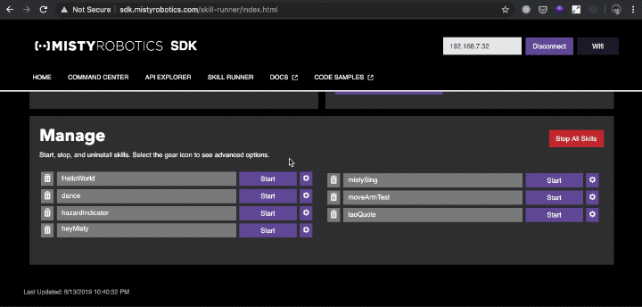
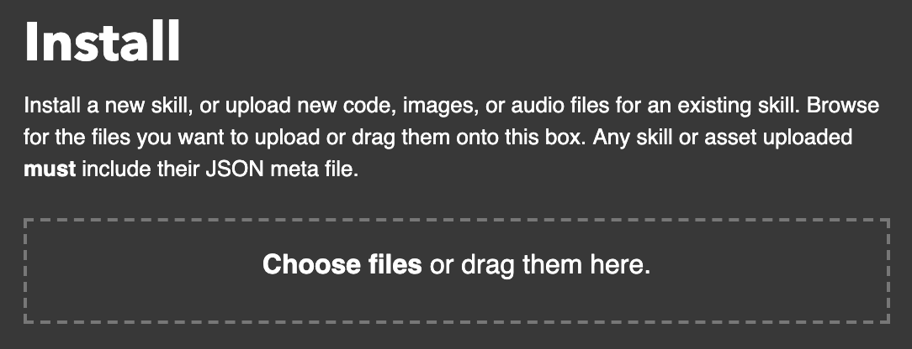
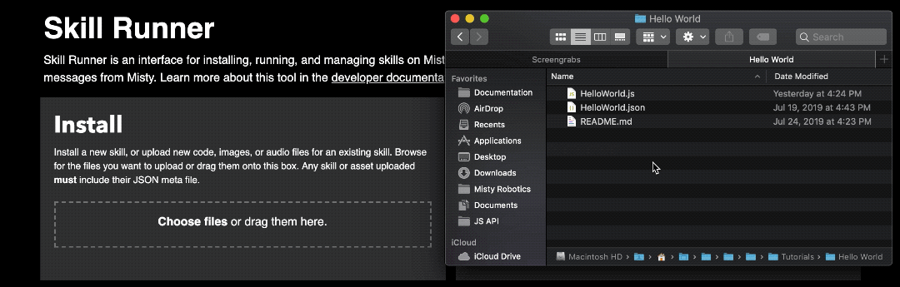
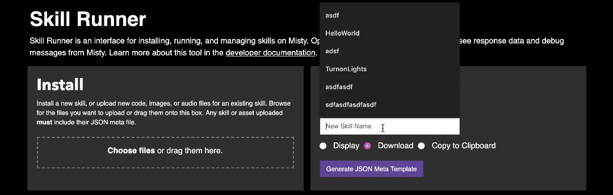
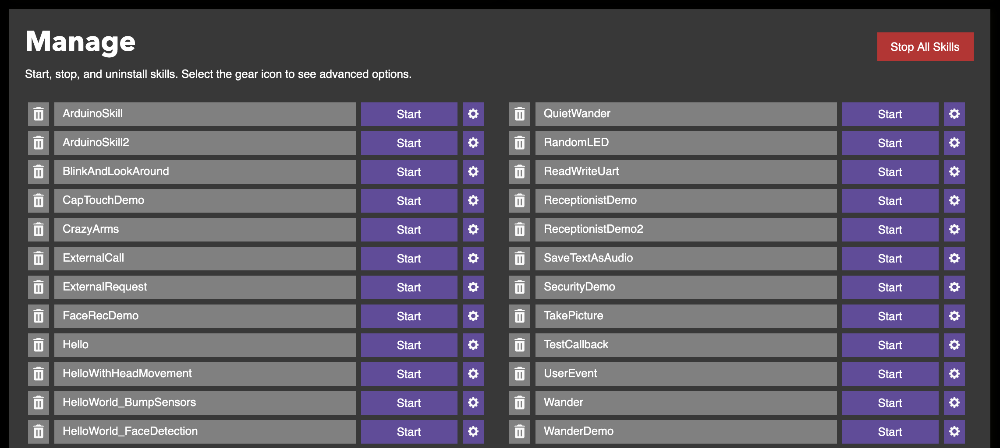

# {{title}}

The Misty [Skill Runner](http://sdk.mistyrobotics.com/skill-runner/) web tool is a graphic interface for some of the skill-management actions that you would otherwise need to handle via a REST client.

## Setting up Skill Runner

When using Skill Runner, make sure your computer and Misty are connected to the same Wi-Fi network. Follow these steps to connect Misty to Skill Runner:

1. Open Skill Runner in a new browser window.
2. Enter Misty's IP address in the **Robot IP Address** field at the top of the page and select **Connect**.

When Misty connects, the text on the button displays **Connected** and the **Manage** section populates with the skills currently installed on your robot.

## Viewing Debug Messages (and Other Skill Data)

When Misty connects to Skill Runner, the web page subscribes to [`SkillData`](../../../misty-ii/robot/sensor-data/#skilldata) events through a WebSocket connection to Misty. `SkillData` event messages include debug messages, error messages, and other data on-robot skills publish during skill execution. When you run a skill from the Skill Runner page, these messages print to the console in your web browser.

We recommend using Skill Runner in Chrome browsers for best results. To open the web console in Chrome, use:
* **Ctrl + Shift + J** (Windows/Linux)
* **Cmd + Option + J** (Mac)

## Installing Skills with Skill Runner

Use the **Install** interface to install and modify Misty's on-robot skills.

### Uploading a New Skill

To upload a new skill, drag-and-drop your skill files onto the box, or click the box to find the files in your computer's file system.

{{box op="start" cssClass="boxed noteBox"}}
**Important!** When you install a new skill on Misty, you must upload the JavaScript `code` file and the JSON `meta` file at the same time. You can upload image and audio assets associated with a skill by including these asset files when you upload the skill.
{{box op="end"}}

### Updating an Existing Skill

To update the code for an existing skill, or to associate new image and audio assets with that skill, upload these files alongside the JSON `meta` file for that skill. Misty uses the `meta` file to identify which existing skill the new files belong to.

**Note:** When updating an existing skill, make sure the JavaScript `code` file and the JSON `meta` file you upload use the same name as the original skill files.

## Generating a JSON Meta File

You can use the Skill Runner to generate JSON `meta` files for your skills. The Skill Runner **Generate** interface automatically populates various fields in the `meta` file and associates a randomized 128 bit GUID with the `UniqueID` parameter. For more information about `meta` files, see [JavaScript SDK Architecture](../../../misty-ii/javascript-sdk/javascript-skill-architecture).

To generate a `meta` template for your skill:

1. Enter your skill's name.
2. Choose **Display** to view the file's contents in a modal on the Skill Runner page, or choose **Download** to download the `.json` file to your computer.
3. Click **Generate JSON Meta Template**.

## Starting, Stopping, and Deleting Skills

Use the **Manage** interface to start, stop, and uninstall Misty's skills. The **Manage** section automatically populates with a list of the skills on your robot when you connect Misty to the Skill Runner page.

### Starting a Skill

To start a skill, select the **Start** button next to the skill's name.

### Stopping a Skill

When a skill is running, the **Start** button turns red and displays **Stop**. Click this button to stop the skill.

### Uninstalling a Skill

To uninstall a skill, select the **Delete** button next to the skill's name.

### Advanced Options

To view the **Advanced Options** for a skill, select the **Advanced Options** button.

You can use the advanced options interface to start a skill with additional parameters that aren't specified in the skill's `meta` file, or to [send a user event](../../../misty-ii/rest-api/api-reference/#triggerskillevent) with a specific payload to the skill.

